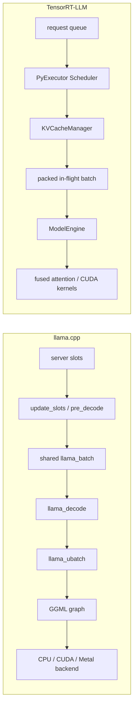

## 问题与范围

验证以下总体判断：`simple.cpp` 只能展示最小单请求生成循环；llama-server 的 `update_slots()` 是观察共享 batch 和 continuous batching 的关键入口；llama.cpp 适合观察 `batch -> ubatch -> graph -> backend` 的源码分层，而 TensorRT-LLM 更强调 NVIDIA GPU serving 所需的 in-flight batching、packed input、paged KV cache 和 fused attention。

本次只记录已观察到的运行流程，不对两者做绝对性能排名。TensorRT-LLM 部分限定为官方文档当前重点描述的 PyTorch backend；不同 attention backend 的具体实现可能不同。

## 速答

总体判断成立，但需要加两条边界：

1. `update_slots()` 是 llama-server 的关键调度入口，不是 llama.cpp 核心 API 的必要入口。直接调用方可以绕过 server 使用 `llama_decode()`。
2. “llama.cpp 更适合源码学习，TensorRT-LLM 更适合 NVIDIA GPU 高吞吐服务”是基于代码可观察性和官方优化目标的场景判断，不表示 llama.cpp 在并发性能上更优，也不表示 TensorRT-LLM 只支持 paged KV 或单一 attention backend。

官方文档足以确认框架级流程、调度边界和优化方向，但 attention mask、input hidden states、position embedding、KV cache、decode 五个变量的创建、shape、dtype、更新和 graph input 位置仍需要结合源码逐函数验证。

## 关键证据

1. `examples/simple/simple.cpp:147-203`：示例只构造单个 `llama_batch`，循环执行 `llama_decode -> sample -> next one-token batch`。这支撑“simple 展示最小 decode loop，但不展示 server 多 slot 调度”。
2. `tools/server/README-dev.md:46-88`：官方 server 文档定义 `server_context`、`server_slot` 和共享 batch，并明确说明 `update_slots()` 遍历 slots、填充 prompt/generated token，随后调用 `llama_decode()`。这支撑“update_slots 是 continuous batching 的关键观察入口”。
3. `tools/server/server-context.cpp:2711-2798`：实际代码执行 `pre_decode -> batch.render -> decode -> post_decode`，并在 batch 过大时按 view 分段重试。文档描述与当前实现一致。
4. `include/llama.h:228-253,342-344`：`llama_batch` 同时承载 token/embedding、position、sequence ID 和 output 标记；`n_batch` 与 `n_ubatch` 分别是 logical maximum batch size 和 physical maximum batch size。这支撑 `batch -> ubatch` 的分层判断。
5. `src/llama-context.cpp:1680-1843` 与 `src/llama-context.cpp:1304-1364`：`decode()` 初始化 batch allocator 和 memory batch，逐个取得 ubatch；`process_ubatch()` 构建或复用 graph、设置 inputs 并交给 backend scheduler 计算。
6. `src/llama-batch.cpp:90-118`、`src/llama-graph.cpp:124-143`、`src/models/llama.cpp:108-156`：缺失 position 可根据 memory 自动生成，随后写入 graph input，并在 Llama graph 中用于 Q/K RoPE。这证明 position 的细节必须由源码补足，不能只依赖 server 流程文档。
7. `NVIDIA/TensorRT-LLM@e05790a:docs/source/torch/arch_overview.md:17-64` 与 `docs/source/features/attention.md:107-126,202-244,317-350`：官方文档将 Scheduler、KVCacheManager、ModelEngine、Decoder 分层，并明确描述 packed QKV、in-flight batching、contiguous/paged KV 和可融合 RoPE。
8. `NVIDIA/TensorRT-LLM@e05790a:docs/source/features/kvcache.md:1-19`：KV cache 被组织成固定 token 数的 block pool，可按请求分配、进行跨请求 prefix reuse、优先级 LRU 和 secondary-memory offload。这支撑 TensorRT-LLM 面向 GPU serving 的 cache 管理判断。

## 细节展开

### llama.cpp 的 server 与 core 边界

HTTP/CLI 输入先进入 `server_task` 和 `server_slot`。`update_slots()` 负责从多个 active slots 选择本轮 prompt token 或上一轮生成 token，形成 server 共享 batch。它同时承载 slot 状态、兼容配置、prompt chunk、context shift、采样回环和 decode 重试等 server 语义。

`llama_decode()` 之后进入 core 层。core 不理解 HTTP request 或 server slot，而是处理 token/embedding、position、sequence ID、memory 和 output 标记。`llama_batch_allocr` 补齐缺省字段，memory implementation 根据 `n_ubatch` 准备 physical ubatch，模型构建 GGML graph，scheduler 再将 graph 分配到具体 backend。

因此 `update_slots()` 的差异化价值主要在请求编排和 continuous batching，而 position、attention mask、hidden state 和 KV tensor 的最终语义属于 core graph/memory 层。

### TensorRT-LLM 的运行侧重点

PyExecutor 的单步循环包括请求获取、调度、资源准备、model forward、decoder/sampler 和结果更新。官方 attention 文档允许 context-phase 和 generation-phase 请求进入同一个 in-flight batch，并要求高效路径使用 packed input。默认 `TrtllmAttention` backend 再根据阶段选择 context FMHA、masked MHA 等优化 kernel。

KV cache 管理和 attention metadata 是调度与 kernel 之间的重要接口。它们携带 sequence length、context length、request/block 信息和 position 等数据，使 fused kernel 不必完全依赖传统 padded tensor 加 dense mask 的表示。

### 五个变量的后续源码验证范围

| 变量 | 需要验证的内容 |
| --- | --- |
| attention mask | 创建者、causal/sequence/SWA 规则、dense 或 metadata 表示、shape、dtype、kernel 消费位置 |
| input hidden states | token embedding 或 external embedding 入口、每层 shape/dtype、QKV projection 前后的布局 |
| position embedding | position ID 的生成者、prefill/decode 更新、RoPE 在模型侧还是 backend/kernel 内融合 |
| KV cache | 分配单位、物理布局、写入/读取时机、sequence/request 映射、prefix reuse 与回收策略 |
| decode | 调度步、prefill/generation 混排、logical/physical batch 拆分、graph 或 CUDA Graph 复用、sampling 边界 |

## 未决问题

- TensorRT-LLM 的 Vanilla、TrtllmAttention 和 FlashInfer backend 对 mask、position 和 KV update 的实现不同，需要选定 backend 后才能记录稳定的 shape/dtype 结论。
- llama.cpp 支持多种模型架构和 memory implementation，Llama/RoPE/普通 KV cache 路径不能代表所有 `src/models/*.cpp`。
- 两个框架的吞吐和延迟优势依赖硬件、模型、batch、context 长度、量化和 cache 命中率，不能从静态代码直接得出绝对排名。

## 后续建议

下一步可按五个变量建立同一格式的逐函数对照表，并固定 llama.cpp commit、TensorRT-LLM commit 和 attention backend，避免版本与实现路径混杂。

## 相关文档

- `docs/development/cli-inference-code-walkthrough.md`：llama.cpp 一侧的逐函数 walkthrough。
- `docs/development/inference-scheduling.md`：当前 fork 中的请求调度代码地图；该文件不是 ggml-org 上游官方文档。
- [llama-server Development Documentation](https://github.com/ggml-org/llama.cpp/blob/master/tools/server/README-dev.md)
- [TensorRT-LLM Architecture Overview](https://nvidia.github.io/TensorRT-LLM/torch/arch_overview.html)
- [TensorRT-LLM Attention](https://nvidia.github.io/TensorRT-LLM/features/attention.html)
- [TensorRT-LLM KV Cache System](https://nvidia.github.io/TensorRT-LLM/features/kvcache.html)
