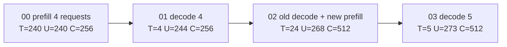
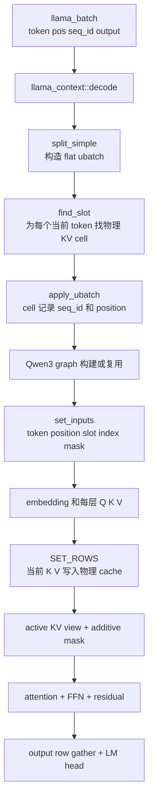
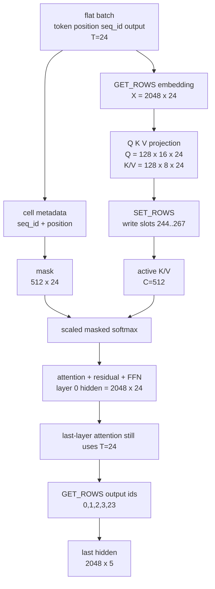

# Qwen3 llama.cpp 四路 continuous batching 张量跟踪

本文不是抽象流程说明，而是对当前工作树中的 Qwen3-1.7B GGUF 做真实运行后得到的代码、张量和日志分析。

对应代码版本：`a49a6a20bf45`

实测模型：`qwen3-1.7b/qwen3-1.7B-BF16.gguf`

实测输出目录：`logs/qwen3_llama_batched_trace_run2`

新增的调试工具：

- `examples/qwen3-batched-trace/qwen3-batched-trace.cpp`
- `examples/qwen3-batched-trace/qwen3-batched-trace-analysis.ipynb`
- `qwen_llama_batched_trace_reader.py`

扩展后的 split GGUF trace 位于 `logs/qwen3_llama_batched_trace_split_complete_v2`。它在原 run2 捕获点基础上增加了物理 V cache、28 层 output hidden 和 LM-head logits。Notebook 默认读取这套完整数据，并可与同配置的单文件 trace `logs/qwen3_llama_batched_trace_mono_complete_v2` 逐 NPY 比较。

这个示例只用于数值研究。它没有修改 Qwen3 模型实现、KV cache 实现或 server 调度实现。

## 1. 先回答 context 大小问题

这个 llama.cpp 测试明确指定了 context 大小：

```bash
-c 512
```

这里的 `512` 是 unified KV cache 可以共同容纳的物理 cell 总数，不是每个 request 各有 512 个 cell，也不是 `batch=5` 后变成 `5 x 512`。

本测试最多实际使用 273 个 cell，所以满足：

```text
273 <= n_ctx 512
```

调试程序还有两层保护：

- 没传 `-c` 时，默认设置 `n_ctx=512`。
- 传入小于 512 的 context 时直接报错。

代码在 `examples/qwen3-batched-trace/qwen3-batched-trace.cpp:594-600`。

llama.cpp 会把 context 按 256 对齐。unified 模式下 `n_ctx_seq=n_ctx`，见 `src/llama-context.cpp:284-301`。因此本次物理 K tensor 是：

```text
[D * Hkv, n_ctx, 1, 1] = [1024, 512, 1, 1]
```

需要区分三个参数：

| 参数 | 本次值 | 含义 |
|---|---:|---|
| `n_ctx` | 512 | KV cache 的总物理容量 |
| `n_batch` | 512 | 一次 `llama_decode()` 可提交的最大逻辑 token 数 |
| `n_ubatch` | 512 | 一个实际 graph 可处理的最大 token 数 |

本次最大 batch 是 240，因此每个阶段都只构建一个 ubatch。这样日志中的一个 phase 就对应一个 GGML graph，不会被拆成多个小 graph。

## 2. 实验负载

初始同时加入四个不同长度的 request：

```text
seq 0: 48 tokens
seq 1: 56 tokens
seq 2: 64 tokens
seq 3: 72 tokens
```

四路 prefill 后执行一次四路 decode。下一次调用把四个旧 request 的当前 token 和一个 20-token 新 request 放在同一个 `llama_batch` 中。最后执行一次五路 decode。



符号：

- `T`：当前 `llama_decode()` 中的 token 数。
- `U`：写入后 KV cache 的逻辑使用 cell 数。
- `C`：attention graph 实际读取的 padded KV span。
- `O`：要求输出 logits 的 token 数。

`C` 不是最大 request 长度。`get_n_kv()` 至少按 256 对齐，见 `src/llama-kv-cache.cpp:1233-1246`。所以 `U=244` 时仍是 `C=256`，`U=268` 时增长到 `C=512`。

### 2.1 四阶段的真实 shape

Qwen3-1.7B 参数：

```text
H    = 2048  hidden size
Hq   = 16    query heads
Hkv  = 8     KV heads
D    = 128   head dimension
L    = 28    decoder layers
```

以下均为 GGML `ne[0], ne[1], ne[2], ne[3]` 顺序：

| 阶段 | 当前 T | position | U | C | embedding / layer0 hidden | mask | active K | active V | 最后一层 hidden |
|---|---:|---|---:|---:|---|---|---|---|---|
| `00_prefill_4` | 240 | 四段 `0..47/55/63/71` | 240 | 256 | `[2048,240,1,1]` | `[256,240,1,1]` | `[128,256,8,1]` | `[256,128,8,1]` | `[2048,4,1,1]` |
| `01_decode_4` | 4 | `[48,56,64,72]` | 244 | 256 | `[2048,4,1,1]` | `[256,4,1,1]` | `[128,256,8,1]` | `[256,128,8,1]` | `[2048,4,1,1]` |
| `02_join_new_request` | 24 | `[49,57,65,73,0..19]` | 268 | 512 | `[2048,24,1,1]` | `[512,24,1,1]` | `[128,512,8,1]` | `[512,128,8,1]` | `[2048,5,1,1]` |
| `03_decode_5` | 5 | `[50,58,66,74,20]` | 273 | 512 | `[2048,5,1,1]` | `[512,5,1,1]` | `[128,512,8,1]` | `[512,128,8,1]` | `[2048,5,1,1]` |

最后一层 hidden 的 token 维不是 prefill 的 `T=240`，而是 `O=4`。原因是 Qwen3 在最后一层 attention 后用 `inp_out_ids` 只保留请求 logits 的行，见 `src/models/qwen3.cpp:114-117`。

layer 0 仍处理全部 240 个当前 token，并写完所有 KV。最后一层只在进入 residual/FFN 前压缩到 4 个 output rows。

## 3. llama_batch 怎样表达四个不同长度的输入

HF 通常构造 dense tensor：

```text
input_ids      [B, Smax]
attention_mask [B, Smax]
position_ids   [B, Smax]
```

llama.cpp 没有为短 request 补齐一整行。它提交的是一个 flat token list：

```text
token    [T]
pos      [T]
seq_id   [T]
logits   [T]
```

`llama_batch` 的字段定义在 `include/llama.h:245-264`，内存分配在 `src/llama-batch.cpp:945-972`。

初始 prefill 的 flat 排列是：

```text
batch index   0..47     seq=0 pos=0..47
batch index  48..103    seq=1 pos=0..55
batch index 104..167    seq=2 pos=0..63
batch index 168..239    seq=3 pos=0..71
```

这里只在每个 request 的最后一个 prompt token 设置 `logits=1`，所以 `T=240`，但 `O=4`。

调试程序构造四阶段 batch 的代码在 `examples/qwen3-batched-trace/qwen3-batched-trace.cpp:486-559`。

注意：

```cpp
llama_batch_init(512, 0, 1)
```

第三个参数 `1` 是“每个 token 最多关联多少个 seq_id”，不是整个 context 有几个 sequence。本例每个 token 只属于一个 request，所以是 1。context 的最大并行 sequence 数由 `params.n_parallel=5` 设置。

unified KV 模式走 `split_simple()`，本次 240 个 ragged token 保持为一个 flat ubatch，见：

- `src/llama-kv-cache.cpp:700-718`
- `src/llama-batch.cpp:476-508`

## 4. 一次 llama_decode 内部发生什么



关键顺序不是“attention 后再登记 cache”：

1. `find_slot()` 找物理 cell。
2. `apply_ubatch()` 先把本轮 token 的 `seq_id` 和 `pos` 登记到 cell metadata。
3. `set_input_kq_mask()` 根据更新后的 cell metadata 构造 mask。
4. graph 中的 `SET_ROWS` 写 K/V 数值。
5. attention 读取包括本轮 token 在内的 active K/V。

因此 prefill 内部的 token 能正确使用 causal mask 看到同 batch 中更早的位置。

源码调用链：

```text
run_phase()
  examples/qwen3-batched-trace/qwen3-batched-trace.cpp:468
  -> llama_decode()
     include/llama.h:964-978
  -> llama_context::decode()
     src/llama-context.cpp:1701
  -> memory->init_batch()
     src/llama-context.cpp:1795-1800
  -> llama_kv_cache::init_batch()
     src/llama-kv-cache.cpp:700
  -> llama_batch_allocr::split_simple()
     src/llama-batch.cpp:476
  -> llama_kv_cache::find_slot()
     src/llama-kv-cache.cpp:894
  -> llama_kv_cache::apply_ubatch()
     src/llama-kv-cache.cpp:1093
  -> llama_context::process_ubatch()
     src/llama-context.cpp:1321
  -> llama_model_qwen3::graph::graph()
     src/models/qwen3.cpp:53
  -> graph input set_input()
     src/llama-graph.cpp:67,125,468
  -> KV SET_ROWS + attention
     src/llama-graph.cpp:2744-2793
  -> GGML backend graph compute + trace callback
     ggml/src/ggml-backend.cpp:1737-1765
```

## 5. input embedding 和 hidden state 如何拼接

### 5.1 Input embedding

Qwen3 graph 从：

```cpp
inpL = build_inp_embd(model.tok_embd);
```

开始，见 `src/models/qwen3.cpp:62`。`build_inp_embd()` 内部执行：

```text
embd = GET_ROWS(token_embd.weight, inp_tokens)
```

见 `src/llama-graph.cpp:2266-2352`。

本次 join 阶段输入是：

```text
4 个旧 request 当前 token + 20 个新 request prompt token
T = 4 + 20 = 24
input embedding = [2048,24,1,1]
```

这里没有把旧 request 的历史 hidden 再拼回来。旧 history 不再经过 embedding，也不再经过 decoder layer。

### 5.2 Hidden state

layer 0 的关键 hidden：

```text
input_embedding_layer0_hidden     [H,T]
attention_norm_hidden_layer0      [H,T]
post_attention_hidden_layer0      [H,T]
ffn_output_layer0                 [H,T]
decoder_output_hidden_layer0      [H,T]
```

join 阶段全部是 `[2048,24,1,1]`。

Transformer 公式：

```text
X0        = Embedding(token)
Xa        = X0 + Wo * Attention(RMSNorm(X0))
X1        = Xa + Wdown * (SiLU(Wgate * RMSNorm(Xa)) * Wup * RMSNorm(Xa))
```

对应 Qwen3 代码：

- attention norm：`src/models/qwen3.cpp:76-80`
- Q/K/V 和 attention：`src/models/qwen3.cpp:82-113`
- attention residual：`src/models/qwen3.cpp:118-119`
- FFN：`src/models/qwen3.cpp:121-138`

最重要的结论：

```text
embedding 和 hidden 只沿当前 flat token 维 T 拼接。
历史 hidden 不持久保存。
历史信息持久保存在每层 KV cache 中。
```

## 6. position 如何保持每个 request 独立

llama.cpp 的 graph position input 是一个 flat `[T]` tensor。`llm_graph_input_pos::set_input()` 直接从 `ubatch->pos` 写入，见 `src/llama-graph.cpp:125-143`。

join 阶段实际值：

```text
[49, 57, 65, 73, 0, 1, 2, ..., 19]
```

前四个位置属于旧 request，各自继续自己的计数器。后 20 个位置属于新 request，从 0 开始。

reader 对 batch position 和 graph position 做了逐元素比较：

```text
batch_position == graph_position: PASS
```

Qwen3 没有一个加到 hidden 上的 learned position embedding。位置通过 RoPE 进入 Q 和 K：

```text
Qrope = RoPE(Qnorm, position)
Krope = RoPE(Knorm, position)
```

对应 `src/models/qwen3.cpp:88-107`。

join 阶段保存的 Q 前后差值：

```text
RoPE Q delta: max_abs=24.40091, mean_abs=0.3231806
```

调试上有一个容易踩的坑：不能等 `Qcur-0` RoPE 执行完以后再读 `src[0]` 作为“RoPE 前”的值，因为 GGML allocator 可能复用 source buffer。工具在 `Qcur_normed-0` 节点完成时立即保存 RoPE 前张量，见调试代码 `examples/qwen3-batched-trace/qwen3-batched-trace.cpp:351-359`。

## 7. KV cache 如何写入和保存

### 7.1 物理 slot

`find_slot()` 选择 cell，`apply_ubatch()` 写 cell 的 `position` 和 `seq_id`：

- 选择 slot：`src/llama-kv-cache.cpp:894`
- 写 position：`src/llama-kv-cache.cpp:1127`
- 写 seq_id：`src/llama-kv-cache.cpp:1137-1139`
- 把 slot index 送进 graph：`src/llama-kv-cache.cpp:1459-1472`

本次真实 slot 分布：

```text
slot   0..47   seq0 prompt pos 0..47
slot  48..103  seq1 prompt pos 0..55
slot 104..167  seq2 prompt pos 0..63
slot 168..239  seq3 prompt pos 0..71

slot 240       seq0 pos48
slot 241       seq1 pos56
slot 242       seq2 pos64
slot 243       seq3 pos72

slot 244       seq0 pos49
slot 245       seq1 pos57
slot 246       seq2 pos65
slot 247       seq3 pos73
slot 248..267  seq4 new prompt pos 0..19

slot 268       seq0 pos50
slot 269       seq1 pos58
slot 270       seq2 pos66
slot 271       seq3 pos74
slot 272       seq4 pos20
```

可以看到，新 request 没有为了追平旧 request 而在逻辑序列维补零。它直接占用新的物理 cell 248..267，但 cell metadata 中的位置仍是 0..19。

### 7.2 当前 K/V、物理 K 和 active K/V

join 阶段：

```text
current K after RoPE  [128,8,24,1]
current V flat        [1024,24,1,1]
                      等价 reshape [128,8,24,1]

physical K cache      [1024,512,1,1]
active K permuted     [128,512,8,1]
active V permuted     [512,128,8,1]
```

每层都有独立 K/V cache。工具保存 layer 0 的完整数值作为代表；28 层的 cache 布局和 token/slot 维相同。

graph 用 `SET_ROWS` 将当前 K/V 写进 slot，见 `src/llama-graph.cpp:2777-2783` 和 `src/llama-kv-cache.cpp:1301-1369`。

实测 physical K 非零 cell：

```text
prefill:       240, slots 0..239
decode 4:      244, slots 0..243
join request:  268, slots 0..267
decode 5:      273, slots 0..272
```

## 8. attention mask 如何隔离 request

unified cache 中所有 request 共享一个物理 KV tensor，因此 mask 必须同时解决两个问题：

1. 不允许 query 看到其他 `seq_id` 的 cell。
2. 不允许 query 看到自己未来 position 的 cell。

对于普通 Qwen3 causal attention，可写成：

```text
M[cell, query] = 0
  当且仅当 cell.seq_id 包含 query.seq_id
          并且 cell.position <= query.position

其他情况 M[cell, query] = -infinity
```

源码判断：

- empty cell 丢弃：`src/llama-kv-cache.cpp:1627-1629`
- seq_id 不同丢弃：`src/llama-kv-cache.cpp:1631-1634`
- 未来 position 丢弃：`src/llama-kv-cache.cpp:1647-1651`
- 保留写 0，丢弃写 `-INFINITY`：`src/llama-kv-cache.cpp:1552-1553,1672-1680`

mask graph shape 在 `src/llama-graph.cpp:27-43` 创建：

```text
[C, T, 1, 1]
```

不是 HF 常见的 `[B,1,Sq,Sk]`。

### 8.1 “mask 拼接”的准确含义

llama.cpp 不保存每个 request 的二维 `attention_mask`，也不会把上一轮 `[256,4]` mask 补齐后与新 request mask 做 `GGML_OP_CONCAT`。每次 ubatch 都重新创建并填充一个统一的 `M[C,T]`：

```text
输入的 flat query 列:
[seq0-pos49 | seq1-pos57 | seq2-pos65 | seq3-pos73 | seq4-pos0 | ... | seq4-pos19]

M = [m0 | m1 | m2 | m3 | m4 | ... | m23]

mt[c] = 0
  当且仅当 cell[c] 非空
          且 seq_id[t] 属于 cell[c].seq_id
          且 cell[c].position <= position[t]

其他 mt[c] = -infinity
```

这里可以从数学上把每个 query 的 mask 看成一个长度为 `C` 的列向量，再沿当前 flat query 维排成 `T` 列；但实现是 `set_input_kq_mask()` 直接逐项 fresh fill，不是先生成多个 per-request tensor 后再做拼接。mask 创建于 `src/llama-graph.cpp:27-43`，填充入口位于 `src/llama-graph.cpp:468-475`，KV cell 判断位于 `src/llama-kv-cache.cpp:1627-1680`。

join 阶段的逻辑块结构是：

```text
                                 当前 query 列
KV cell 行       seq0 p49  seq1 p57  seq2 p65  seq3 p73  seq4 p0..19
seq0 cells          0         -inf       -inf       -inf       -inf
seq1 cells         -inf        0         -inf       -inf       -inf
seq2 cells         -inf       -inf        0         -inf       -inf
seq3 cells         -inf       -inf       -inf        0         -inf
seq4 p0..19        -inf       -inf       -inf       -inf   causal triangle
empty p268..511    -inf       -inf       -inf       -inf       -inf
```

上面的 `0` 表示该列中满足 position 条件的同序列 cell；并不是整块都无条件为 0。特别是新 request 的 20 x 20 区域是 causal triangle：位置 `r` 只能看到 `0..r`。

四次 `llama_decode()` 都重新生成 mask：

| phase | `C x T` | 每列可见项计算 | finite 0 | `-inf` |
|---|---:|---|---:|---:|
| `00_prefill_4` | `256 x 240` | `48*49/2 + 56*57/2 + 64*65/2 + 72*73/2` | 7480 | 53960 |
| `01_decode_4` | `256 x 4` | `49 + 57 + 65 + 73` | 244 | 780 |
| `02_join_new_request` | `512 x 24` | `50 + 58 + 66 + 74 + sum(1..20)` | 458 | 11830 |
| `03_decode_5` | `512 x 5` | `51 + 59 + 67 + 75 + 21` | 273 | 2287 |

`01_decode_4` 的旧 mask 不会进入 `02_join_new_request`。join 时 `U` 从 244 增长为 268，padded active span `C` 从 256 变成 512，因此 runtime 直接 fresh fill 新的 `[512,24]`。下一轮又 fresh fill `[512,5]`。

### 8.2 join 阶段真实 mask

```text
mask shape      = [512,24,1,1]
finite 0 entries= 458
-infinity       = 11830
```

旧 request 的四个 query：

```text
q0 seq0 pos49 sees slots 0..47,240,244       count 50
q1 seq1 pos57 sees slots 48..103,241,245     count 58
q2 seq2 pos65 sees slots 104..167,242,246    count 66
q3 seq3 pos73 sees slots 168..239,243,247    count 74
```

新 request：

```text
q4  seq4 pos0  sees slot 248                 count 1
q5  seq4 pos1  sees slots 248..249           count 2
...
q23 seq4 pos19 sees slots 248..267           count 20
```

所有 query 都通过了：

```text
visible_count == position + 1: PASS
```

`458` 也可以直接算出：

```text
50 + 58 + 66 + 74 + (1 + 2 + ... + 20) = 458
```

## 9. attention graph 节点和公式

关闭 Flash Attention 后，layer 0 的关键节点是：

| 保存变量 | GGML 节点或 source | shape | Transformer 公式 |
|---|---|---|---|
| input embedding | `embd` | `[H,T]` | `X=Embedding(token)` |
| position | `Qcur-0(ROPE).src[1]` | `[T]` | 每 request 独立 position |
| Q before RoPE | `Qcur_normed-0` | `[D,Hq,T]` | `RMSNorm(XWq)` |
| Q after RoPE | `Qcur-0`, `ROPE` | `[D,Hq,T]` | `RoPE(Q,pos)` |
| K after RoPE | `Kcur-0`, `ROPE` | `[D,Hkv,T]` | `RoPE(K,pos)` |
| current V | `Vcur-0` | `[D*Hkv,T]` | `XWv` |
| slot index | K `SET_ROWS.src[1]` | `[T]` | 当前 K/V 的物理写入位置 |
| active K | `kq-0.src[0]` | `[D,C,Hkv]` | cache K view |
| attention score | `kq-0` | `[C,T,Hq]` | `Kcache^T Q` |
| additive mask | `kq_soft_max-0.src[1]` | `[C,T]` | seq + causal mask |
| attention probability | `kq_soft_max-0` | `[C,T,Hq]` | `softmax(score/sqrt(D)+M)` |
| active V | `kqv-0.src[0]` | `[C,D,Hkv]` | cache V view |
| attention context | `kqv-0` | `[D,T,Hq]` | `Vcache^T probability` |
| merged heads | `kqv_out-0` | `[H,T]` | `Concat(heads)` |
| post attention hidden | `ffn_inp-0` | `[H,T]` | `X + Wo*context` |
| layer output hidden | `l_out-0` | `[H,T]` | attention residual + FFN residual |

这些 node 在 `src/llama-graph.cpp:2499-2631` 构建。

## 10. HF 和 llama.cpp shape 对照

| 语义 | HF dense/padded | llama.cpp unified KV |
|---|---|---|
| 当前 token IDs | `[B,S]` | flat `[T]` |
| 当前 position IDs | `[B,S]` | flat `[T]`，每项由自己的 seq 独立给值 |
| input embedding | `[B,S,H]` | `[H,T]` |
| current Q | `[B,Hq,S,D]` | `[D,Hq,T,1]` |
| current K/V | `[B,Hkv,S,D]` | `[D,Hkv,T,1]` |
| 持久 KV | `[B,Hkv,Scache,D]` | 每层 `[D*Hkv,n_ctx,1]` 加 cell metadata |
| active K | 通常仍按 batch 分开 | `[D,C,Hkv,1]` |
| additive mask | `[B,1,Sq,Sk]` | `[C,T,1,1]` |
| layer hidden | `[B,S,H]` | `[H,T]` |
| output hidden | `[B,1,H]` 或选中行 | `[H,O]` |

关系是：

```text
HF 的 batch 维没有直接变成 GGML 的 batch 维。
HF 中 B 个 request 的当前有效 token 被压平为 T。
seq_id 和 KV cell metadata 代替 dense batch/padding 语义。
```

## 11. 捕获和保存实现

### 11.1 为什么不用 common_debug_cb_eval

`common_debug_cb_eval()` 在 callback 的 `ask=true` 阶段总是返回 true，见 `common/debug.cpp:143-163`。即使配置 tensor filter，也会对每个 graph node 同步，长 prefill 会非常慢。

本工具在 `ask=true` 时只选择目标节点：

```text
embd
Qcur_normed-0 / Kcur_normed-0
Qcur-0 / Kcur-0 ROPE
layer0 KV SET_ROWS
kq-0 / kq_soft_max-0 / kqv-0
layer0 hidden
all l_out-0..27 hidden
final norm hidden
result output logits
```

过滤代码在 `examples/qwen3-batched-trace/qwen3-batched-trace.cpp:204-232`，保存映射在同文件 `346-390`。

backend 对被选中的 node 计算并同步后，以 `ask=false` 再次调用 callback，见 `ggml/src/ggml-backend.cpp:1737-1765`。工具在这时立即复制数值，不能保留 `ggml_tensor *` 到 graph reset 之后再读。

### 11.2 输出文件

每个 phase 目录包含：

| 文件 | 内容 |
|---|---|
| `batch.tsv` | 每个当前 token 的 token/position/seq_id/output |
| `batch_*.npy` | flat batch 数值 |
| `memory.tsv` | 每个 sequence 的 public KV position 范围 |
| `kv_writes.tsv` | `batch index -> physical slot -> seq_id/position` |
| `position_ids_graph.npy` | graph 实际收到的 position |
| `input_embedding_layer0_hidden.npy` | input embedding，也就是 layer 0 input hidden |
| `q_before_rope_layer0.npy` | RoPE 前 Q |
| `q_after_rope_layer0.npy` | RoPE 后 Q |
| `k_before_rope_layer0.npy` | RoPE 前 K |
| `k_after_rope_layer0.npy` | RoPE 后 K |
| `v_current_flat_layer0.npy` | 当前 V |
| `kv_slot_indices.npy` | 当前 token 对应的物理 KV slot |
| `physical_k_cache_after_write_layer0.npy` | layer 0 完整物理 K cache |
| `physical_v_cache_after_write_layer0.npy` | layer 0 完整物理 V cache |
| `attention_mask_layer0.npy` | additive mask，0 或 `-inf` |
| `attention_scores_layer0.npy` | mask 前 KQ score |
| `attention_probabilities_layer0.npy` | softmax 后 attention 权重 |
| `active_k_permuted_layer0.npy` | attention 读取的 K view |
| `active_v_permuted_layer0.npy` | attention 读取的 V view |
| `decoder_output_hidden_layer0.npy` 到 `decoder_output_hidden_layer27.npy` | 28 层 output hidden |
| `decoder_output_hidden_last_layer.npy` | 最后一层 output hidden |
| `final_norm_hidden.npy` | final RMSNorm 后、LM head 前的 hidden |
| `lm_head_logits.npy` | output projection 后的 `[n_vocab,O]` logits |

所有 graph tensor 均转成 float32 NPY。NPY 使用 Fortran order，因此 NumPy 显示的 shape 与 GGML `ne[]` 顺序一致。例如：

```python
mask = np.load("attention_mask_layer0.npy")
print(mask.shape)  # (512, 24, 1, 1)
```

原 run2 共保存 53 MB；完整 v2 trace 约 128 MB。`manifest.tsv` 记录每个 NPY 对应的 trigger node、op、原 tensor 名、原类型和 GGML shape。

## 12. 构建和运行命令

### 12.1 配置和构建

```bash
cmake -S . -B build \
  -DCMAKE_BUILD_TYPE=Debug \
  -DLLAMA_BUILD_EXAMPLES=ON

cmake --build build \
  --target llama-qwen3-batched-trace \
  -j 8
```

参数含义：

- `-S .`：源码目录是当前 llama.cpp 根目录。
- `-B build`：构建产物放到 `build/`。
- `CMAKE_BUILD_TYPE=Debug`：保留源码断点和局部变量。
- `LLAMA_BUILD_EXAMPLES=ON`：构建 examples 下的调试程序。
- `--target llama-qwen3-batched-trace`：只构建本实验 target。
- `-j 8`：最多并行 8 个编译任务。

### 12.2 运行

实际验证命令：

```bash
build/bin/llama-qwen3-batched-trace \
  -m qwen3-1.7b/qwen3-1.7B-BF16.gguf \
  -c 512 \
  -b 512 \
  -ub 512 \
  -t 8 \
  -tb 8 \
  --trace-dir logs/qwen3_llama_batched_trace_run2
```

运行参数：

| 参数 | 含义 |
|---|---|
| `-m` | GGUF 模型路径 |
| `-c 512` | unified KV cache 总容量 512 cells |
| `-b 512` | 一个 `llama_decode()` 最多接受 512 tokens |
| `-ub 512` | 一个 graph 最多处理 512 tokens，确保 240-token prefill 不拆分 |
| `-t 8` | decode CPU 线程数 |
| `-tb 8` | batch/prefill CPU 线程数 |
| `--trace-dir` | NPY、TSV、manifest 和 trace.log 输出目录 |

程序内部为保证捕获点稳定，强制设置：

```text
n_parallel=5
kv_unified=true
flash_attn=disabled
n_gpu_layers=0
KV offload=false
graph op offload=false
warmup=false
```

代码在 `examples/qwen3-batched-trace/qwen3-batched-trace.cpp:594-614`。

这意味着本日志是 CPU、unified KV、非 Flash Attention 的可观察基准，不是 GPU 性能测试。

如需保存包含 llama.cpp 自身 loader 日志的完整 console 输出，可运行：

```bash
build/bin/llama-qwen3-batched-trace \
  -m qwen3-1.7b/qwen3-1.7B-BF16.gguf \
  -c 512 -b 512 -ub 512 -t 8 -tb 8 \
  --trace-dir logs/qwen3_llama_batched_trace_run3 \
  2>&1 | tee logs/qwen3_llama_batched_trace_run3.console.log
```

### 12.3 读取所有阶段

```bash
python3 qwen_llama_batched_trace_reader.py \
  logs/qwen3_llama_batched_trace_run2
```

只查看新 request 加入阶段，并输出每个 query 的可见物理 slot：

```bash
python3 qwen_llama_batched_trace_reader.py \
  logs/qwen3_llama_batched_trace_run2 \
  --phase 02_join_new_request \
  --full-mask
```

列出所有保存 tensor：

```bash
python3 qwen_llama_batched_trace_reader.py \
  logs/qwen3_llama_batched_trace_run2 \
  --all-tensors
```

reader 的核心 mask 校验在 `qwen_llama_batched_trace_reader.py:41-72`，阶段 shape 汇总在同文件 `79-152`。

### 12.4 使用 Notebook 打印和重算中间变量

Notebook 路径：

```text
examples/qwen3-batched-trace/qwen3-batched-trace-analysis.ipynb
```

启动：

```bash
uv pip install --python .venv/bin/python jupyterlab
.venv/bin/python -m jupyter lab \
  examples/qwen3-batched-trace/qwen3-batched-trace-analysis.ipynb
```

Notebook 会打印四阶段 batch、position、slot、shape、统计值和小切片，并执行以下数值自检：

- 单 GGUF 与两个 shard 的全部公共 NPY 逐元素一致。
- decoder shard 的 embedding lookup 与 runtime embedding 一致。
- current K/V 经 F16 转换后写入指定物理 slot。
- physical K/V 与 active view 的 reshape/permute 关系正确。
- 根据 `seq_id + position` 重建的 mask 与 runtime mask 逐元素一致。
- GQA 的 `QK^T`、scaled masked softmax、V aggregation 和 ConcatHeads 可以从保存值重算。
- layer 0 FFN residual、head shard final RMSNorm 和选定 LM-head rows 可以重算。

默认分析 `02_join_new_request`；可在启动 kernel 前用环境变量切换：

```bash
QWEN3_TRACE_PHASE=03_decode_5 \
  .venv/bin/python -m jupyter lab \
  examples/qwen3-batched-trace/qwen3-batched-trace-analysis.ipynb
```

## 13. 真实日志摘录和解释

### 13.1 初始四路 prefill

```text
[phase] 00_prefill_4 n_tokens=240
[tensor] input_embedding_layer0_hidden  ggml=[2048,240,1,1]
[tensor] kv_slot_indices                ggml=[240,1,1,1] min=0 max=239
[tensor] attention_mask_layer0          ggml=[256,240,1,1] finite=7480 -inf=53960
[tensor] decoder_output_hidden_layer0   ggml=[2048,240,1,1]
[tensor] decoder_output_hidden_last_layer ggml=[2048,4,1,1]
[memory] total_logical_tokens=240
```

解释：layer 0 处理全部 240 个 prompt token。active KV span 对齐为 256。最后层只保留四个 output rows。

`7480` 是四个 causal 三角形之和：

```text
48*49/2 + 56*57/2 + 64*65/2 + 72*73/2 = 7480
```

### 13.2 四路 decode

```text
[phase] 01_decode_4 n_tokens=4
[tensor] position_ids_graph             ggml=[4,1,1,1] min=48 max=72
[tensor] kv_slot_indices                ggml=[4,1,1,1] min=240 max=243
[tensor] attention_mask_layer0          ggml=[256,4,1,1] finite=244 -inf=780
[memory] total_logical_tokens=244
```

解释：当前 hidden 只有四行 token，即 GGML `[H,4]`。历史 240 个 token 不重新计算，只从 KV cache 读取。

### 13.3 旧 decode 和新 prefill 同批加入

```text
[phase] 02_join_new_request n_tokens=24
[tensor] position_ids_graph             ggml=[24,1,1,1] min=0 max=73
[tensor] input_embedding_layer0_hidden  ggml=[2048,24,1,1]
[tensor] kv_slot_indices                ggml=[24,1,1,1] min=244 max=267
[tensor] active_k_permuted_layer0       ggml=[128,512,8,1]
[tensor] attention_mask_layer0          ggml=[512,24,1,1] finite=458 -inf=11830
[tensor] decoder_output_hidden_layer0   ggml=[2048,24,1,1]
[tensor] decoder_output_hidden_last_layer ggml=[2048,5,1,1]
[tensor] final_norm_hidden              ggml=[2048,5,1,1] finite=10240
[memory] total_logical_tokens=268
```

解释：当前输入只拼为 24 tokens。KV 使用量越过 256，active KV span 增长到 512。mask 用 seq_id 让 20 个新 token 看不到 248 之前的其他 request cache。

#### 13.3.1 这一组 shape 和计数如何逐步算出

这一节把上面的 compact 日志完整展开。先固定符号：

```text
H    = 2048   hidden size
Hq   = 16     query head 数
Hkv  = 8      KV head 数
D    = 128    每个 head 的维度
T    = 24     本轮 flat token 数
U    = 268    写入后真正占用的 KV cell 数
C    = 512    attention graph 读取的 padded KV span
O    = 5      需要输出 logits 的 token 行数

H       = Hq * D  = 16 * 128 = 2048
D * Hkv = 128 * 8 = 1024
GQA group size = Hq / Hkv = 2
```

整个数据流可以概括为：



##### 第一步：为什么 position 是 `[49,57,65,73,0..19]`

四个旧 request 的初始 prompt 长度为：

```text
L = [48,56,64,72]
```

初始 prefill 已写入位置 `0..L[i]-1`，第一次四路 decode 又分别写入位置 `L[i]`。所以 join 阶段四个旧 request 的下一个位置是：

```text
p_old[i] = L[i] + 1
         = [49,57,65,73]
```

新 request 是第一次 prefill，20 个 token 从位置 0 开始：

```text
p_new = [0,1,2,...,19]
```

llama.cpp 不按最长序列做 padding，而是直接组成一个 flat batch：

```text
position = concat(p_old, p_new)
         = [49,57,65,73,0,1,...,19]

T = 4 * 1 + 20 = 24
```

这里的 `concat` 表示调试程序构造 flat `llama_batch` 的逻辑结果，不是 GGML graph 中额外执行了一个 `CONCAT` 节点。position 由 `llm_graph_input_pos::set_input()` 从 `ubatch->pos` 直接复制，见 `src/llama-graph.cpp:125-143`。

日志中的 position 均值也可以复算：

```text
sum(position)
= 49 + 57 + 65 + 73 + (0 + 1 + ... + 19)
= 244 + 190
= 434

mean(position) = 434 / 24 = 18.0833
```

这与 `position_ids_graph mean=18.0833` 一致。

##### 第二步：为什么 input embedding 是 `[2048,24,1,1]`

设 token embedding 表为 `E`，第 `t` 个 flat token ID 为 `token[t]`。embedding lookup 是：

```text
X0[:,t] = E[:,token[t]]
```

常规 Transformer 通常把它写成 `[T,H]=[24,2048]`。GGML 把连续的 feature 维放在 `ne[0]`，所以日志显示：

```text
X0: [H,T,1,1]
  = [2048,24,1,1]

元素数 = H * T = 2048 * 24 = 49152
```

对应实现是 `ggml_get_rows(tok_embd, inp_tokens)`，见 `src/llama-graph.cpp:2266-2352`。历史 244 个 token 的 hidden 不会重新拼进 `X0`；历史信息只从每层 KV cache 读取。

##### 第三步：为什么 current K 是 `[128,8,24,1]`

用 Transformer 记法表示第 `l` 层的 Q/K/V 计算：

```text
N_l  = RMSNorm(X_l)
Qraw = Wq * N_l
Kraw = Wk * N_l
Vcur = Wv * N_l

Qcur[t,h] = RoPE(QHeadNorm(Qraw[t,h]), position[t])
Kcur[t,g] = RoPE(KHeadNorm(Kraw[t,g]), position[t])
```

Qwen3 使用 16 个 query heads 和 8 个 KV heads：

```text
Qcur: [D,Hq,T,1]  = [128,16,24,1]
Kcur: [D,Hkv,T,1] = [128, 8,24,1]
Vcur: [D,Hkv,T,1] = [128, 8,24,1]
```

K 的 projection 输出维度是：

```text
D * Hkv = 128 * 8 = 1024
```

所以它也可以先看成 flat shape `[1024,24]`，再 reshape 为 `[128,8,24]`。current K 的元素数为：

```text
128 * 8 * 24 = 24576
```

Q/K projection 和 reshape 在 `src/llama-graph.cpp:1591-1664`，Q/K head norm 和 RoPE 在 `src/models/qwen3.cpp:84-107`。

RoPE 不改变 tensor shape。对一个由 `rope_type` 确定的二维分量对 `(x_a,x_b)`，其核心旋转可以写成：

```text
phi = position[t] * rope_frequency

x'_a = x_a * cos(phi) - x_b * sin(phi)
x'_b = x_a * sin(phi) + x_b * cos(phi)
```

所以不同 request 可以从不同 position 独立计算 RoPE；它们是否能互相 attention 由后面的 `seq_id` mask 决定。

##### 第四步：为什么写入 slot 是 `244..267`

进入 join 阶段以前已经使用：

```text
四路 prefill:       48 + 56 + 64 + 72 = 240 cells
第一次四路 decode:   1 +  1 +  1 +  1 =   4 cells
-------------------------------------------------
U_before                                  = 244 cells
```

本例没有删除、共享或形成空洞，所以 `find_slot()` 从第一个空 cell 244 开始连续分配。对当前 batch index `t=0..23`：

```text
slot[t] = U_before + t = 244 + t

slot = [244,245,...,267]
```

这是本次 cache 状态的观测结果，不是所有运行中都能假设的通用公式。发生删除、slot 复用或共享前缀后，物理 slot 不一定连续。

K 写入可以表示为：

```text
Kcache[h * D + d, slot[t], 0]
    = Kcur[d,h,t,0]
```

同时 cell metadata 记录：

```text
cell[slot[t]].position = position[t]
cell[slot[t]].seq_id   contains seq_id[t]
```

写入后：

```text
U_after = U_before + T = 244 + 24 = 268 cells
```

slot 选择、metadata 登记和 graph 写入分别位于：

- `src/llama-kv-cache.cpp:894-1140`
- `src/llama-kv-cache.cpp:1459-1472`
- `src/llama-graph.cpp:2768-2792`

##### 第五步：physical K、active K 和 active V 为什么是这些 shape

创建 context 时已经按 `n_ctx=512` 固定分配了物理 K：

```text
physical K cache:
[D * Hkv,n_ctx,1,1]
= [1024,512,1,1]
```

其总元素数为：

```text
1024 * 512 = 524288
```

写完本轮后使用 268 个 cell，空尾部为：

```text
512 - 268 = 244 cells
```

本次实测中已写入列没有额外的精确零，因此空尾部对应的零元素数为：

```text
244 * 1024 = 249856
```

这正好等于日志中 physical K 的 `zero=249856`。

attention 不直接根据 `U=268` 构造任意长度的 graph。`get_n_kv()` 至少按 256 对齐 active span：

```text
C = min(n_ctx, max(256, alignUp(U_after,256)))
  = min(512, max(256, alignUp(268,256)))
  = min(512, 512)
  = 512
```

这里需要区分：

```text
U = 268: 真正已使用的 KV cell 数
C = 512: graph 实际读取的 padded KV span
```

K view 和 attention 前 permute：

```text
storage/view: [D,Hkv,C,1] = [128,8,512,1]
permute:      [D,C,Hkv,1] = [128,512,8,1]
```

所以保存的 active K 是：

```text
[128,512,8,1]
```

关闭 Flash Attention 时，V cache 使用适合后续矩阵乘法的转置布局：

```text
active V: [C,D,Hkv,1] = [512,128,8,1]
```

K/V view 在 `src/llama-kv-cache.cpp:1233-1298` 构造，attention 前的 permute 在 `src/llama-graph.cpp:2514-2518`。

##### 第六步：mask 的 `458` 和 `11830` 如何计算

对 active span 中的物理 cell `c` 和当前 query `t`，普通 causal unified KV mask 是：

```text
M[c,t] = 0
  当且仅当 cell c 非空
          且 seq_id[t] 属于 cell[c].seq_id 集合
          且 cell[c].position <= position[t]

其他情况 M[c,t] = -infinity
```

四个旧 request 的当前 query 分别能看到：

```text
seq0 pos49: 旧 prompt 48 + 两次 decode 2 = 50 cells
seq1 pos57: 旧 prompt 56 + 两次 decode 2 = 58 cells
seq2 pos65: 旧 prompt 64 + 两次 decode 2 = 66 cells
seq3 pos73: 旧 prompt 72 + 两次 decode 2 = 74 cells
```

新 request 的 position `r=0..19` 只能看到同一新 request 中位置 `0..r`：

```text
visible_new(r) = r + 1

20 个 query 的可见数 = [1,2,3,...,20]
```

因此 mask 中有限的 0 一共有：

```text
N_keep
= 50 + 58 + 66 + 74 + (1 + 2 + ... + 20)
= 248 + 20 * 21 / 2
= 248 + 210
= 458
```

mask 总元素数为：

```text
N_mask = C * T = 512 * 24 = 12288
```

所以 `-infinity` 项数是：

```text
N_drop = N_mask - N_keep
       = 12288 - 458
       = 11830
```

还可以把这 11830 项拆成：

```text
空的 padded cells:
(512 - 268) * 24 = 5856

已占用但被 seq_id 或 future-position 屏蔽:
268 * 24 - 458 = 5974

总计:
5856 + 5974 = 11830
```

`visible_count = position + 1` 在本次实验成立，是因为每个 sequence 都完整保留了位置 `0..position`，没有 position gap、context shift 或 SWA 淘汰。它不是所有 llama.cpp 运行的通用不变量。

mask 的 empty、seq_id 和 causal 判断在 `src/llama-kv-cache.cpp:1627-1680`。

##### 第七步：active K/V 和 mask 如何进入 attention 公式

attention 矩阵乘法使用：

```text
Q:    [D,T,Hq]  = [128,24,16]
K:    [D,C,Hkv] = [128,512,8]
V:    [C,D,Hkv] = [512,128,8]
mask: [C,T]     = [512,24]
```

Qwen3-1.7B 的 GQA group size 是：

```text
g = Hq / Hkv = 16 / 8 = 2
```

因此 query head `h` 使用 KV head：

```text
kv_head(h) = floor(h / 2)
```

未缩放的 attention score：

```text
S[c,t,h]
= sum over d=0..127 of K[d,c,kv_head(h)] * Q[d,t,h]
```

shape 为：

```text
S: [C,T,Hq] = [512,24,16]
元素数 = 512 * 24 * 16 = 196608
```

scaled masked softmax：

```text
Z[c,t,h] = S[c,t,h] / sqrt(128) + M[c,t]

P[c,t,h]
= exp(Z[c,t,h])
  / sum over j=0..511 of exp(Z[j,t,h])
```

`M[C,T]` 广播到 16 个 query heads。本次被 mask 后概率为 0 的元素数为：

```text
11830 * 16 = 189280
```

这和日志中 `attention_probabilities_layer0 zero=189280` 一致。

每个 `(t,h)` 的 softmax 概率和为 1，共有 `24 * 16=384` 组，因此整个 probability tensor 的均值为：

```text
mean(P)
= (24 * 16) / (512 * 24 * 16)
= 1 / 512
= 0.001953125
```

这也与日志中的 `mean=0.00195313` 一致。

attention context：

```text
A[d,t,h]
= sum over c=0..511 of V[c,d,kv_head(h)] * P[c,t,h]

A: [D,T,Hq] = [128,24,16]
```

合并 16 个 query heads：

```text
ConcatHeads(A): [D * Hq,T]
              = [128 * 16,24]
              = [2048,24]
```

对应源码节点：

- `K^T Q`：`src/llama-graph.cpp:2565-2570`
- scaled masked softmax：`src/llama-graph.cpp:2599-2601`
- `V^T P`：`src/llama-graph.cpp:2603-2610`
- 合并 heads：`src/llama-graph.cpp:2618-2621`

##### 第八步：为什么 layer 0 hidden 是 `[2048,24]`，最后一层却是 `[2048,5]`

第 `l` 个 Qwen3 decoder layer 可以写成：

```text
N_l = RMSNorm(X_l)
A_l = Wo * Attention(N_l)
Y_l = X_l + A_l

F_l = RMSNorm(Y_l)
G_l = Wdown * (SiLU(Wgate * F_l) elementwise_mul (Wup * F_l))

X_(l+1) = Y_l + G_l
```

attention、residual 和 SwiGLU FFN 都不改变当前 token 数，所以 layer 0 output 是：

```text
[H,T] = [2048,24]
```

本轮只有以下 batch rows 设置了 `output=1`：

```text
inp_out_ids = [0,1,2,3,23]
O = 5
```

前四行是四个旧 request 的当前 decode token，第 23 行是新 request prompt 的最后一个 token。新 prompt 的前 19 个 token 必须经过所有层并写入每层 KV，但不需要各自计算 logits。

Qwen3 在最后一层 attention 完成以后才执行：

```text
selected_attention = GET_ROWS(attention_output, inp_out_ids)
selected_residual  = GET_ROWS(layer_input,     inp_out_ids)
```

所以实际顺序是：

```text
最后一层 Q/K/V、KV write、attention: 仍处理 T=24
最后一层 attention 后 residual/FFN:    只处理 O=5
最后一层 hidden:                       [H,O]=[2048,5]
```

元素数：

```text
2048 * 5 = 10240
```

这与日志中 `decoder_output_hidden_last_layer finite=10240` 一致。`inp_out_ids` 从 `ubatch.output` 生成，见 `src/llama-graph.cpp:197-221`；Qwen3 最后一层 gather 在 `src/models/qwen3.cpp:114-117`。最终 LM head 只对这 5 行执行：

```text
logits = W_output * RMSNorm(X_last_selected)
shape  = [n_vocab,O] = [151936,5]
```

原 run2 callback 保存到 `final_norm_hidden=[2048,5]` 为止。完整 v2 trace 已增加 `result_output` 捕获，实际落盘 `lm_head_logits=[151936,5]`；Notebook 还会从 head shard 选择词表行重算对应 logits。output matmul 位于 `src/models/qwen3.cpp:143-158`。

### 13.4 五路 decode

```text
[phase] 03_decode_5 n_tokens=5
[tensor] position_ids_graph             ggml=[5,1,1,1] min=20 max=74
[tensor] kv_slot_indices                ggml=[5,1,1,1] min=268 max=272
[tensor] attention_mask_layer0          ggml=[512,5,1,1] finite=273 -inf=2287
[memory] total_logical_tokens=273
```

解释：五个 request 每个只提交一个当前 token。每个 query 能看到的同序列 cell 数分别为 `[51,59,67,75,21]`，总和正好是 273。

## 14. GDB 断点建议

用 Debug build：

```bash
gdb --args build/bin/llama-qwen3-batched-trace \
  -m qwen3-1.7b/qwen3-1.7B-BF16.gguf \
  -c 512 -b 512 -ub 512 -t 1 -tb 1 \
  --trace-dir logs/qwen3_gdb_trace
```

建议断点：

```gdb
break examples/qwen3-batched-trace/qwen3-batched-trace.cpp:477
break src/llama-context.cpp:1701
break src/llama-context.cpp:1798
break src/llama-kv-cache.cpp:894
break src/llama-kv-cache.cpp:1093
break src/llama-kv-cache.cpp:1459
break src/llama-kv-cache.cpp:1725
break src/models/qwen3.cpp:53
break src/llama-graph.cpp:2782
break examples/qwen3-batched-trace/qwen3-batched-trace.cpp:346
run
```

查看当前 batch：

```gdb
print batch.n_tokens
print batch.pos[0]@batch.n_tokens
print batch.logits[0]@batch.n_tokens
print batch.seq_id[0][0]
```

在 `apply_ubatch()` 查看当前 token metadata 和目标 slot：

```gdb
print ubatch.n_tokens
print ubatch.pos[0]@ubatch.n_tokens
print ubatch.seq_id[0][0]
print sinfo.idxs[0]
```

在 `set_input_kq_mask()` 查看 mask shape：

```gdb
print dst->ne[0]@4
print ubatch->n_tokens
```

在 trace callback 只停 join 阶段：

```gdb
condition <breakpoint-number> trace.phase == "02_join_new_request"
```

## 15. 结论

这次真实运行说明 llama.cpp continuous batching 的核心不是把四个 request padding 成 `[4,Smax,...]`，而是：

```text
当前 token:
  按 flat T 拼接 token、position、embedding 和 hidden

历史状态:
  按物理 KV cell 持久保存

request 身份:
  由每个 token/cell 的 seq_id 保存

因果关系:
  由 cell.position 和当前 query.position 判断

跨 request 隔离:
  由 additive attention mask 写 0 或 -infinity
```

新 request 加入时不需要把它的 KV 右补到旧 request 的长度，也不需要重算旧 hidden。它只获得新的物理 slot、从 0 开始的独立 position，并与旧 request 当前 token 一起进入同一个 flat graph。

## 16. 限制

- graph node 名称和 `src[]` 关系属于内部实现，不是稳定 ABI；升级 llama.cpp 后要重新核对。
- 为了看到独立 score、mask、softmax 和 active V，本实验关闭 Flash Attention。
- 为了可靠读取 tensor，本实验强制 CPU 和 KV 不 offload。
- callback 会在选中的 node 处同步，因此本工具不能用于性能 benchmark。
- 工具保存 layer 0 的完整 attention/KV 数值、28 层 output hidden 和 LM-head logits；没有保存 layer 1 到 27 的完整 Q/K/V、mask 和 FFN 内部节点，以避免日志膨胀。
- 本文分析的是 dense `llama_model_qwen3`；Qwen3 MoE 使用独立 graph 实现。
