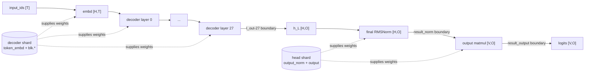

# Qwen3 decoder / LM head GGUF 分片与分段计时

本文针对当前源码版本 `a49a6a20bf45`。目标分成两件事：

1. 将一个 untied Qwen3 GGUF 按 tensor 语义写成 decoder shard 和 LM-head shard。
2. 两个 shard 仍作为一个完整模型加载，在同一张 GGML graph 中分别统计 embedding、每个 decoder layer、final RMSNorm 和 LM head 的同步分段 wall time，并与无回调的总耗时对比。

这里的两个 GGUF 是一个模型的两个存储 shard，不是两个可以各自运行的 Qwen3 模型。这个区别很重要：只拆文件不会自动拆 graph，也不会产生 hidden state 的跨进程传输。

## 1. 拆分边界

Qwen3 tensor 的加载入口在 `src/models/qwen3.cpp:15-46`。本工具采用下面的边界：

| shard | tensor 规则 | Qwen3-1.7B BF16 实测 |
| --- | --- | ---: |
| decoder | `token_embd.weight` + 全部 `blk.*` | 309 tensors，约 3.21 GiB 文件 |
| LM head | `output_norm.weight` + `output.weight` | 2 tensors，594 MiB 文件 |

309 的组成是 `1 + 28 * 11`。每个 Qwen3-1.7B decoder layer 有：

| tensor name | GGUF shape | 作用 |
| --- | ---: | --- |
| `blk.N.attn_norm.weight` | `[2048]` | attention 前 RMSNorm |
| `blk.N.attn_q.weight` | `[2048,2048]` | Q projection |
| `blk.N.attn_k.weight` | `[2048,1024]` | K projection，8 KV heads |
| `blk.N.attn_v.weight` | `[2048,1024]` | V projection，8 KV heads |
| `blk.N.attn_q_norm.weight` | `[128]` | per-head Q RMSNorm |
| `blk.N.attn_k_norm.weight` | `[128]` | per-head K RMSNorm |
| `blk.N.attn_output.weight` | `[2048,2048]` | attention output projection |
| `blk.N.ffn_norm.weight` | `[2048]` | FFN 前 RMSNorm |
| `blk.N.ffn_gate.weight` | `[2048,6144]` | SwiGLU gate projection |
| `blk.N.ffn_up.weight` | `[2048,6144]` | SwiGLU up projection |
| `blk.N.ffn_down.weight` | `[6144,2048]` | FFN down projection |

decoder shard 还包含 `[2048,151936]` 的 `token_embd.weight`；head shard 包含 `[2048]` 的 `output_norm.weight` 和 `[2048,151936]` 的 `output.weight`。

将 `output_norm.weight` 放进 head，是因为 graph 的真实边界为：

```text
h_L
  -> RMSNorm(output_norm.weight)
  -> MatMul(output.weight)
  -> logits
```

对应 `src/models/qwen3.cpp:143-156`。如果把 final RMSNorm 算在 decoder 一侧，也可以定义另一种边界，但文件分组和计时分组必须同时改变，不能一边按 pre-norm、一边按 post-norm。

### 1.1 计算公式

令：

- `T`：本次送入 graph 的 token 数。
- `O`：要求输出 logits 的 token 行数；正常 prefill 通常 `O=1`，decode 也为 `O=1`。
- `H`：hidden size；Qwen3-1.7B 为 2048。
- `V`：vocabulary size；该模型为 151936。

decoder shard 对应：

```text
X_0 = Embedding(input_ids)                         [H, T]

for l = 0 .. L-1:
    A_l = X_l + Attention_l(RMSNorm(X_l), pos, KV)
    X_(l+1) = A_l + W_down,l(
        SiLU(W_gate,l RMSNorm(A_l))
        elementwise_mul
        W_up,l RMSNorm(A_l)
    )

H_decoder = X_L                                    [H, O]
```

LM-head shard 对应：

```text
H_norm[:, o] = H_decoder[:, o] * r_o * gamma

r_o = 1 / sqrt(mean(H_decoder[:, o]^2) + eps)

logits = transpose(W_output) * H_norm               [V, O]
```

在 llama.cpp 的 GGML shape 顺序中，Qwen3-1.7B 的最后几项为：

```text
l_out-27            [2048, O, 1, 1]
output_norm.weight  [2048, 1, 1, 1]
result_norm         [2048, O, 1, 1]
output.weight       [2048, 151936, 1, 1]
result_output       [151936, O, 1, 1]
```

最后一层 attention 仍处理本轮全部 `T` 个 token 并写 KV。`src/models/qwen3.cpp:114-117` 随后按 output IDs 做 `GET_ROWS`，所以最后一层 FFN、final norm 和 LM head 只处理 `O` 行。这是正常 llama.cpp 推理路径，不是 benchmark 特殊裁剪。

## 2. 为什么不能直接得到两个独立模型

分片加载路径位于 `src/llama-model-loader.cpp:549-660`：

```text
decoder shard ----\
                   +-> weights_map -> one llama_model -> one GGML graph
head shard -------/
```

loader 会检查：

- 第一片 `split.no == 0`。
- 所有分片的 `split.count` 一致。
- tensor name 不重复。
- 合并后的 tensor 数等于 `split.tensors.count`。

然后 Qwen3 仍按 `src/models/qwen3.cpp:53-158` 构建一张完整 graph。文件边界不会成为执行边界。

不能把 head shard 单独交给 stock Qwen3 loader：它缺少所有 required `blk.*` tensor。也不能把 decoder hidden 填进另一个 stock Qwen3 context 的 `llama_batch.embd`，因为 `embd` 是第 0 层输入，第二个 context 会再次运行所有 decoder layer。

如果研究目标是真正的两个进程或两个 device graph，还需要新增 decoder-only graph 和 stateless head runner，并额外统计 hidden 的 D2H/H2D 或 IPC 成本。本实验先测量数值完全等价的单图边界，避免把一个错误的“双 context”结果当成模型拆分。

## 3. 工具文件

```text
examples/qwen3-staged-bench/
  split_qwen3_gguf.py       按 tensor name 重写两个 GGUF shard
  qwen3-staged-bench.cpp    graph 边界计时和无回调 baseline
  compare_concurrent.py     单 GGUF 与两 shard 的 server continuous-batching 对比
  CMakeLists.txt
```

分片脚本只接受：

- 单文件 GGUF。
- `general.architecture=qwen3`。
- untied output，即文件中存在独立 `output.weight`。
- 除 `token_embd.weight`、`blk.*`、`output_norm.weight`、`output.weight` 以外没有未知 tensor。

tied 模型中 `token_embd.weight` 同时充当 embedding 和 output projection，无法在不重复 tensor name 的情况下做两个互斥 shard，因此脚本会明确拒绝。

## 4. 构建和运行

### 4.1 构建 Release CPU benchmark

```bash
cmake -S . -B build-staged-bench \
  -DCMAKE_BUILD_TYPE=Release \
  -DGGML_CUDA=OFF \
  -DLLAMA_BUILD_EXAMPLES=ON

cmake --build build-staged-bench \
  --target llama-qwen3-staged-bench \
  -j 16
```

计时工具当前有意固定为 CPU。GGML eval callback 会在选中的 graph 边界调用 backend synchronize；CPU 上可以解释为分段 wall time，GPU 上则会改变异步流水和 CUDA graph 行为，不能当成无扰动 kernel profile。

### 4.2 生成两个 GGUF

```bash
.venv/bin/python \
  examples/qwen3-staged-bench/split_qwen3_gguf.py \
  qwen3-1.7b/qwen3-1.7B-BF16.gguf \
  qwen3-1.7b/staged/qwen3-1.7B-BF16-staged
```

输出：

```text
qwen3-1.7b/staged/
  qwen3-1.7B-BF16-staged-00001-of-00002.gguf  decoder
  qwen3-1.7B-BF16-staged-00002-of-00002.gguf  LM head
  qwen3-1.7B-BF16-staged.manifest.json
```

默认拒绝覆盖已有文件。只有确认目标文件可覆盖时才添加 `--force`。

脚本先在目标目录写唯一临时文件，关闭后重新读取两片并检查 tensor names 和 split metadata，最后才逐文件原子替换正式路径。输入文件、hard link、两个 shard、manifest 之间的路径冲突会在写入前拒绝；`--force` 安装失败时会尝试回滚原文件。

实测 manifest 摘要：

```text
total tensors:   311
decoder tensors: 309
decoder bytes:   3441389568
head tensors:    2
head bytes:      622338048
total bytes:     4063727616
```

### 4.3 检查分片

```bash
PYTHONPATH=gguf-py .venv/bin/python - <<'PY'
from gguf import GGUFReader

paths = [
    "qwen3-1.7b/staged/qwen3-1.7B-BF16-staged-00001-of-00002.gguf",
    "qwen3-1.7b/staged/qwen3-1.7B-BF16-staged-00002-of-00002.gguf",
]

for path in paths:
    reader = GGUFReader(path)
    value = lambda key: reader.get_field(key).contents()
    print(path)
    print("  tensors:", len(reader.tensors))
    print("  split:", value("split.no"), "/", value("split.count"))
    print("  total:", value("split.tensors.count"))
    print("  names:", [tensor.name for tensor in reader.tensors])
PY
```

实际摘要：

```text
shard 0: tensors=309, split.no=0, split.count=2, total=311
         first=token_embd.weight
shard 1: tensors=2,   split.no=1, split.count=2, total=311
         names=[output_norm.weight, output.weight]
```

### 4.4 执行 benchmark

下面命令会分别测量固定长度 prefill 和固定 KV 长度的单 token decode。命令参数以程序 `--help` 输出为准：

```bash
mkdir -p logs/qwen3_staged_bench

build-staged-bench/bin/llama-qwen3-staged-bench \
  --paths \
    qwen3-1.7b/staged/qwen3-1.7B-BF16-staged-00001-of-00002.gguf \
    qwen3-1.7b/staged/qwen3-1.7B-BF16-staged-00002-of-00002.gguf \
  --prompt-tokens 32 \
  --ctx-size 256 \
  --threads 8 \
  --warmup 3 \
  --prefill-iters 10 \
  --decode-iters 30 \
  --csv logs/qwen3_staged_bench/qwen3-1.7b-bf16.csv
```

prefill 每轮先清除 KV metadata，然后输入相同的 32 个 token。decode 先建立长度 32 的 KV，然后每轮在 position 32 计算同一个 token，计时后删除刚写入的 position 32，使每次 decode 的 KV 长度相同。

benchmark 默认拒绝覆盖已有 CSV，避免误删之前的测量结果。重复运行时请换一个输出名，或先明确处理旧 CSV。

## 5. 计时方法



计时回调只选择这些节点，不读取 tensor 数据：

```text
embd
l_out-0
l_out-1
...
l_out-(L-1)
result_norm
result_output
```

`ggml/src/ggml-backend.cpp:1737-1765` 的执行顺序为：

```text
ask=true 找到边界
  -> 计算上一个边界到当前边界的 graph view
  -> backend synchronize
  -> ask=false 记录时间
```

因此单次 instrumented 运行的时间定义为：

```text
t_embedding = ts(embd) - ts(graph_start)
t_layer[0]  = ts(l_out-0) - ts(embd)
t_layer[i]  = ts(l_out-i) - ts(l_out-(i-1))

t_decoder_layers = sum(t_layer[i])
t_decoder_shard  = t_embedding + t_decoder_layers
t_norm    = ts(result_norm) - ts(l_out-last)
t_lm_head = ts(result_output) - ts(result_norm)
t_head_shard = t_norm + t_lm_head
t_graph   = t_decoder_shard + t_head_shard

t_wall = time(llama_decode + llama_synchronize)
t_outside_stages = t_wall - t_graph
```

这里每个 `t_layer`、`t_norm`、`t_lm_head` 都是 boundary-synchronized stage wall time，不是硬件 kernel 的纯执行时间。它包含两个边界之间的 callback 扫描、graph view 构造/提交和 synchronize。大部分分段调度开销已经分摊进各 stage；`t_outside_stages` 只表示第一个和最后一个选中边界之外的 wall time，不能解释成“全部 runtime overhead”。尤其 final RMSNorm 只有约 0.03 ms，其数值很容易被边界调度成本主导。

另建一个配置相同但 `cb_eval=nullptr` 的 context 测 baseline wall time。这样有两种“总时间”：

| 名称 | 含义 |
| --- | --- |
| instrumented wall | 含每层 callback、graph 切段和同步，用于让各段可相加 |
| baseline wall | 完全不安装 callback，更接近正常 `llama_decode` 总耗时 |

两者不能混用。尤其不要用 `decoder + head` 除以 baseline 后宣称严格的 kernel 占比，因为 instrumented run 改变了 graph 提交粒度。

## 6. 实测结果

测试环境：Qwen3-1.7B BF16、Release CPU build、Intel Core i5-12600KF、8 threads、Flash Attention disabled、`n_ctx=256`。prefill 输入 32 tokens，只请求最后一行 logits；decode 在已有 32-token KV 上输入 1 token。结果保存在 `logs/qwen3_staged_bench/qwen3-1.7b-bf16.csv`。

### 6.1 两个 GGUF 对应阶段

下表使用同一批 instrumented samples 的 mean，因此各项可以相加：

| workload | decoder shard | head shard | graph sum | decoder 占 graph | head 占 graph |
| --- | ---: | ---: | ---: | ---: | ---: |
| prefill, `T=32,O=1` | 279.467 ms | 10.284 ms | 289.751 ms | 96.45% | 3.55% |
| decode, `T=1,O=1,KV=32` | 56.445 ms | 10.149 ms | 66.595 ms | 84.76% | 15.24% |

head shard 中还能继续拆为：

| workload | final RMSNorm mean | output matmul mean | head shard total |
| --- | ---: | ---: | ---: |
| prefill | 0.028 ms | 10.256 ms | 10.284 ms |
| decode | 0.027 ms | 10.122 ms | 10.149 ms |

这里 LM head 两次都约为 10 ms，因为两种 workload 都只有 `O=1`，实际执行的 output matmul 都是：

```text
[2048,151936] x [2048,1] -> [151936,1]
```

prefill 增长的主要是 decoder 内部的 `T=32` attention/FFN；LM head 不会对未请求 logits 的另外 31 行重复计算。

### 6.2 总时间

| workload | 无 callback baseline mean | instrumented wall mean | instrumented graph sum | selected stages 外部时间 |
| --- | ---: | ---: | ---: | ---: |
| prefill | 295.056 ms | 289.950 ms | 289.751 ms | 0.199 ms |
| decode | 66.241 ms | 66.763 ms | 66.595 ms | 0.169 ms |

prefill 的 baseline 和 instrumented 不是同一次执行，且 callback 将 graph 切成 31 个同步片段；本次 instrumented prefill 比 baseline 快约 1.7%，说明二者会受到 CPU frequency、cache 和 graph 分段的影响。因此两个 shard 的 96.45%/3.55% 只在 instrumented graph 内比较，不应强行套到 baseline。decode 两种 wall time 比较接近。

### 6.3 每个 decoder layer

下面使用 median，降低个别调度抖动的影响：

| layer | prefill median (ms) | decode median (ms) |
| ---: | ---: | ---: |
| 0 | 10.073 | 1.955 |
| 1 | 10.344 | 1.908 |
| 2 | 10.324 | 1.881 |
| 3 | 9.821 | 1.913 |
| 4 | 9.840 | 1.889 |
| 5 | 9.739 | 1.945 |
| 6 | 9.931 | 1.936 |
| 7 | 10.240 | 1.930 |
| 8 | 9.918 | 1.957 |
| 9 | 10.290 | 1.964 |
| 10 | 9.820 | 1.896 |
| 11 | 10.016 | 1.926 |
| 12 | 9.705 | 1.887 |
| 13 | 10.203 | 1.936 |
| 14 | 10.172 | 1.926 |
| 15 | 10.291 | 1.930 |
| 16 | 9.763 | 1.917 |
| 17 | 9.670 | 1.926 |
| 18 | 10.287 | 1.891 |
| 19 | 10.146 | 1.876 |
| 20 | 9.856 | 1.923 |
| 21 | 10.210 | 1.902 |
| 22 | 9.939 | 1.963 |
| 23 | 9.883 | 1.962 |
| 24 | 10.048 | 1.899 |
| 25 | 10.497 | 1.960 |
| 26 | 10.341 | 1.904 |
| 27 | 5.102 | 1.910 |

prefill 的 layer 27 明显更快，不是 tensor 缺失。Qwen3 在最后一层 attention 后执行 output-row gather；因此 layer 27 的 FFN 只处理 `O=1`，而 layer 0 到 26 仍处理 `T=32`。decode 本来就是 `T=O=1`，所以 28 层接近 1.9 ms。

### 6.4 分片数值完整性

对源 GGUF 和两个输出 shard 的 311 个 tensor 逐个比较 name、GGML type、shape、nbytes 和全部 data bytes：

```text
PASS tensors=311 bytes=4063727616
```

另外，benchmark 通过 `llama_model_load_from_splits()` 成功加载两片并完整运行 prefill/decode，证明这两个文件的 split metadata 和联合 tensor 集合满足 loader 校验。

## 7. 如何读 CSV 和日志

CSV 使用 long-form，每一行是某轮 workload 的一个 component：

```text
workload,mode,iteration,context_tokens,input_tokens,component,layer,time_us
```

`context_tokens` 是本轮输入前已经存在的 KV 长度；prefill 为 0，decode 为 32。`input_tokens` 是本轮 flat batch token 数；本例分别为 32 和 1。时间单位固定为微秒。

最重要的检查项：

1. `decoder_layers_total` 应接近 `sum(layer_i)`。
2. `decoder_shard_total` 应接近 `embedding + decoder_layers_total`。
3. `graph_sum` 应接近 `decoder_shard_total + final_norm + lm_head`。
4. normal prefill 和 decode 都只请求一行 logits，所以 LM head 的输入 shape 都是 `[H,1]`，其时间不随 prompt token 数线性增长。
5. prefill 的 decoder attention/FFN 处理更多 token，prompt 越长，decoder 占比通常越大。
6. decode 的 decoder 每次只有一个 query token，但要读取已有 KV；LM head 的大词表矩阵乘仍可能占明显比例。

## 8. 源码调用链

```text
split_qwen3_gguf.py
  -> GGUFReader
  -> tensor name 分组
  -> GGUFWriter
  -> split.no / split.count / split.tensors.count

qwen3-staged-bench
  -> llama_model_load_from_splits()
  -> llama_model_loader::llama_model_loader()
  -> 合并两个 shard 到 weights_map
  -> llama_model_qwen3::load_arch_tensors()
  -> llama_init_from_model()
  -> llama_decode()
  -> llama_model_qwen3::graph::graph()
  -> ggml_backend_sched_graph_compute_async()
  -> timing callback boundaries
```

关键源码位置：

| 内容 | 位置 |
| --- | --- |
| Qwen3 tensor 创建 | `src/models/qwen3.cpp:15-46` |
| Qwen3 decoder graph | `src/models/qwen3.cpp:53-142` |
| final norm 和 LM head | `src/models/qwen3.cpp:143-158` |
| public split-load API | `include/llama.h:500-517` |
| 多 GGUF 合并和校验 | `src/llama-model-loader.cpp:549-660` |
| callback 分段和同步 | `ggml/src/ggml-backend.cpp:1737-1765` |
| stock gguf-split 的切分规则 | `tools/gguf-split/gguf-split.cpp:35-69,256-293` |
| 语义 tensor 分组 | `examples/qwen3-staged-bench/split_qwen3_gguf.py:68-127` |
| split metadata / 校验 / 事务安装 | `examples/qwen3-staged-bench/split_qwen3_gguf.py:130-352` |
| graph boundary 计时器 | `examples/qwen3-staged-bench/qwen3-staged-bench.cpp:51-178` |
| 固定 prefill/decode workload | `examples/qwen3-staged-bench/qwen3-staged-bench.cpp:315-440` |
| baseline 与 instrumented context | `examples/qwen3-staged-bench/qwen3-staged-bench.cpp:531-654` |

## 9. 结果边界与下一步

- stock `llama-gguf-split` 只能按 tensor 数量或文件大小切分，不能按 tensor 名称语义切分，所以本实验使用独立 Python 工具。
- 两个 shard 必须一起加载。第二片不含完整 metadata，也不是 standalone LM-head model。
- 计时不包含首次模型文件读取时间；warmup 后主要反映 graph 执行。
- 当前结果用于 CPU 研究。GPU 应改用 backend event 或 profiler，并避免每层同步。
- 若要真正分成 decoder executable 和 head executable，需要新增 decoder-only graph、post-norm hidden 输出、stateless head graph、输出行映射和跨设备传输计时。这属于不同于 GGUF 存储分片的下一阶段设计。

单文件与两 shard 在 ConTRoL 异长请求、4 路 continuous batching 下的总体 wall-time 对比、运行脚本、AB/BA 原始结果和 mmap 对照见 `QWEN3_SPLIT_CONCURRENT_BENCH.md`。
