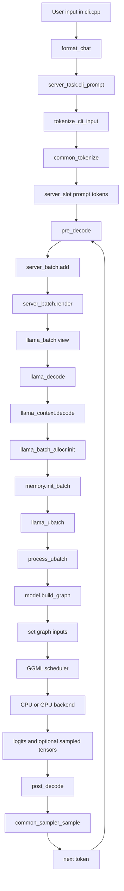

# CLI inference code walkthrough

本文以 `llama-cli` 的文本对话路径为主，追踪一次输入从 CLI 到模型计算、logits 和采样的实际代码。当前代码中，`tools/cli/cli.cpp` 不直接调用 tokenizer 或 `llama_decode()`，而是把请求交给 `server_context`，因此需要同时阅读 CLI、server 和 `src/` 三层。

本文重点解释以下计算步骤：

- attention mask
- input hidden states
- position input and RoPE
- KV cache
- `llama_decode()`、ubatch、GGML graph 和 backend scheduler

相关的请求调度总览见 [inference-scheduling.md](inference-scheduling.md)。

## 0. 官方文档对总体判断的支持范围

官方文档支持本文对两类框架运行流程的总体判断，但框架级说明不能替代对具体 tensor 的源码验证。

`examples/simple/simple.cpp` 只展示最小单请求 decode loop：构造一个 `llama_batch`，调用 `llama_decode()`，采样一个 token，再把该 token 作为下一轮 batch。它适合解释最小生成循环，但不会展示多 slot 调度、共享 batch、continuous batching 或跨请求 KV cache 组织。

`llama-server` 的[官方开发文档](https://github.com/ggml-org/llama.cpp/blob/master/tools/server/README-dev.md#batching)明确说明：`server_context` 维护一个跨 slots 共享的 batch；`update_slots()` 遍历 active slots，将可用的 prompt token 或上一轮 generated token 加入 batch；batch 填满或 slots 遍历完成后调用 `llama_decode()`。因此，下面这条路径是观察 llama-server continuous batching 的关键入口：

```text
update_slots()
  -> pre_decode()
  -> server_batch::render()
  -> llama_decode()
```

这里的“关键入口”是 server 调度层结论，不表示 `update_slots()` 是 llama.cpp 核心 API 的必要入口。`examples/simple` 等调用方可以直接构造 `llama_batch` 并调用 `llama_decode()`。

llama.cpp 的运行特点是轻量、多后端，并且 server 层能够直接观察 slot、`seq_id`、batch 和 KV cache 的组织方式。公共 API 将 `n_batch` 定义为提交给 `llama_decode()` 的 logical maximum batch size，将 `n_ubatch` 定义为 physical maximum batch size。因此，它适合沿着 `batch -> ubatch -> GGML graph -> backend` 分层阅读运行过程。这里的“适合阅读”是基于源码可观察性的比较判断，不是官方性能结论。

TensorRT-LLM 的[官方架构文档](https://nvidia.github.io/TensorRT-LLM/torch/arch_overview.html)将 Scheduler、KVCacheManager、ModelEngine 和 Decoder 分成独立运行组件；[Attention 文档](https://nvidia.github.io/TensorRT-LLM/features/attention.html)明确强调 in-flight batching、packed input、paged attention 和 fused attention kernel；[KV Cache 文档](https://nvidia.github.io/TensorRT-LLM/features/kvcache.html)进一步描述 block pool、跨请求复用、优先级淘汰和 offloading。

因此，不能简单判断 llama.cpp 在多并发上一定更优。更准确的比较是：llama.cpp 的优势在跨平台部署和源码可观察性；TensorRT-LLM 的目标则是在 NVIDIA GPU 上通过 packed input、融合 kernel、paged KV cache 和 iteration-level scheduling 提高 serving throughput。

| 观察维度 | llama.cpp | TensorRT-LLM |
| --- | --- | --- |
| 调度入口 | `update_slots()` 汇集 active slots，形成共享 logical batch | PyExecutor Scheduler 选择请求，KVCacheManager 准备资源，ModelEngine 执行 forward |
| batch 表示 | `llama_batch` 再按 `n_ubatch` 拆成 `llama_ubatch` | context 与 generation 请求可组成同一 in-flight batch，通常使用 packed tokens |
| attention 优化 | GGML graph 交给 CPU、CUDA、Metal 等 backend | 重点优化 NVIDIA GPU fused attention、paged attention 和 CUDA Graph |
| KV cache | 通过 sequence、position、cell/stream 和 graph input 组织 | 通过 request、block pool、paged KV 和跨请求 prefix reuse 组织 |
| 主要适用方向 | 跨平台部署、嵌入式集成、源码级流程学习 | NVIDIA GPU 上的大规模、高吞吐 serving |

后续源码阅读继续围绕五个变量展开：

1. attention mask
2. input hidden states
3. position embedding
4. KV cache
5. decode

官方文档能够确认框架级流程、组件边界和优化方向，但这些变量的创建位置、shape、dtype、更新时机以及进入 graph 或 kernel 的方式，仍需要逐函数结合源码验证。本文后续章节负责完成 llama.cpp 一侧的这部分验证；TensorRT-LLM 需要按具体 backend 和版本另行核对，不能把单一 attention backend 的实现泛化为整个框架。

## 1. 总体流程



### 1.1 CLI 层

用户输入和生成请求的入口在 `tools/cli/cli.cpp`：

| 代码 | 作用 |
| --- | --- |
| `tools/cli/cli.cpp:499` | 读取交互式输入或 `--prompt` |
| `tools/cli/cli.cpp:644-657` | 保存 user message，调用 `generate_completion()`，保存 assistant message |
| `tools/cli/cli.cpp:80-125` | 应用 chat template，构造 `server_task`，设置 `cli_prompt` 并投递到 server queue |
| `tools/cli/cli.cpp:424-426` | 在独立线程中运行 `server_context::start_loop()` |

关键点是：

```cpp
task.cli_prompt = chat_params.prompt;
task.cli = true;
rd.post_task({std::move(task)});
```

这段代码只负责提交任务。真正的 tokenize、batch 构造、decode 和 sampling 都在 server 线程中完成。

### 1.2 Tokenizer

CLI 任务到达 server 后，在 `tools/server/server-context.cpp:2216-2230` 的 `tokenize_cli_input()` 中被处理。纯文本路径调用：

```text
tokenize_cli_input
  -> tokenize_input_prompts
  -> tokenize_input_subprompt
  -> tokenize_mixed
  -> common_tokenize
  -> llama_tokenize
  -> llama_vocab::tokenize
```

对应代码位置：

- `tools/server/server-context.cpp:2216-2223`: CLI prompt 进入 tokenizer。
- `tools/server/server-common.cpp:735-782`: 处理字符串、token id 数组和混合输入。
- `common/common.cpp:1685-1704`: 分配结果数组，处理 tokenizer 返回的容量不足情况。
- `src/llama-vocab.cpp:4315-4324`: `llama_tokenize()` 转发到 `vocab->tokenize()`。

如果模型带有 multimodal projector，则 `tokenize_cli_input()` 会走 `process_mtmd_prompt()`，此时图片或音频 chunk 会以 embedding 输入进入后续 batch，不再是普通的 token id。

## 2. llama_batch 和 ubatch

### 2.1 server 先构造逻辑 batch

`server_batch` 是 server 层的临时 batch。它的生命周期和每次 `update_slots()` 对应：

- `tools/server/server-context.cpp:98-110`: 分配 `llama_batch` 和 token 暂存区。
- `tools/server/server-context.cpp:131-139`: `render()` 把暂存的 token、position、sequence id 和 output 标记写入 `llama_batch`。
- `tools/server/server-context.cpp:141-157`: `get_view()` 从逻辑 batch 中取一个连续窗口。
- `tools/server/server-context.cpp:2711-2798`: 每轮执行 `pre_decode() -> batch.render() -> decode() -> post_decode()`。

prefill 和 token generation 都使用同一个 `llama_decode()` API：

- prefill 时，batch 通常包含一段尚未处理的 prompt token。
- generation 时，每个 active sequence 通常向 batch 添加上一步采样出的一个 token。

在 prompt 完成时，`tools/server/server-context.cpp:3475-3487` 把最后一个 prompt token 标为 output，并记录 `slot.i_batch`。这样 decode 完成后，server 可以从对应 logits 行采样下一个 token。

### 2.2 core 层把逻辑 batch 拆成物理 ubatch

入口是 `src/llama-context.cpp:4058-4066`：

```cpp
int32_t llama_decode(llama_context * ctx, llama_batch batch) {
    const int ret = ctx->decode(batch);
    ...
}
```

实际逻辑在 `src/llama-context.cpp:1680-2000`：

1. `balloc->init()` 校验 token、sequence id、position 和 output 标志。
2. `memory->init_batch()` 根据 memory 类型和 `n_ubatch` 生成一组 ubatch。
3. 每次循环取 `mctx->get_ubatch()`。
4. 调用 `process_ubatch()` 构图并执行。
5. 从结果 tensor 异步复制 logits、embedding 或 backend sampling 结果。

普通 KV cache 的拆分在 `src/llama-kv-cache.cpp:698-733`：

```cpp
while (true) {
    auto ubatch = n_stream == 1
        ? balloc.split_simple(n_ubatch)
        : balloc.split_equal(n_ubatch, true, 0);
    ...
}
```

`split_simple()` 的实现位于 `src/llama-batch.cpp:474-505`，最终由 `ubatch_add()` 在 `src/llama-batch.cpp:747-841` 拷贝出独立的 token、embedding、position、sequence id 和 output 数组。

## 3. GGML graph 和 backend scheduler

`src/llama-context.cpp:1304-1373` 是一次 ubatch 的核心入口：

```text
memory_context.apply()
  -> graph_params()
  -> model.build_graph()
  -> graph reuse or graph allocation
  -> result.set_inputs()
  -> graph_compute()
```

关键位置：

- `src/llama-context.cpp:1305-1309`: 应用当前 ubatch 对 memory 的更新。
- `src/llama-context.cpp:1314-1337`: 生成 graph 参数；如果拓扑不可复用，调用 `model.build_graph()`。
- `src/llama-context.cpp:1347-1351`: 为 graph 分配 scheduler buffer。
- `src/llama-context.cpp:1354-1360`: 将本次 ubatch 的输入写入 graph input tensor。
- `src/llama-context.cpp:1364`: 调用 `graph_compute()`。
- `src/llama-context.cpp:2425-2451`: 调用 `ggml_backend_sched_graph_compute_async()`。

`llama_model::build_graph()` 位于 `src/llama-model.cpp:2276-2293`。它先调用每种模型架构自己的 `build_arch_graph()`，再追加 pooling、backend sampling 和输出层。

以 Llama 架构为例，模型图在 `src/models/llama.cpp:98-247` 构造。具体模型的计算差异应从对应的 `src/models/*.cpp` 的 `build_arch_graph()` 开始阅读。

GGML scheduler 的实际 backend 分配和执行位置：

- `ggml/src/ggml-backend.cpp:1013-1015`: `ggml_backend_sched_split_graph()`，给 graph node 分配 backend 并切分 subgraph。
- `ggml/src/ggml-backend.cpp:1072-1148`: 按已有 tensor/backend、相邻节点和 backend capability 扩展 backend assignment。
- `ggml/src/ggml-backend.cpp:1541-1725`: `ggml_backend_sched_compute_splits()`，处理跨 backend 的输入复制并执行每个 split。
- `ggml/src/ggml-backend.cpp:1889-1902`: `ggml_backend_sched_graph_compute_async()` 进入 scheduler compute。
- `ggml/src/ggml-backend.cpp:1677-1681`: 对每个 split 调用 `ggml_backend_graph_compute_async()`，最终进入 CPU、CUDA、Metal 或其他 backend 的实现。

因此，`llama_context::graph_compute()` 本身不实现矩阵乘法，它只是把已经构造好的 GGML graph 交给 scheduler。真正的 kernel 在 `ggml/src/ggml-*` 对应 backend 中。

## 4. 关键计算步骤的位置

### 4.1 Input hidden states

对于普通文本 token，token id 先在 graph 中通过 embedding table 查表，得到第一个 hidden state。核心代码是：

- 输入数据写入 graph input：`src/llama-graph.cpp:66-80` 的 `llm_graph_input_embd::set_input()`。
- 创建 token input、embedding input 和选择节点：`src/llama-graph.cpp:2130-2216` 的 `build_inp_embd()`。
- token embedding lookup：`src/llama-graph.cpp:2151-2156` 的 `ggml_get_rows(ctx0, tok_embd, inp->tokens)`。
- token embedding 和外部 vector embedding 的选择：`src/llama-graph.cpp:2180-2190`。

对 Llama 架构，`src/models/llama.cpp:108` 得到初始 `inpL`，随后每层循环在 `src/models/llama.cpp:126-228` 更新它：

```text
inpL
  -> attention norm
  -> Q/K/V projection
  -> RoPE
  -> attention
  -> residual add
  -> FFN norm and FFN
  -> residual add
  -> next layer inpL
```

`inpL` 就是每层的 input hidden states。`build_qkv()` 在 `src/llama-graph.cpp:1466-1539` 中把归一化后的 hidden state 投影成 `Qcur`、`Kcur` 和 `Vcur`。

对于已经由外部模块产生的 hidden state，例如部分 multimodal 或 MTP 路径，`llm_graph_input_embd_h::set_input()` 会在 `src/llama-graph.cpp:91-112` 直接把 `ubatch->embd` 写入 `h`。这条路径不经过普通 token embedding lookup。

### 4.2 Position input and position embedding

标准 Llama/Qwen decoder 通常没有单独的 learned position embedding lookup，而是把 position id 输入到 RoPE。代码分成两步：

1. 创建并写入 position input：

   - `src/llama-graph.cpp:2219-2230`: `build_inp_pos()` 创建 I32 position tensor。
   - `src/llama-graph.cpp:124-143`: `llm_graph_input_pos::set_input()` 写入 `ubatch->pos`。
   - 对 M-RoPE，`src/llama-graph.cpp:128-142` 将文本的一维 position 扩展为四维 position。

2. 在模型架构 graph 中应用 RoPE：

   - `src/models/llama.cpp:110-111`: 创建 `inp_pos`。
   - `src/models/llama.cpp:146-155`: 对 `Qcur` 和 `Kcur` 调用 `ggml_rope_ext()`。

```cpp
Qcur = ggml_rope_ext(ctx0, Qcur, inp_pos, rope_factors, ...);
Kcur = ggml_rope_ext(ctx0, Kcur, inp_pos, rope_factors, ...);
```

相对 position bucket 是另一条路径，输入构造在 `src/llama-graph.cpp:173-194`，普通 KV cache 的 bucket 数据由 `src/llama-kv-cache.cpp:1757-1778` 填充。具体是否使用 RoPE、relative position bucket 或 learned position embedding，需要看对应模型的 `src/models/*.cpp`。

### 4.3 Attention mask

attention mask 的代码不是一个单独的 GGML 算子，而是先在 host 侧填充一个 graph input tensor，再被 attention softmax 使用。

#### 普通 KV cache

- mask tensor 的 shape 在 `src/llama-graph.cpp:26-42` 的 `build_attn_inp_kq_mask()` 中创建。
- graph input 在 `src/llama-graph.cpp:467-484` 的 `llm_graph_input_attn_kv::set_input()` 中填充。
- 普通 KV cache 的实际填充入口是 `src/llama-kv-cache.cpp:1719-1750`。
- 核心规则在 `src/llama-kv-cache.cpp:1531-1678`：

  - 不同 sequence 的 cell 被 mask。
  - causal attention 下，`p0 > p1` 的未来 key 被 mask。
  - sliding window attention 根据 `is_masked_swa()` 被 mask。
  - ALiBi 不使用简单的 0，而是写入 `-abs(p0 - p1)` 作为 bias。
  - 可以访问的位置写入 `0`，不可访问的位置写入 `-INFINITY`。

核心判断可以概括为：

```cpp
if (!cells.seq_has(j, seq_id)) {
    goto skip;
}
if (causal && p0 > p1) {
    goto skip;
}
data[idst + j] = mask_keep; // 0
...
data[idst + j] = mask_drop; // -INFINITY
```

#### 无 KV cache 的 encoder 或 non-causal graph

`src/llama-graph.cpp:406-465` 的 `llm_graph_input_attn_no_cache::set_input()` 直接按 batch 内 token 的 sequence id 和 position 填 mask。它同样处理不同 sequence、future token 和 SWA，但 key/value 数量等于当前 batch 的 token 数量。

#### mask 在 attention 中的消费位置

- Flash Attention 路径：`src/llama-graph.cpp:2386-2408` 调用 `ggml_flash_attn_ext(..., kq_mask, ...)`。
- 普通 attention 路径：`src/llama-graph.cpp:2428-2465` 先计算 `K * Q`，然后在 `ggml_soft_max_ext(ctx0, kq, kq_mask, ...)` 中使用 mask，再计算 `V * softmax(KQ)`。

### 4.4 KV cache

KV cache 的抽象接口在 `src/llama-memory.h:50-91`。KV cache 是 memory 的一种实现，不同模型还可能使用 recurrent、hybrid、SWA 或 DSA memory。

普通 KV cache 的主要路径如下：

```text
llama_context::decode
  -> memory->init_batch
  -> llama_kv_cache::prepare
  -> memory_context.apply
  -> build_attn_inp_kv
  -> build_attn
  -> cpy_k / cpy_v
  -> get_k / get_v
```

对应代码：

- `src/llama-context.cpp:1765-1771`: 处理 pending memory update，并初始化当前 batch 的 memory context。
- `src/llama-kv-cache.cpp:698-733`: 生成 ubatch 并调用 `prepare()`，为每个 token 找 cache slot。
- `src/llama-kv-cache.cpp:1093-1141`: `apply_ubatch()` 更新 cell 的 position、sequence id 和覆盖关系。
- `src/llama-graph.cpp:2575-2605`: 创建 K index、V index 和 KQ mask 等 graph input。
- `src/llama-graph.cpp:2641-2647`: 将当前层的 `Kcur` 和 `Vcur` 写入 KV cache。
- `src/llama-graph.cpp:2650-2656`: 从 KV cache 取得历史 K/V，并进入 attention。
- `src/llama-kv-cache.cpp:1295-1383`: `cpy_k()` 和 `cpy_v()` 使用 `ggml_set_rows()` 写 cache。
- `src/llama-kv-cache.cpp:1243-1293`: `get_k()` 和 `get_v()` 创建指向 cache storage 的 view。

这里的关键语义是：当前 token 产生的 K/V 先写入 cache，attention 再读取包含历史 token 和当前 token 的 K/V view。cache 本身不是每次 decode 都重新计算的 hidden state，而是跨 decode 调用保留的 memory。

### 4.5 Decode、logits 和 sampling

`llama_decode()` 同时覆盖 prompt evaluation 和 token generation。一次调用内部的主要计算位置是：

- `src/llama-context.cpp:1680-1811`: 输入校验、batch allocator、memory context 和输出 buffer。
- `src/llama-context.cpp:1822-1843`: 遍历每个 ubatch 并调用 `process_ubatch()`。
- `src/llama-context.cpp:1881-1901`: 从 graph 的 `t_logits` 异步复制 logits 到 context 的 host buffer。
- `src/models/llama.cpp:231-246`: 最后一层 norm 和 lm head，生成 `res->t_logits`。
- `src/llama-graph.cpp:1215-1257`: 将 logits、embedding 和 backend sampling outputs 标记为 graph outputs。

server 在 `llama_decode()` 返回后进入 `post_decode()`：

- `tools/server/server-context.cpp:3652-3725`: 找到当前 slot 对应的 logits 行，调用 `common_sampler_sample()`。
- `common/sampling.cpp:540-621`: 同步 context，读取 logits，优先处理 backend sampler，否则执行 CPU sampler chain。
- `tools/server/server-context.cpp:3727-3755`: 接受采样 token、转成 text、检查停止条件并生成响应。

下一轮 `pre_decode()` 会在 `tools/server/server-context.cpp:2991-2995` 通过 `slot.handle_last_sampled_token(batch)` 把新 token 加回 batch，于是流程重新进入 `llama_decode()`。

## 5. 关键代码注释的含义

| 原代码位置 | 原注释或符号 | 含义 |
| --- | --- | --- |
| `src/models/llama.cpp:110-111` | `inp_pos - contains the positions` | `inp_pos` 不是结果 embedding，而是供 RoPE 使用的 position id tensor。 |
| `src/llama-context.cpp:1837-1839` | `needs to happen before the graph is built` | `n_outputs` 会影响输出 tensor 的 shape 和 graph topology，所以必须在构图前统计。 |
| `src/llama-graph.cpp:104-111` | hidden state is provided as an embedding | 当前 `llama_ubatch` 没有单独的 hidden-state 字段，外部 hidden state 暂时复用 `embd` 字段传递。 |
| `src/llama-graph.cpp:2632-2637` | nodes are added to the graph together | 将 Q/K/V 一起加入 graph，减少 scheduler 重新排序和 backend split 的机会。 |
| `src/llama-graph.cpp:2641-2647` | `store to KV cache` | 这一步是把当前层新产生的 K/V 写入持久 memory，不是普通的临时 tensor copy。 |
| `src/llama-graph.cpp:2652-2656` | `get_k()` and `get_v()` | 读取历史 cache 的 view，供当前 query 做 attention。 |
| `src/llama-kv-cache.cpp:1641-1645` | `mask future tokens` | causal attention 的判断，key 的 position 大于 query position 时写入 `-INFINITY`。 |
| `src/llama-context.cpp:1321-1325` | synchronize before `set_inputs` | graph 复用且启用 pipeline parallel 时，必须确认 GPU 不再读取旧 input tensor，才能覆盖本轮输入。 |
| `src/llama-context.cpp:2444-2447` | `graph_compute_async` | 这里提交异步 graph 执行；sampling 前的 `llama_synchronize()` 会等待 backend 完成。 |

## 6. 建议的阅读顺序

如果要继续深入某个具体模型，建议按以下顺序阅读：

1. `tools/cli/cli.cpp:80-125` 和 `tools/cli/cli.cpp:499-657`，确认 CLI 只负责构造任务和消费结果。
2. `tools/server/server-context.cpp:2216-2230`，确认 CLI prompt 如何 tokenize。
3. `tools/server/server-context.cpp:2711-2798` 和 `tools/server/server-context.cpp:2991-3487`，确认 server batch 如何形成。
4. `src/llama-context.cpp:1680-2000`，确认 batch 如何进入 ubatch 和 graph。
5. `src/models/llama.cpp:98-247`，以 Llama 架构为例看 hidden state、RoPE、attention、FFN 和 logits。
6. `src/llama-graph.cpp:2363-2496`，看 attention 数学算子和 mask 的消费位置。
7. `src/llama-kv-cache.cpp:1093-1755`，看 cache slot、K/V 写入和 mask 数据。
8. `ggml/src/ggml-backend.cpp:1013-1725`，看 graph 如何分配到 CPU/GPU 并执行。

注意：`src/models/llama.cpp` 只是一个代表性 decoder 实现。仓库支持很多模型架构，实际 position encoding、attention 类型和 memory 类型可能不同；遇到具体模型时，应从该模型对应的 `build_arch_graph()` 进入，而不是假设所有模型都使用同一套 QKV 或 KV cache 逻辑。
