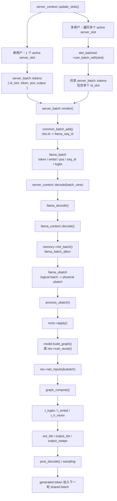
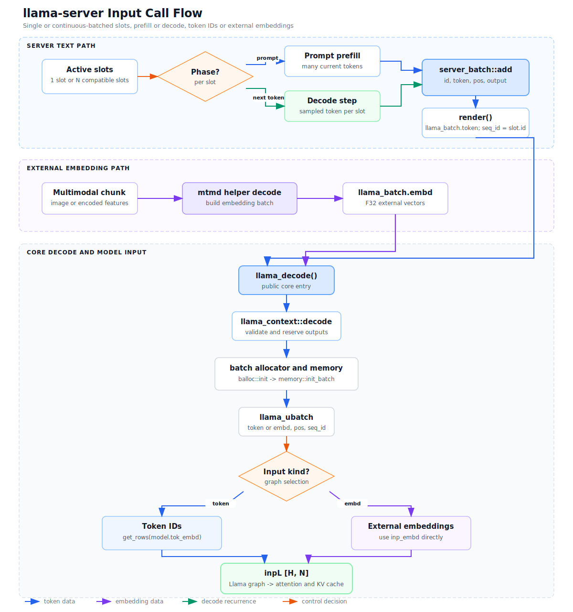
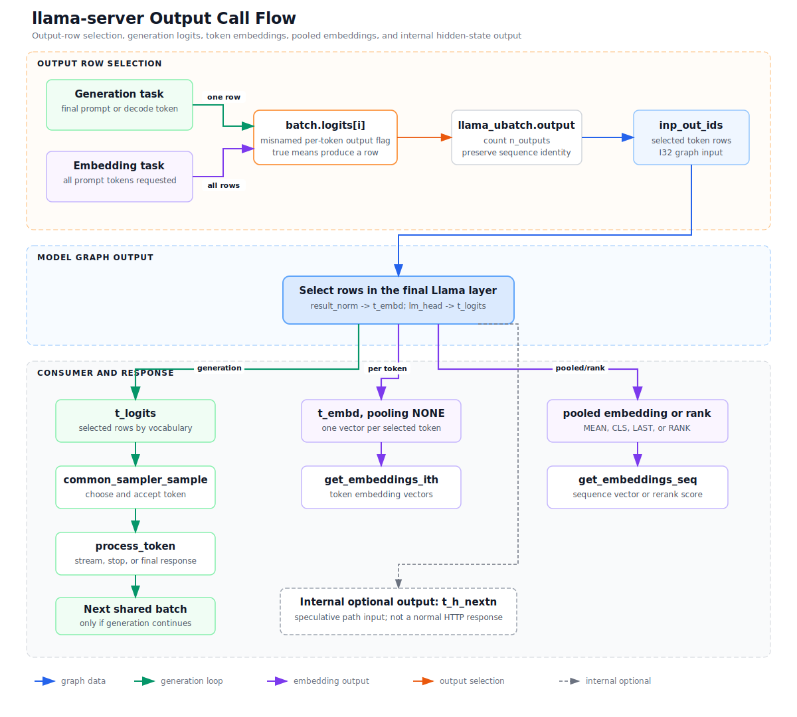
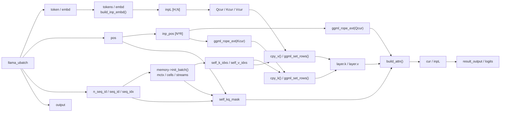

# llama.cpp 单用户与多用户推理变量流程

## 结论

在 `llama-server` 中，单用户与多用户使用相同的核心函数调用链。区别主要发生在 `server_context::update_slots()`：

```text
单用户：1 slot  -> 1 shared batch -> 1..n ubatch -> graph
多用户：n slots -> 1 shared batch -> 1..n ubatch -> graph
```

多用户不是“每个用户各调用一次模型”，而是将多个兼容 slot 的 token 放入一个 logical batch。每个 token 携带 `seq_id`，core 层用它隔离 position、attention mask 和 KV cache。logical batch 超过 `n_batch` 或 physical batch 超过 `n_ubatch` 时继续切分。

如果比较 `llama-simple` 和 `llama-server`，两者上层入口不同，但都会在 `llama_decode()` 汇合。

## 变量符号

GGML shape 按 `ne[]` 顺序表示：

```text
N   = ubatch.n_tokens
S   = cparams.kv_unified ? 1 : ubatch.n_seqs_unq
T   = N / S
M   = mctx->get_n_kv()
H   = hparams.n_embd
D   = head dimension
Hq  = n_head
Hkv = n_head_kv
R   = n_pos_per_embd
O   = n_outputs
V   = vocabulary size
```

## 单用户与多用户调用流程



关键入口：

- [`server_context::update_slots()`](../../tools/server/server-context.cpp)
- [`llama_context::decode()`](../../src/llama-context.cpp)
- [`llama_context::process_ubatch()`](../../src/llama-context.cpp)

## Input and output scenarios

Scope for the diagrams below:

```text
revision: c528416388b6363d2781d8b82a59d0fba4968740
model path: standard Llama decoder graph
server path: llama-server with one slot or continuous batching
phases: prompt prefill and ordinary one-token decode
outputs: generation, token embedding, pooled embedding, rerank, internal next-N state
excluded: speculative multi-token acceptance details and encoder-only models
```

The three independent dimensions are:

1. The server phase decides whether the current input is a prompt chunk or a
   previously sampled token.
2. The core input type decides whether `build_inp_embd()` performs a token-table
   lookup or consumes caller-provided embeddings.
3. The output flags and context mode decide which token rows survive the final
   layer and how the caller consumes them.

Do not read `llama_batch.logits[i]` as "return logits only." In this path it is a
per-token output flag shared by logits and embeddings. The allocator copies it
to `llama_ubatch.output`, and `inp_out_ids` turns the true entries into graph row
indices (`src/llama-batch.cpp:120`, `src/llama-batch.cpp:790`,
`src/llama-graph.cpp:216`).

### Scenario matrix

| Scenario | Current input | Output rows | Consumer and next action |
| --- | --- | --- | --- |
| Generation prefill | Text prompt chunk, possibly several tokens per slot | The server initially adds prompt tokens with output false, then marks the final prompt token true (`tools/server/server-context.cpp:3430`, `tools/server/server-context.cpp:3482`) | Final prompt logits are sampled; the slot changes from prompt processing to generation (`tools/server/server-context.cpp:3704`, `tools/server/server-context.cpp:3724`) |
| Generation decode | One sampled token per ordinary active slot | The sampled token is added with output true (`tools/server/server-context.cpp:448`, `tools/server/server-context.cpp:454`) | Logits -> sampler -> token processing -> next shared batch if the request continues (`tools/server/server-context.cpp:3724`, `tools/server/server-context.cpp:3755`, `tools/server/server-context.cpp:2993`) |
| Token embeddings | Prompt tokens with `slot.need_embd()` true | Every prompt token is an output row; `cparams.embeddings` also makes core `output_all` true (`tools/server/server-context.cpp:3433`, `src/llama-context.cpp:1702`) | `llama_get_embeddings_ith()` returns one vector per selected token (`tools/server/server-context.cpp:2153`) |
| Pooled embeddings | Same prompt token input, pooling type MEAN, CLS, or LAST | All prompt states participate, then the graph/context produces one sequence result | `llama_get_embeddings_seq()` returns one vector for the slot sequence (`src/llama-context.cpp:1934`, `tools/server/server-context.cpp:2155`) |
| Rerank | Same prompt input with pooling type RANK | Sequence-level rank output | `send_rerank()` reads the sequence embedding and returns its first value as the score (`tools/server/server-context.cpp:2180`, `tools/server/server-context.cpp:2203`) |
| Multimodal external embeddings | An encoded image/audio chunk becomes `llama_batch.embd`; it does not enter the ordinary shared text-token `server_batch` | The helper sets output flags false for the chunk (`tools/mtmd/mtmd-helper.cpp:202`) | The MTMD helper invokes `llama_decode()` directly, updates the same sequence memory, then text prompt processing continues (`tools/mtmd/mtmd-helper.cpp:232`, `tools/mtmd/mtmd-helper.cpp:304`, `tools/server/server-context.cpp:3405`, `tools/server/server-context.cpp:3411`) |
| Direct core API with `batch.logits == nullptr` | Token IDs or external embeddings | Non-embedding mode defaults to the last token; embedding mode forces all tokens (`src/llama-batch.cpp:120`, `src/llama-batch.cpp:121`, `src/llama-context.cpp:1702`) | The caller reads logits or embeddings through the public getter matching its context mode |

For multi-user execution, these rows are not concatenated into one user result.
Compatible slots share compute, but `server_batch::render()` writes `slot.id` as
the token sequence ID (`tools/server/server-context.cpp:136`). Each slot keeps
its own `i_batch`, and the context records a mapping from original batch token
index to output-buffer row (`src/llama-context.cpp:2015`).

### Input call flow

The text path and external-embedding path meet at `llama_decode()`, not at the
ordinary server token batch. Text prefill and decode tokens can share the same
`server_batch`; the MTMD helper constructs an embedding batch and calls the core
separately.



[PNG version](images/llama-server-input-call-flow.png)

Source-backed edges:

```text
compatible slots
  -> server_slot::can_batch_with()                 tools/server/server-context.cpp:388
  -> server_batch::add()                           tools/server/server-context.cpp:104
  -> server_batch::render()                        tools/server/server-context.cpp:131
  -> llama_decode()                                tools/server/server-context.cpp:3562
  -> llama_context::decode()                       src/llama-context.cpp:1680
  -> llama_batch_allocr::init()                    src/llama-context.cpp:1731
  -> memory->init_batch()                          src/llama-context.cpp:1771
  -> llama_context::process_ubatch()               src/llama-context.cpp:1843

token input
  -> inp_tokens                                    src/llama-graph.cpp:2138
  -> ggml_get_rows(model.tok_embd, inp_tokens)     src/llama-graph.cpp:2155
  -> inpL                                          src/models/llama.cpp:108

external embedding input
  -> llama_batch.embd                              tools/mtmd/mtmd-helper.cpp:232
  -> inp_embd                                      src/llama-graph.cpp:2143
  -> graph input selection                        src/llama-graph.cpp:2190
  -> inpL                                          src/models/llama.cpp:108
```

The specialized MTP hook can carry both token and embedding data. The diagram
shows the ordinary mutually exclusive token-lookup and external-embedding
branches; it does not generalize that simplification to the MTP hook
(`src/llama-context.cpp:1681`).

### Output call flow

Output selection happens before the final model rows are copied to host memory.
The standard Llama graph uses `inp_out_ids` at the last layer, exposes normalized
hidden states as `t_embd`, and applies the LM head to produce `t_logits`
(`src/models/llama.cpp:124`, `src/models/llama.cpp:174`,
`src/models/llama.cpp:236`, `src/models/llama.cpp:240`).



[PNG version](images/llama-server-output-call-flow.png)

The consumer branches are:

```text
generation
  -> t_logits                                      src/llama-context.cpp:1881
  -> host logits, when raw logits are needed       src/llama-context.cpp:1890
  -> common_sampler_sample()                       tools/server/server-context.cpp:3724
  -> process_token()                               tools/server/server-context.cpp:3755
  -> next shared batch, if continuing              tools/server/server-context.cpp:2993

token embeddings, pooling NONE
  -> t_embd                                        src/llama-context.cpp:1882
  -> per-token extraction                          src/llama-context.cpp:1912
  -> llama_get_embeddings_ith()                    src/llama-context.cpp:887

pooled embeddings, MEAN / CLS / LAST
  -> sequence extraction by seq_id                 src/llama-context.cpp:1934
  -> llama_get_embeddings_seq()                    src/llama-context.cpp:908

rank output
  -> n_cls_out values per sequence                 src/llama-context.cpp:1947
  -> server rerank score                           tools/server/server-context.cpp:2203

internal next-N hidden state
  -> t_h_nextn                                     src/llama-context.cpp:1883
  -> optional speculative-path buffer              src/llama-context.cpp:1973
```

For an embedding task, prompt completion is terminal: the server sends the
embedding and releases the slot instead of entering the sampling loop
(`tools/server/server-context.cpp:3689`, `tools/server/server-context.cpp:3690`). For a generation task, the final prompt
output row initializes sampling, and each accepted token becomes the next
decode input.

## 单用户与多用户的变量差异

| 项目 | 单用户 | 多用户 |
| --- | --- | --- |
| Server slot | 一个 `slot.id` | 多个兼容的 `slot.id` |
| `llama_batch.seq_id` | 一个 sequence | 多个 sequence |
| Core 调用链 | 相同 | 相同 |
| Hidden states | `[H, N]` | `[H, N]`，`N` 是当前 ubatch 的 token 总数 |
| Position | 当前 sequence 的 position | 每个 sequence 独立维护 position |
| Unified KV | 共享 cell pool 中一个 sequence 的 cells | 多个 sequence 共享同一 cell pool |
| Non-unified KV | 一个 stream | 多个 stream |
| Attention mask | position/causal 条件 | position/causal 条件加 `seq_id` 隔离 |
| Decode | shared batch | shared batch，不是每用户一次 |

若多 slot 的模型配置、LoRA 等条件不兼容，`slot_batched->can_batch_with(slot)` 会阻止它们进入同一个 shared batch。

## 五类变量的总关系



## 1. Attention mask

### 变量名

```text
self_kq_mask
kq_mask
attn_inp_kq_mask
```

### 创建与填充

```text
build_attn_inp_kq_mask(ctx, mctx, ubatch, cparams)
-> llama_kv_cache::set_input_kq_mask()
```

```text
shape = [M, T, 1, S]
dtype = cparams.flash_attn ? F16 : F32
```

填充时关注：

```text
seq_id
seq_idxs
cells
p0          // KV token position
p1          // query token position
mask_keep   // 0
mask_drop   // -INFINITY
```

条件：

```text
cache cell 是否有效
cells.seq_has(j, seq_id)
causal: p0 > p1
SWA window
M-RoPE position
ALiBi distance
```

消费路径：

```text
Flash Attention:
ggml_flash_attn_ext(q, k, v, kq_mask, ...)

Non-Flash Attention:
ggml_mul_mat(k, q)
-> ggml_soft_max_ext(kq, kq_mask, ...)
-> ggml_mul_mat(v, kq)
```

源码：

- [`build_attn_inp_kq_mask()`](../../src/llama-graph.cpp)
- [`llama_kv_cache::set_input_kq_mask()`](../../src/llama-kv-cache.cpp)

## 2. Position / RoPE

### 变量链

```text
server_batch::token.pos
-> llama_batch.pos
-> llama_ubatch.pos
-> llm_graph_input_pos::pos
-> inp_pos
-> ggml_rope_ext()
```

```text
ubatch.pos = [N * R]
inp_pos    = [N * R], I32
Qcur       = [D, Hq, N]
Kcur       = [D, Hkv, N]
```

LLaMA 不将 position embedding 直接加到 `inpL`，而是对 Q/K 执行 RoPE：

```cpp
Qcur = ggml_rope_ext(..., inp_pos, ...);
Kcur = ggml_rope_ext(..., inp_pos, ...);
```

`batch.pos == nullptr` 时，batch allocator 可以基于 `memory->seq_pos_max(seq_id) + 1` 自动生成 position。

M-RoPE 使用 `n_pos_per_embd` 个 position section；文本输入广播 position，图像 embedding 保留各 section 的 position。

源码：

- [`llama_batch_allocr`](../../src/llama-batch.cpp)
- [`llm_graph_input_pos`](../../src/llama-graph.cpp)
- [LLaMA graph](../../src/models/llama.cpp)

## 3. Input hidden states

### 输入变量

```text
batch.token / batch.embd
ubatch.token / ubatch.embd
tokens / embd
```

### Hidden-state 变量

```text
cur
inpL
inpSA
ffn_inp
```

Token 路径：

```text
tokens [N], I32
-> ggml_get_rows(tok_embd, inp->tokens)
-> inpL [H, N]
```

External embedding 路径：

```text
embd [n_embd_inp, N], F32
-> inpL [H, N]
```

每层关注：

```text
inpL
attn_norm
Qcur / Kcur / Vcur
attn_out
ffn_inp
ffn_out
l_out
result_norm
result_output
```

Shape：

```text
inpL      = [H, N]
Qcur      = [D, Hq, N]
Kcur/Vcur = [D, Hkv, N]
logits    = [V, O]
```

源码：

- [`llm_graph_context::build_inp_embd()`](../../src/llama-graph.cpp)
- [LLaMA hidden-state loop](../../src/models/llama.cpp)

## 4. KV cache

### 核心对象

```text
memory
llama_kv_cache
mctx
llama_kv_cache_context
```

### 元数据

```text
v_cells
v_heads
seq_to_stream
slot_info
sinfo.strm
sinfo.idxs
```

### Tensor 与 graph input

```text
layer.k / layer.v
cache_k_l%d / cache_v_l%d
self_k_idxs / self_v_idxs
Kcur / Vcur
```

```text
K cache = [n_embd_k_gqa, kv_size, n_stream_alloc]
V cache = [n_embd_v_gqa, kv_size, n_stream_alloc]

n_stream_alloc = cparams.kv_unified ? 1 : n_seq_max
```

生命周期：


Continuous batching 不是在每轮临时拼接多个 KV tensor，而是：

```text
共享预分配 KV cell pool
+ 每个 cell 的 sequence metadata
+ seq_id-aware attention mask
```

源码：

- [`llama_kv_cache`](../../src/llama-kv-cache.cpp)
- [`build_attn_inp_kv_impl()`](../../src/llama-graph.cpp)

## 5. Decode

### Server 变量

```text
server_batch batch
llama_batch batch_view
n_batch
off
n_tokens
```

### Core 变量

```text
llama_batch_allocr balloc
llama_memory_context_ptr mctx
llama_ubatch ubatch

n_tokens_all
n_outputs_all
n_tokens_prev
n_outputs_prev

gf_res_prev
res
gf

t_logits
t_embd
t_h_nextn

out_ids
output_ids
output_swaps
```

控制流：

```text
update_slots()
-> pre_decode()
-> batch.render()
-> server_context::decode(batch_view)
-> llama_decode()
-> llama_context::decode()
-> memory->init_batch()
-> mctx->get_ubatch()
-> process_ubatch()
-> mctx->next()
-> post_decode()
```

`process_ubatch()`：

```text
mctx->apply()
-> res->can_reuse(gparams) 或 model.build_graph(gparams)
-> res->set_inputs(&ubatch)
-> graph_compute()
```

源码：

- [`server_context`](../../tools/server/server-context.cpp)
- [`llama_context::decode()` 和 `process_ubatch()`](../../src/llama-context.cpp)

## llama.cpp 中值得关注的操作

| 操作 | 变量/函数 |
| --- | --- |
| Logical batch 与 physical ubatch 分离 | `n_batch`, `n_ubatch`, `llama_batch_allocr` |
| Slot ID 作为 sequence ID | `slot.id -> llama_seq_id` |
| Unified KV cache | `cparams.kv_unified`, `n_stream = 1` |
| Non-unified KV streams | `n_stream = n_seq_max` |
| KV 长度 padding | `get_n_kv()`, `n_pad` |
| 相同 sequence 的 mask 复用 | `seq_srct`, `seq_idxs` |
| Flash Attention mask 使用 F16 | `cparams.flash_attn` |
| 非 Flash Attention 的 V cache 特殊布局 | `layer.v` |
| QKV fused projection | `layer.wqkv` |
| CUDA RoPE 与 KV set-rows 融合 | `ggml_cuda_should_fuse_rope_set_rows()` |
| Graph 复用 | `res->can_reuse(gparams)` |
| 只选择需要输出的 token rows | `inp_out_ids`, `n_outputs` |
| 输出顺序恢复 | `out_ids`, `output_ids`, `output_swaps` |
| 多 slot 兼容性检查 | `slot_batched->can_batch_with(slot)` |

## Debug 观察顺序

```text
server_batch.tokens
-> llama_batch.seq_id / pos
-> llama_ubatch
-> mctx / v_cells / v_heads
-> inp_pos
-> inpL
-> Qcur / Kcur / Vcur
-> self_kq_mask
-> layer.k / layer.v
-> t_logits
```

配套断点与 VS Code 配置参见 [`vscode-inference-debugging.md`](vscode-inference-debugging.md)。
