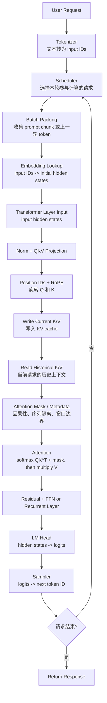
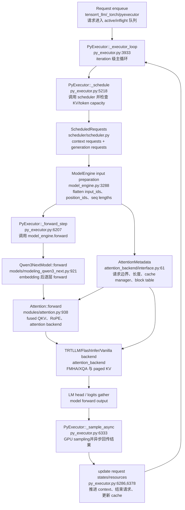
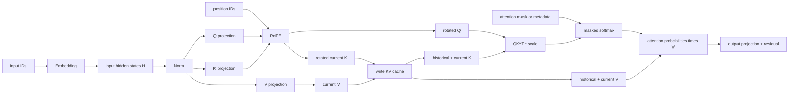
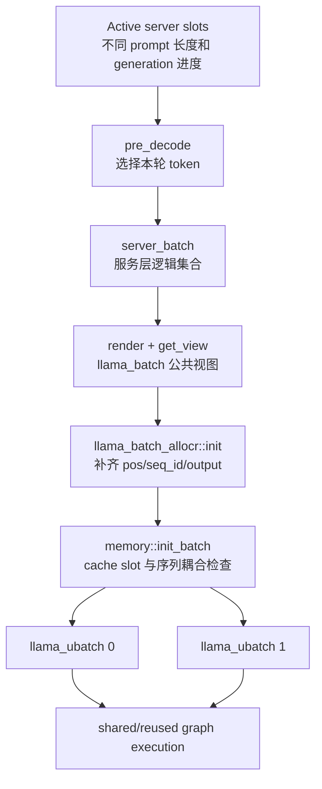
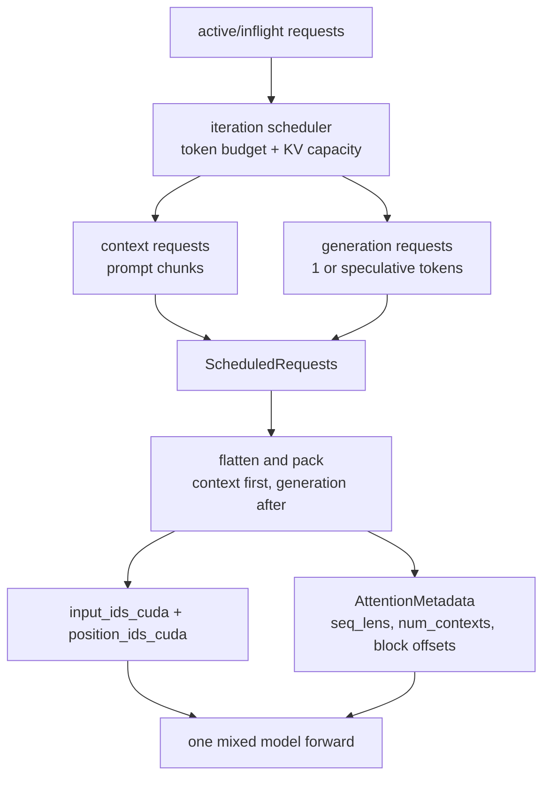

# llama.cpp 与 TensorRT-LLM 五个推理核心变量源码分析

## 0. 文档范围与阅读约定

本文从当前工作区源码出发，追踪以下五个核心对象在推理链路中的产生、传递、消费和性能影响：

1. attention mask
2. input hidden states
3. position embedding
4. KV cache
5. decode

源码基线：

- llama.cpp: `c528416388b6363d2781d8b82a59d0fba4968740`
- TensorRT-LLM: `5344a0ad729e3411c14a1ddac65c39f6d0050824`

需要先明确三个约定：

1. 文中的 `[T, H]`、`[Tq, Tkv]` 等是便于推导的逻辑形状；源码中的物理维度顺序、分块方式和量化布局可能不同。
2. `decode` 有两种含义：`llama_decode()` 是可以同时执行 prompt prefill 和 generation decode 的 API；generation decode 才是通常所说的逐 token 阶段。
3. 当前工作区的 TensorRT-LLM 已经移除 TensorRT engine backend，PyTorch 是唯一执行后端，见 [release-notes.md](../../TensorRT-LLM/docs/source/release-notes.md#L29)。本文分析当前 `_torch/pyexecutor`，不沿用旧版 `trtllm-build -> engine.execute` 调用链。

Qwen3.5 还有一个重要特例：它不是每层都执行标准 softmax attention。当前两套实现都把它建模为 Full Attention 与 Gated Delta Net/线性循环层混合的网络。因此：

- Full Attention 层使用 Q/K/V、RoPE、attention mask 和 KV cache。
- 线性循环层使用 convolution/recurrent state，不产生同样的 `QK^T` 矩阵，也不使用同样的 KV cache。

后文提到 Attention、mask 和 KV cache 时，默认指 Qwen3.5 的 Full Attention 层；循环层会单独标注。

---

# 1. 一个 token 从输入到输出的完整链路

## 1.1 逻辑数据流



五个核心对象并不是同一时刻产生：

| 对象 | 主要产生阶段 | 主要消费阶段 | 生命周期 |
|---|---|---|---|
| input hidden states | embedding 或上一 Transformer 层 | QKV 投影、FFN、LM head | 每层每轮重新产生 |
| position IDs / position embedding | batch 构造；RoPE 在 Attention 前计算 | Q、K 旋转 | position IDs 每轮输入，旋转结果随 Q/K 存在 |
| attention mask | 根据序列位置、请求身份、窗口策略生成，或编码为 metadata | softmax/FMHA kernel | 每轮或每个 graph shape 更新 |
| KV cache | 每层当前 token 的 K/V 投影后写入 | 当前及未来轮次 Attention | 跨 decode iteration 持久存在 |
| decode | scheduler 选出 generation 请求后触发 | 整个模型 forward 和 sampler | 每生成一步重复一次，推测解码时可一次处理多个候选 token |

## 1.2 Prefill 阶段

Prefill 输入一个 prompt 或 prompt chunk。设本轮某序列的新 query token 数为 `Tq > 1`，典型计算为：

```text
input IDs [Tq]
  -> embedding [Tq, H]
  -> every layer computes Q/K/V for all Tq tokens
  -> causal attention among the new tokens and any reused prefix KV
  -> append Tq K/V entries to cache
  -> keep logits needed by the caller, normally the last prompt token
```

这一阶段的矩阵乘法具有较大的 `M=Tq`，通常更容易利用 GPU Tensor Core，性能指标重点是 TTFT 和 prompt tokens/s。

## 1.3 Generation decode 阶段

普通自回归 decode 中，每个活跃序列每轮只加入上一步生成的一个 token：

```text
new token [1]
  -> hidden state [1, H]
  -> current Q/K/V
  -> append current K/V to cache
  -> Q reads all historical cached K/V
  -> produce one logits row
  -> sample one next token
```

它避免重新计算历史 token 的 K/V，但每一步仍要读取越来越长的 cache。小 batch 下 GEMM 规模小、KV 和权重读取占比高，通常更偏内存带宽和 kernel launch 延迟受限。指标重点是 inter-token latency、单请求 tokens/s 和系统总 output tokens/s。

## 1.4 Continuous batching 在哪里介入

Continuous batching 位于“完成上一轮采样”和“构造下一轮模型输入”之间。每个 iteration 都重新决定：

- 哪些新请求进入 prefill。
- 哪些旧请求继续 generation。
- 哪些请求已经结束并释放 slot/cache。
- prompt 是否需要 chunking。
- 本轮 token budget 和 KV 容量能否容纳这些请求。

因此一个物理 forward 可以同时包含：

```text
请求 A: prompt chunk, Tq = 256
请求 B: generation, Tq = 1
请求 C: generation, Tq = 1
请求 D: speculative tokens, Tq > 1
```

“模型 forward 中 token 总数大于 1”不等于“整个 forward 纯属 prefill”。阶段应按每个序列的输入来源和状态判断。

---

# 2. 两套框架的端到端源码调用图

## 2.1 llama-server -> llama.cpp -> ggml

```mermaid
flowchart TD
    A[HTTP request / server task<br/>tools/server<br/>解析请求并绑定 slot]
    B[server_context_impl::update_slots<br/>tools/server/server-context.cpp:2711<br/>每个 iteration 驱动所有 active slots]
    C[server_context_impl::pre_decode<br/>tools/server/server-context.cpp:2801<br/>收集 prompt chunk 和 generation token]
    D[server_batch::render<br/>tools/server/server-context.cpp:69<br/>把逻辑 token 项渲染为连续数组]
    E[server_batch::get_view<br/>tools/server/server-context.cpp:141<br/>创建不拥有内存的 llama_batch 视图]
    F[server_context_impl::decode<br/>tools/server/server-context.cpp:3528<br/>设置 LoRA/输出模式并调用公共 API]
    G[llama_decode<br/>src/llama-context.cpp:4058<br/>公共 C API 转发]
    H[llama_context::decode<br/>src/llama-context.cpp:1680<br/>校验 batch、更新 memory、循环 ubatch]
    I[llama_batch_allocr::init<br/>src/llama-batch.cpp:25<br/>补 pos/seq_id/output 并规范化 batch]
    J[memory::init_batch<br/>src/llama-kv-cache.cpp:698 或 llama-memory-hybrid.cpp:67<br/>分配 cache slot 并决定 ubatch 切分]
    K[llama_context::process_ubatch<br/>src/llama-context.cpp:1304<br/>构图、设置 graph input、提交 backend]
    L[llama_model::build_graph<br/>模型专用 src/models/qwen35.cpp<br/>构造 embedding、各层 Attention/循环层、FFN]
    M[llm_graph_result::set_inputs<br/>src/llama-context.cpp:1359<br/>上传 token、position、mask、cache index]
    N[graph_compute<br/>src/llama-context.cpp:1364<br/>CPU/CUDA/backend 执行 ggml graph]
    O[post_decode + common_sampler_sample<br/>tools/server/server-context.cpp:2791,3724<br/>读取 logits、采样并更新 slot]

    A --> B --> C --> D --> E --> F --> G --> H --> I --> J --> K --> L --> M --> N --> O
    O --> B
```



关键观察：`llama_decode()` 不是“只允许 Tq=1 的 decode kernel”。它是统一的模型执行入口，prefill 和 generation 都从这里进入。

## 2.2 TensorRT-LLM PyExecutor -> model -> attention backend



这里的 `TRTLLM` 是 PyTorch Attention backend 名称，底层调用 TensorRT-LLM 自定义 CUDA FMHA/XQA op，不代表已经移除的 TensorRT engine backend。

---

# 3. 五个核心变量

## 3.1 Attention mask

### 3.1.1 理论作用

Attention 计算可写为：

```text
S = Q K^T * scale + M
P = softmax(S)
O = P V
```

`M` 决定一个 query 能看到哪些 key：

- causal mask: 位置 `p_q` 不能看到未来的 `p_k > p_q`。
- padding/有效长度: 不能读取无效 token 或 CUDA graph 的 dummy token。
- sequence isolation: 请求 A 不能读取请求 B 的 KV。
- sliding window: 只允许读取指定历史窗口。
- 特殊 mask: speculative tree、prefix-LM、cross attention 等。

多用户时，sequence isolation 是正确性边界，不只是性能优化。若 packed batch 中只做 causal 判断而不识别 request/sequence，用户 A 会注意到用户 B 的内容。

### 3.1.2 数据结构

逻辑上可以把 mask 理解为每个序列一张 `[Tq, Tkv]` 矩阵：允许位置为 `0`，禁止位置为 `-inf`。但高性能实现通常不真正物化整张矩阵，而是把边界编码为 sequence lengths、block table、window size 和 mask type。

| 框架 | 典型物理表示 | dtype |
|---|---|---|
| llama.cpp | GGML tensor `[n_kv, n_tokens/n_stream, 1, n_stream]` | Flash Attention 时 F16，否则 F32 |
| TensorRT-LLM | `AttentionMetadata` + `PredefinedAttentionMask` + block offsets；必要时才有显式 mask data | metadata 常用 int32；显式 mask 随 backend |

### 3.1.3 llama.cpp 实现

构造 graph input 的入口是 [build_attn_inp_kq_mask()](../../src/llama-graph.cpp#L26)：

```cpp
n_kv     = mctx->get_n_kv();
n_tokens = ubatch.n_tokens;
n_stream = cparams.kv_unified ? 1 : ubatch.n_seqs_unq;
type     = cparams.flash_attn ? GGML_TYPE_F16 : GGML_TYPE_F32;
```

各参数含义：

- `ctx`: 只负责创建 GGML tensor 元数据和 graph 节点。
- `mctx`: 本轮 KV cache 上下文，提供实际参与 Attention 的 KV cell 数量和序列映射。
- `ubatch`: 当前物理 micro-batch，包含 token 数、position、sequence IDs。
- `cparams`: context 运行参数，决定 causal、Flash Attention、unified KV 等策略。
- `n_kv`: Attention 可以扫描的 cache cell 范围，不等于单个请求的有效长度。
- `n_tokens`: 当前 ubatch 中所有新 query token 的总数。
- `n_stream`: unified cache 时为 1；非 unified 时可以按唯一序列拆成多个 stream。

tensor 创建后只被标记为 graph input。真正的 mask 值在 graph 执行前由 [llama_kv_cache::set_input_kq_mask()](../../src/llama-kv-cache.cpp#L1719) 填入。核心规则位于 [set_input_kq_mask_impl()](../../src/llama-kv-cache.cpp#L1532)：

1. cache cell 为空时写 `-inf`。
2. cache cell 与 query 不共享 seq_id 时写 `-inf`。
3. causal 模式下，历史位置晚于 query 位置时写 `-inf`。
4. M-RoPE/二维位置使用模型定义的位置比较规则。
5. sliding-window 之外写 `-inf`。
6. 允许位置为 `0`，ALiBi 等模型可以叠加距离 bias。

消费位置在 [llm_graph_context::build_attn_mha()](../../src/llama-graph.cpp#L2363)：

- Flash 路径: `ggml_flash_attn_ext(q, k, v, kq_mask, ...)`。
- 非 Flash 路径: `QK^T -> ggml_soft_max_ext(..., kq_mask, ...) -> V`。

调用链：

```text
llama_batch.seq_id + llama_batch.pos
  -> llama_batch_allocr::init()
  -> llama_ubatch
  -> build_attn_inp_kq_mask()
  -> llm_graph_input_attn_kv::set_input()
  -> llama_kv_cache::set_input_kq_mask()
  -> ggml_flash_attn_ext() or ggml_soft_max_ext()
```

### 3.1.4 TensorRT-LLM 实现

当前 PyTorch backend 更倾向于 metadata-driven mask：

- [AttentionMetadata](../../TensorRT-LLM/tensorrt_llm/_torch/attention_backend/interface.py#L61) 保存 `seq_lens`、`seq_lens_kv`、`num_contexts`、KV cache manager 和 CUDA 侧长度。
- [PredefinedAttentionMask](../../TensorRT-LLM/tensorrt_llm/_torch/attention_backend/interface.py#L858) 表示 `CAUSAL`、`FULL` 等模式。
- [model_engine.py](../../TensorRT-LLM/tensorrt_llm/_torch/pyexecutor/model_engine.py#L4141) 把本轮每个 packed sequence 的 query 长度写入 `attn_metadata.seq_lens`。
- [trtllm.py](../../TensorRT-LLM/tensorrt_llm/_torch/attention_backend/trtllm.py#L1369) 把预定义 mask 转换为 CUDA attention op 的 mask type。
- request 对应的 block offsets 由 KV cache manager 复制到设备侧，FMHA/XQA 只读取该请求的页。

因此在常规 causal serving 中，不需要分配 `[Tq, Tkv]` 的 dense mask。kernel 通过以下信息恢复有效区域：

```text
cu_q_seqlens / seq_lens
+ cached KV lengths
+ request block table
+ causal/full enum
+ attention_window_size
= this query may read these KV pages and token offsets
```

packed input 本身消除了大部分传统 padding。piecewise CUDA graph 为复用已捕获 graph 可能把 token 数 pad 到 capture size；这些 dummy slots 仍由 metadata 隔离，不能简单理解为“永远零 padding”。

### 3.1.5 两者区别与性能影响

| 项目 | llama.cpp | TensorRT-LLM |
|---|---|---|
| mask 表示 | 常见路径物化为 GGML input tensor | 常见路径以长度、页表、mask type 驱动 kernel |
| 序列隔离 | cache cell 的 seq_id membership + mask | 每请求 block table + cumulative lengths |
| causal | 逐 query/cache cell 填 0 或 `-inf` | FMHA/XQA 根据 mask type 和长度计算边界 |
| sliding window | mask 填充阶段判断 | `attention_window_size` 传入 backend |
| 优势 | 语义直观、backend 通用、便于调试 | 减少 dense mask 内存和填充开销，更适合大并发 |
| 代价 | 长上下文/大 batch 下 mask 填充与传输更明显 | metadata 和专用 kernel 复杂，backend 限制更多 |

---

## 3.2 Input hidden states

### 3.2.1 理论作用

Hidden state 是 Transformer 的主干激活。第 0 层输入来自 token embedding，后续层输入来自上一层 residual stream：

```text
H_0 = Embedding(input_ids)
Q_l, K_l, V_l = Projection(Norm(H_l))
H_l' = H_l + Attention(Q_l, K_l, V_l)
H_{l+1} = H_l' + FFN(Norm(H_l'))
```

它不是 KV cache。hidden states 只服务当前 forward；KV cache 保存的是每个 Attention 层投影后的历史 K/V。

### 3.2.2 数据结构

逻辑形状通常写成 `[B, T, H]`。continuous batching 会去掉规则的 `B x T` 网格，转换成 packed token 形状：

```text
[N_total_tokens, H]
```

| 框架 | 物理形状习惯 | dtype |
|---|---|---|
| llama.cpp | GGML 常见为 `[H, N]`，`ne[0]` 是连续的 hidden 维 | embedding graph input 可为 F32，后续随模型权重和 backend 变化 |
| TensorRT-LLM | PyTorch packed `[N, H]` | BF16/FP16/FP8/FP4 等取决于模型和量化配置 |

不能只根据 GGUF 文件名中的 BF16 推断 graph 中所有中间 tensor 都是 BF16；GGML op 会按权重类型、计算策略和 backend 决定实际类型。

### 3.2.3 llama.cpp 实现

[llm_graph_context::build_inp_embd()](../../src/llama-graph.cpp#L2130) 有两条输入路径：

1. `ubatch.token != nullptr`: 创建 I32 token input，通过 `ggml_get_rows(tok_embd, tokens)` 查 embedding table。
2. `ubatch.embd != nullptr`: 创建 F32 embedding input，直接使用调用方提供的向量。

Qwen3.5 graph 从 [qwen35.cpp](../../src/models/qwen35.cpp#L148) 的 `inpL = build_inp_embd(model.tok_embd)` 开始。每层把 `inpL` 保存为 residual，归一化后进入 Full Attention 或 recurrent 分支：

```text
inpL
  -> RMSNorm
  -> Full Attention: Wq/Wk/Wv -> RoPE -> cache -> MHA
     or
  -> Gated Delta Net: fused projections -> conv/recurrent state
  -> residual add
  -> FFN
  -> next inpL
```

Full Attention 的 Q/K/V 投影在 [qwen35.cpp](../../src/models/qwen35.cpp#L257)。Qwen3.5 的 Q projection 同时携带 output gate，K/V 分别投影，随后 Q/K norm、M-RoPE、Attention 和 gated output projection。

### 3.2.4 TensorRT-LLM 实现

Qwen3.5 的注册类只是 Qwen3Next 的薄封装，见 [modeling_qwen3_5.py](../../TensorRT-LLM/tensorrt_llm/_torch/models/modeling_qwen3_5.py#L596)。实际模型 forward 位于 [modeling_qwen3_next.py](../../TensorRT-LLM/tensorrt_llm/_torch/models/modeling_qwen3_next.py#L921)：

```python
inputs_embeds = self.embed_tokens(input_ids)
hidden_states = inputs_embeds
for decoder_layer in self.layers:
    hidden_states, residual = decoder_layer(...)
```

Full Attention 层把 hidden states 传给 [Attention.forward()](../../TensorRT-LLM/tensorrt_llm/_torch/modules/attention.py#L938)，在 [line 973](../../TensorRT-LLM/tensorrt_llm/_torch/modules/attention.py#L973) 执行一次 fused QKV projection：

```python
qkv = self.qkv_proj(hidden_states)
```

Qwen3.5 还带 attention output gate，所以 projection 结果会拆为 `q_gate, k, v`，再把 `q_gate` 拆为 `q` 与 `gate`。相较于把 Wq/Wk/Wv 永久理解为三个独立 GEMM，这里的源码证据表明 TensorRT-LLM PyTorch 模型明确使用 fused QKV linear。

### 3.2.5 两者区别与性能影响

| 项目 | llama.cpp | TensorRT-LLM |
|---|---|---|
| packed hidden layout | GGML `[H,N]` | Torch `[N,H]` |
| QKV 图表达 | Qwen3.5 graph 中 Q/K/V 为可见的 GGML投影节点 | `qkv_proj` fused linear，一次产生拼接结果 |
| 执行策略 | GGML backend 调度，支持 CPU、Metal、CUDA 等 | NVIDIA GPU 专用 Torch/custom op 路径 |
| 优势 | 跨硬件、量化格式灵活，graph 可检查 | 更容易做融合、torch.compile、CUDA graph 和 Tensor Core 特化 |
| 典型性能影响 | 多个小 op 时 launch/中间写回更明显 | fused projection 降低 launch 和中间内存流量，但约束更强 |

---

## 3.3 Position embedding

### 3.3.1 理论作用

自回归 Attention 本身对 token 顺序不敏感。RoPE 用位置 `p` 对 Q/K 的成对通道做旋转：

```text
Q_rot(p) = R(p) Q
K_rot(p) = R(p) K
score(pq, pk) = Q_rot(pq) K_rot(pk)^T
```

位置直接改变 QK 点积，因此影响“当前 token 更关注哪一个历史位置”。V 通常不做 RoPE。

需要区分：

- `position_ids`: 整数位置索引，是 graph input/metadata。
- position embedding/RoPE result: 根据位置对 Q/K 进行的实际变换。

`batch.pos[i] = pos` 只是写 position ID，不是已经完成 position embedding。

### 3.3.2 数据结构

| 场景 | 逻辑形状 |
|---|---|
| 普通文本 RoPE | `[N]` integer positions |
| llama.cpp Qwen3.5 文本 M-RoPE 输入 | 4 组位置，文本转换为 `[p,p,p,0]` |
| TensorRT-LLM 文本 M-RoPE 输入 | 当前实现使用 `[3,1,N]`，文本广播为三轴相同位置 |
| RoPE 后 Q/K | 与 Q/K 原形状相同 |

M-RoPE 维数差异是两套内部 kernel 约定差异，不代表模型语义必然不同。

### 3.3.3 llama.cpp 实现

position 的来源有两种：

1. 调用方显式填写 `llama_batch.pos`。
2. 若为空，[llama_batch_allocr::init()](../../src/llama-batch.cpp#L25) 根据每个 sequence 在 memory 中的最大位置生成下一位置。

[llm_graph_input_pos::set_input()](../../src/llama-graph.cpp#L124) 负责把 ubatch 的 position IDs 上传到 backend tensor。Qwen3.5 文本 token 且 `n_pos_per_embd == 4` 时，它把一维位置扩展为：

```text
axis 0: p
axis 1: p
axis 2: p
axis 3: 0
```

这个函数只做数据准备，不进行 sin/cos 旋转。真正的位置注入位于 Qwen3.5 Full Attention graph 的 [ggml_rope_multi()](../../src/models/qwen35.cpp#L302)：

```text
normalized hidden states
  -> Q projection, K projection
  -> Q/K normalization
  -> ggml_rope_multi(Q, inp_pos)
  -> ggml_rope_multi(K, inp_pos)
  -> cache write and Attention
```

因此调试时若停在 `llm_graph_input_pos::set_input()`，只能验证 position IDs 是否正确，不能证明 RoPE 数值已经算完。

### 3.3.4 TensorRT-LLM 实现

[model_engine.py](../../TensorRT-LLM/tensorrt_llm/_torch/pyexecutor/model_engine.py#L3361) 在遍历 context requests 时按 prompt chunk 的实际起点生成 position IDs；generation request 则从已见 token 数继续。

普通位置被复制到 `position_ids_cuda`。M-RoPE 路径位于 [model_engine.py:4049](../../TensorRT-LLM/tensorrt_llm/_torch/pyexecutor/model_engine.py#L4049)：

- 先把 scalar position 广播到 `[3,1,N]`，作为 text token 默认位置。
- 再覆盖 multimodal token span 的真实三轴坐标。

[Attention.apply_rope()](../../TensorRT-LLM/tensorrt_llm/_torch/modules/attention.py#L1047) 有两种执行方式：

1. `rope_fusion == false`: Python/Torch 路径显式 split QKV，再调用 rotary embedding。
2. `rope_fusion == true`: 此处跳过，position/RoPE 参数交给 Attention backend，在 fused op 中处理。

是否融合由 backend capability 决定，见 [attention.py:620](../../TensorRT-LLM/tensorrt_llm/_torch/modules/attention.py#L620)，不能笼统宣称 TensorRT-LLM 永远不存在独立 RoPE kernel。

### 3.3.5 两者区别与性能影响

| 项目 | llama.cpp | TensorRT-LLM |
|---|---|---|
| position 产生 | batch caller 或 batch allocator 补齐 | model engine 按 context/generation request 打包 |
| Qwen3.5 M-RoPE 表示 | 内部四分量约定 | `[3,1,N]` 三轴约定 |
| RoPE graph 表达 | Qwen3.5 中显式 `ggml_rope_multi` 节点 | 可显式 `rotary_emb`，也可 backend fused |
| 优势 | 容易设断点观察输入和 RoPE 节点 | fused QK norm + RoPE 可减少中间 tensor 和 launch |
| 风险点 | position 与 seq_id 错配会污染 cache/mask | packed order、cached length、spec decode offset 必须同步 |

---

## 3.4 KV cache

### 3.4.1 理论作用

如果生成第 `t` 个 token 时重新计算 `0..t-1` 的全部 K/V，decode 的重复计算会快速增长。KV cache 保存每个 Attention 层历史 token 的 K/V：

```text
current hidden state
  -> K_t, V_t
  -> append to layer cache

Q_t attends to [K_0 ... K_t]
output uses      [V_0 ... V_t]
```

它省掉历史 K/V projection 和历史层 forward，但没有省掉当前 Q 对历史 K 的读取和点积。

### 3.4.2 数据结构

概念形状：

```text
K_cache[layer] : [T_cache, n_kv_heads, head_dim]
V_cache[layer] : [T_cache, n_kv_heads, head_dim]
```

GQA/MQA 中 `n_kv_heads` 可以小于 query heads。实际 serving 还需要 sequence ownership 和物理地址映射。

| 框架 | 物理组织 |
|---|---|
| llama.cpp | 每层 K/V tensor 常见为 `[n_embd_k/v_gqa, kv_size, n_stream]`，由 cache cells 和 seq_id membership 管理 |
| TensorRT-LLM | paged pool；单个 zero-copy 物理 view 可表示为 `[num_pages, tokens_per_block, num_heads, head_dim]`，请求持有 block table |

dtype 可为 FP16/BF16/FP8 等，取决于模型与 KV cache quantization 配置。

### 3.4.3 llama.cpp 实现

普通 KV cache 的初始化和 batch 使用链路：

```text
llama_context::decode()
  -> memory_update()
  -> llama_kv_cache::init_batch()
  -> find/prepare cache slots
  -> llama_kv_cache_context
  -> model graph build_attn()
  -> cpy_k() / cpy_v()
  -> read cached K/V view
  -> build_attn_mha()
```

[llama_kv_cache::init_batch()](../../src/llama-kv-cache.cpp#L698) 依据 `n_ubatch` 和 sequence coupling 拆分 ubatch，并为当前 token 找 cache slots。Qwen3.5 使用 [llama_memory_hybrid::init_batch()](../../src/llama-memory-hybrid.cpp#L67)，使 recurrent state 与 Attention cache 的 batch 切分保持一致。

当前 K/V 写入发生在 graph 内，而不是 graph 外部 memcpy：

- [llama_kv_cache::cpy_k()](../../src/llama-kv-cache.cpp#L1295)
- [llama_kv_cache::cpy_v()](../../src/llama-kv-cache.cpp#L1330)
- graph 挂接写节点的位置 [llama-graph.cpp:2646](../../src/llama-graph.cpp#L2646)

在 `--kv-unified` 下，多请求可以共享一个物理 stream；cache cell 的 sequence membership 与 mask 保证隔离。非 unified 模式可按 stream 分开。它不是“每个 batch 固定 padding 到 `--batch-size` 的四维连续数组”，`--batch-size` 是容量上限，本轮实际 token 数由 batch/ubatch 决定。

llama.cpp 也能做 prompt cache、sequence copy 和共享前缀 cell，但其核心寻址模型仍是 cell arena + sequence membership，不是 TensorRT-LLM 的每请求 block table。

### 3.4.4 TensorRT-LLM 实现

[KVCacheManagerV2](../../TensorRT-LLM/tensorrt_llm/_torch/pyexecutor/kv_cache_manager_v2.py#L615) 管理固定 token 数的 pages/blocks：

- `tokens_per_block`: 每页容纳的 token 数。
- `max_blocks_per_seq`: 单序列 block table 的最大长度。
- `enable_block_reuse`: 是否允许完整前缀 block 复用。
- request KV cache: 保存该请求逻辑 block 到 pool page index 的映射。

[get_batch_cache_indices()](../../TensorRT-LLM/tensorrt_llm/_torch/pyexecutor/kv_cache_manager_v2.py#L2812) 生成请求页索引，[copy_batch_block_offsets()](../../TensorRT-LLM/tensorrt_llm/_torch/pyexecutor/kv_cache_manager_v2.py#L3155) 把本轮 block offsets 复制到设备 metadata。Attention kernel 通过页表读取离散物理页。

物理 view 的源码说明位于 [kv_cache_manager_v2.py:1657](../../TensorRT-LLM/tensorrt_llm/_torch/pyexecutor/kv_cache_manager_v2.py#L1657)：

```text
[num_pages, tokens_per_block, num_heads, head_dim]
```

这是一种 zero-copy view；底层 pool 可能还包含 K/V 合并、量化 scale、不同 layer pool mapping，不能把这一个 view 当成所有 backend 的唯一布局。

Qwen3.5 特例：当前 Qwen3Next/Qwen3.5 默认关闭 block reuse，见 [modeling_qwen3_next.py:989](../../TensorRT-LLM/tensorrt_llm/_torch/models/modeling_qwen3_next.py#L989)，因为 hybrid Mamba/SSM state 尚不支持同样的前缀 block reuse。Full Attention 层仍可使用 paged KV 存储，但不要把“paged storage”和“跨请求 prefix block reuse”混为一谈。

### 3.4.5 两者区别与性能影响

| 项目 | llama.cpp | TensorRT-LLM |
|---|---|---|
| KV 组织方式 | layer tensor + cache cell arena + stream | fixed-size page pool + block table |
| 请求归属 | cell 的 seq_id membership | request 自己的 block table |
| 分配粒度 | cell/slot 范围 | token block/page |
| prefix reuse | prompt cache、sequence copy/共享 cell | radix/prefix-aware block reuse；Qwen3.5 当前默认关闭 reuse |
| 多用户扩缩 | 结构较简单，适合有限并发 | page 可非连续分配，适合请求频繁加入退出 |
| 优势场景 | 单机、跨后端、资源受限部署 | NVIDIA GPU 大并发、长上下文、碎片控制 |
| 成本 | 大规模动态服务的管理弹性较弱 | 页表、allocator、metadata 与专用 kernel 更复杂 |

---

## 3.5 Decode

### 3.5.1 理论作用

Decode 不是一个数学 tensor，而是一种执行状态：已有历史状态，每轮消费新 token，更新状态并产生下一个 token。它把以下对象串成闭环：

```text
sampled token
  -> position/sequence metadata
  -> hidden state
  -> current Q/K/V
  -> KV/recurrent cache update
  -> masked Attention
  -> logits
  -> next sampled token
```

### 3.5.2 数据结构

llama.cpp 的关键层次：

```text
server_batch                 服务层逻辑集合
  -> llama_batch             公共 C API 的非 owning 视图
  -> llama_batch_allocr      规范化并拥有辅助数组
  -> llama_ubatch            满足 cache/graph 约束的物理 micro-batch
```

TensorRT-LLM 的关键层次：

```text
active/inflight requests
  -> ScheduledRequests(context + generation)
  -> flattened input_ids / position_ids
  -> AttentionMetadata + block offsets
  -> compiled/eager model forward
```

### 3.5.3 llama.cpp 实现

[server_context_impl::update_slots()](../../tools/server/server-context.cpp#L2711) 每轮执行：

```text
pre_decode()
  -> batch.render()
  -> batch.get_view()
  -> server_context_impl::decode()
  -> llama_decode()
  -> llama_context::decode()
  -> post_decode()
  -> common_sampler_sample()
```

`pre_decode()` 会把 active slot 的输入装进同一个 server batch：

- `SLOT_STATE_GENERATING`: 加入上一轮采样 token 或 speculative draft。
- 有容量且开启 continuous batching: 加入尚未处理完的 prompt token。
- prompt 完成时，只请求最后一个 prompt token 的 logits，见 [server-context.cpp:3475](../../tools/server/server-context.cpp#L3475)。

[llama_context::decode()](../../src/llama-context.cpp#L1680) 完成：

1. 校验 token/embedding 和 batch token 数。
2. 调用 `llama_batch_allocr::init()` 规范化 pos、seq_id、output。
3. 更新 memory，调用 `memory->init_batch()`。
4. 循环取得 `llama_ubatch`。
5. 调用 [process_ubatch()](../../src/llama-context.cpp#L1304) 构图/复用图、设置输入、执行 backend。
6. 异步或同步取得需要的 logits/embedding。

采样位于 [server-context.cpp:3724](../../tools/server/server-context.cpp#L3724)。默认 sampler chain 通常在 CPU 侧消费 logits，但项目也有实验性的 backend sampling，不能绝对写成“llama.cpp 一定把全部 logits 拷回 CPU 后串行采样”。

### 3.5.4 TensorRT-LLM 实现

[PyExecutor._executor_loop()](../../TensorRT-LLM/tensorrt_llm/_torch/pyexecutor/py_executor.py#L3933) 是 iteration-level 循环：

1. `_schedule()` 从 active/inflight 中选 context 和 generation requests。
2. resource managers 准备 KV pages、LoRA、multimodal state 等。
3. `_forward_step()` 调用 `model_engine.forward()`。
4. `_sample_async()` 在 GPU 侧运行 sampler。
5. 更新 request state，移除 finished 请求并推进 context chunk。
6. 更新 KV cache resource，进入下一 iteration。

[model_engine.py:3288](../../TensorRT-LLM/tensorrt_llm/_torch/pyexecutor/model_engine.py#L3288) 把 context chunk、generation token 和 speculative token flatten 到预分配 CUDA buffer。context requests 先打包，generation requests 后打包；`sequence_lengths` 和 `num_contexts` 保留边界。

Torch sampler 的 greedy fast path 和通用 batched sampling 都在 GPU 上执行，结果再异步 D2H；这降低了每轮 CPU 排序和大 logits 传输，但 executor 仍需在 host 侧更新请求状态。

### 3.5.5 两者区别与性能影响

| 项目 | llama.cpp | TensorRT-LLM |
|---|---|---|
| 调度粒度 | server 每轮重建 active slots 的 batch | iteration-level scheduler 每轮按 token/KV budget 调度 |
| prefill/decode 混合 | 支持 continuous batching，统一 `llama_decode` | `ScheduledRequests` 明确保存 context/generation 子集 |
| micro-batch | cache-aware `llama_ubatch` | packed token buffer + AttentionMetadata |
| graph 执行 | GGML 动态构图/复用，多个硬件 backend | PyTorch compile/CUDA graph/custom CUDA op，NVIDIA 专用 |
| sampling | 默认 CPU chain，可选实验 backend sampling | 默认 GPU Torch sampler + async D2H |
| 优势 | 路径短、可调试、跨硬件 | 大 batch、高并发、kernel 和调度高度特化 |

---

# 4. Attention 内部五变量如何汇合



## 4.1 QKV 的来源

- Q 只服务当前 forward 的 query token，不进入长期 cache。
- K/V 先由当前 hidden states 投影得到，然后写入当前层 cache。
- Attention 读取的是“当前请求历史 K/V + 本轮新 K/V”。
- prefill 中 Q/K/V 都有多个新 token；普通 decode 中每请求通常各有一个新 Q/K/V。

Qwen3.5 使用 GQA 时 query heads 多于 KV heads，多个 Q heads 共享一个 K/V head。这能降低 KV cache 容量和 decode 读带宽。

## 4.2 RoPE 在何处加入

- llama.cpp Qwen3.5: Q/K norm 后通过 `ggml_rope_multi()`，再写 K cache。
- TensorRT-LLM: `Attention.apply_rope()` 显式执行，或由 `rope_fusion` 交给 fused Attention op。

缓存中必须保存与后续 Attention kernel 约定一致的 K 表示。若 kernel 约定 cache 存 RoPE 后 K，position 错误会永久写入历史 cache，不能靠下一轮 mask 修复。

## 4.3 Mask、KV cache 与多用户隔离

两套框架都要同时满足：

```text
valid(q, k) =
    same_request_or_shared_sequence(q, k)
    and k_is_allocated
    and causal_position(k) <= position(q)
    and k_within_attention_window
```

llama.cpp 把这些条件主要展开为 mask tensor；TensorRT-LLM 把请求归属主要编码进 block table，把位置边界交给 FMHA metadata。逻辑规则相同，物理实现不同。

## 4.4 Qwen3.5 线性循环层的旁路

对 Qwen3.5 必须补充另一条数据流：

```text
hidden states
  -> fused recurrent projections
  -> causal convolution state
  -> gated delta recurrent state update
  -> layer output
```

这里没有标准 `[Tq,Tkv]` softmax mask，也没有 K/V page；跨 token 状态由 recurrent/conv cache 承担。llama.cpp 在 `llama_memory_hybrid` 中协调两类 memory，TensorRT-LLM 通过 Mamba/SSM metadata/cache manager 协调。把所有层都描述成 QKV + paged KV 会错误估计显存、带宽和 kernel 占比。

---

# 5. Prefill 与 Decode 的严格对比

| 维度 | Prefill | 普通 generation decode |
|---|---|---|
| 单序列本轮输入 token | prompt 或 chunk，通常 `Tq > 1` | 通常 `Tq = 1` |
| Q 长度 | 多个 query | 每请求一个 query |
| K/V 新增长度 | 本轮所有 prompt token | 每请求一个 token |
| KV cache 读取 | 可读 reused prefix + 当前 chunk | 读取完整有效历史 + 当前 token |
| causal Attention | chunk 内三角因果 + prefix | 单 query 对全部历史，无“未来”新 token |
| GEMM 特征 | M 较大，计算并行度高 | M 很小，权重/KV 带宽和 launch 更突出 |
| 输出 logits | 通常只需要 chunk/prompt 最后位置 | 每个序列都需要当前位置 logits |
| 优化重点 | TTFT、prompt throughput、chunking | ITL、output throughput、KV bandwidth、CUDA graph |

`Tq > 1 -> prefill`、`Tq = 1 -> decode` 是有用的调试经验，但不是完整定义：

- chunked prefill 的最后一个 chunk 可能只有 1 token。
- speculative decode 一次验证多个 draft token，`Tq > 1`。
- continuous batch 的总 token 数可能大于 1，但每个 generation 序列仍是 `Tq = 1`。
- llama.cpp 的 `batch.size() > 1` 可能是多个用户各一个 decode token，也可能是 prompt 与 decode 混合。

因此调试时应同时检查：

```text
slot/request state
per-sequence token count
position relative to cached length
whether token came from prompt chunk or previous sampler
```

---

# 6. Continuous batching 与 `batch != ubatch`

## 6.1 llama.cpp



`batch` 与 `ubatch` 不相等的原因：

1. server batch 是服务层本 iteration 的全部 token。
2. `llama_batch` 是 C API 视图，仍可能包含超过 `n_ubatch` 的 token。
3. allocator 会生成缺省 position/sequence/output 数组。
4. memory implementation 必须按 cache stream、recurrent sequence coupling 和 `n_ubatch` 拆分。
5. graph 的物理 shape 和 backend workspace 对 ubatch 更敏感，不必等于服务层 batch。

llama-server 的 continuous batching 默认开启，见 [common.h](../../common/common.h#L566)。因此“llama.cpp 同一 batch 完全结束后才能取下一请求”的描述不适用于当前 llama-server。

## 6.2 TensorRT-LLM



不同输入长度通过 packing 和 `seq_lens` 表示，不要求所有请求 pad 到相同序列长度。不同生成速度通过每 iteration 重新调度解决：已结束请求被移除，新请求可以加入，慢请求只占自己的 token 和 KV pages。

两者都支持混合批处理，但 TensorRT-LLM 把 token budget、paged KV capacity、CUDA graph shape 和 GPU sampler 纳入更完整的 serving scheduler；llama.cpp 的路径更短、更通用，也更容易在 VS Code 中逐层设断点。

---

# 7. A100 + Qwen3.5-0.8B 场景分析

## 7.1 测试前提

```text
Hardware: NVIDIA A100
Model: Qwen3.5-0.8B
Precision: BF16 baseline
Case 1: concurrency=1, input=1024, output=128
Case 2: concurrency=4, each input=1024, each output=128
```

要让对比有效，至少固定：

- tokenizer 和实际 input token 数。
- warmup 次数、随机种子、采样策略和 stop 条件。
- Flash Attention/backend、KV dtype、quantization。
- prompt cache/block reuse 是否开启；首轮冷 cache 与重复 prompt 分开测试。
- 是否包含 tokenizer、HTTP、排队时间。
- llama.cpp 的 `n_batch`、`n_ubatch`、`--parallel`、`--cont-batching`、`--kv-unified`。
- TensorRT-LLM 的 max batch/token budget、tokens per block、CUDA graph/compile 配置和 attention backend。

推荐同时报告：

```text
TTFT                 = first token timestamp - request arrival
TPOT/ITL             = decode duration / generated intervals
per-request output/s = generated tokens / request generation time
system output/s      = all generated tokens / wall time
prompt throughput    = all uncached prompt tokens / prefill wall time
GPU memory           = weights + KV/recurrent cache + workspace peak
GPU utilization      = SM active + DRAM bandwidth, not only nvidia-smi utilization
CPU utilization      = process CPU%, scheduler/sampler thread profile
```

## 7.2 Case 1: 单用户 1024 输入，128 输出

### Prefill

1024 token 形成较大的 packed hidden matrix。Full Attention 层的 QK 规模约为 `Tq x Tkv`，循环层则可按序列扫描/分块更新 state。A100 对 0.8B BF16 模型通常有充足算力，实际瓶颈可能落在：

- 小模型不能完全占满 GPU。
- graph/kernel launch 数量。
- embedding、norm、RoPE、gating 等小 op 的中间读写。
- Qwen3.5 hybrid recurrent kernel 的实现质量。

llama.cpp 的优势是 GGML 路径简单、配置灵活；TensorRT-LLM 的 fused QKV、QK norm/RoPE、FMHA、torch.compile/CUDA graph 更有机会减少小 op 开销。但必须实测，不能只凭框架名字推导倍率。

### Decode

每轮只有一个 query，0.8B 模型的权重读取和 kernel launch 很容易主导。KV cache 随序列从约 1024 增长到 1151，但 Qwen3.5 只有 Full Attention 层使用标准 KV，循环层读写固定大小 recurrent state。因此不能用“所有层都读取 1152-token KV”估算带宽。

TensorRT-LLM 的 GPU sampler 和 CUDA graph 对降低单步 host/launch 开销有利；llama.cpp 的默认 CPU sampler 和通用 graph/backend 可能增加同步比例。不过单用户低 batch 下，TensorRT-LLM 的服务调度和 paged metadata 也有固定成本。

## 7.3 Case 2: 4 并发，每请求 1024 输入，128 输出

### Prefill

若四个请求同时到达，本轮最多有约 4096 个 uncached prompt token。实际 forward 受 token budget、`n_batch`/`n_ubatch` 或 context chunking 约束，可能拆成多个 ubatch/iteration。

- llama.cpp: `server_batch` 可收集四个 slot 的 prompt，`llama_context::decode()` 再按 `n_ubatch` 和 hybrid memory 约束拆分。`--batch-size 4096` 表示容量，不代表不足 4096 时也做 4096 padding。
- TensorRT-LLM: scheduler 按 token budget 选择 context chunks，packed input 避免把不同 prompt 长度 pad 到同一 `Tmax`；piecewise CUDA graph 仍可能对总 token 数做 capture-size padding。

四请求 prefill 增大 GEMM，通常比单请求更能利用 A100。但同时增加 mask/metadata、KV 分配和 workspace 压力。

### Decode

四个请求进入稳定 generation 后，普通 decode iteration 的逻辑输入约为四个 token，而不是每次只计算一个用户：

```text
packed Q: 4 x query rows
KV: four independent histories
mask/block table: enforce four-way isolation
sampler: four logits rows
```

预期变化：

- system output tokens/s 上升，因为权重可被一个更大的 iteration 复用，GPU 并行度提高。
- 单请求 tokens/s/ITL 可能下降，因为请求共享 iteration、等待最慢 kernel 和 scheduler。
- KV/recurrent state 近似随并发增长，权重显存不随并发增长。
- llama.cpp 的 CPU 端 slot 遍历、mask 填充、默认 sampling 和 HTTP response 工作增加。
- TensorRT-LLM 的 scheduler、block table 更新和 request state bookkeeping 增加，但 GPU sampler/paged kernel 更适合扩大并发。

### 内存拆解

不要只记录 `nvidia-smi` 总数，应拆成：

```text
model weights
+ graph/backend workspace
+ logits/output buffers
+ Full Attention KV cache
+ Gated Delta Net recurrent/conv state
+ allocator fragmentation/reserved pool
```

KV cache 的理论基线可按 Full Attention 层估算：

```text
bytes_KV ~=
  concurrency
  * cached_tokens_per_request
  * num_full_attention_layers
  * 2                     # K and V
  * n_kv_heads
  * head_dim
  * bytes_per_element
```

再单独加入 recurrent/conv state。TensorRT-LLM 还要考虑 page 内部未用 token 和预留 pool；llama.cpp 要考虑配置的 cache capacity、stream 和 cell 空洞。二者的 `allocated`、`reserved`、`used` 不应混为一个指标。

## 7.4 对已有 4 并发结果的解释边界

此前样例中四个请求各自报告约 `2553-2621 prompt tokens/s` 和 `53.53-53.68 decode tokens/s`，并且 wall time 约 2.8 秒，说明四个请求确实高度重叠执行，而不是严格串行完成。若各请求计时窗口一致，粗略系统 decode throughput 可接近四个 per-request throughput 之和；但这组数据来自 4090 环境，不能当作 A100 基线，也不能用 per-slot prompt throughput 的简单相加替代服务端全局计时。

应以同一个 wall-clock 区间统计 `4 x 1024` uncached prompt tokens 和 `4 x 128` output tokens，才能得到系统吞吐。

---

# 8. 设计思想与适用场景总结

## 8.1 不是“逻辑不同”，而是“物理化位置不同”

两套框架都必须维护 token 顺序、请求隔离和历史状态，但不要求把每个概念都物化成独立 tensor/kernel：

| 逻辑对象 | llama.cpp 常见实现 | TensorRT-LLM 常见实现 |
|---|---|---|
| hidden states | GGML graph tensor | packed Torch tensor |
| QKV | 模型 graph 中可见的投影节点 | fused QKV linear/custom fusion |
| position | input tensor +显式 RoPE graph op | position tensor；可显式或 fused RoPE |
| mask | GGML mask input tensor | metadata + block table + kernel mask type |
| KV | layer cache tensors + cells/streams | paged pool + per-request block table |
| decode loop | server slot loop +统一 llama_decode | iteration scheduler + model engine + GPU sampler |

性能差异来自数据何时写回显存、kernel 启动次数、batch 是否足够大、cache 是否连续/分页、调度能否保持 GPU 饱和，而不是来自“某框架跳过了 Transformer 必需的数学语义”。

## 8.2 llama.cpp 优势

- CPU、CUDA、Metal 等多 backend，适合边端和异构部署。
- GGUF 量化与内存控制灵活，小模型和单机应用门槛低。
- server、batch、graph、cache 数据结构相对直接，便于源码学习和逐层调试。
- unified API 同时覆盖 prefill/decode，多模型架构适配范围广。
- 当前 llama-server 已支持 continuous batching、slot 隔离、prompt cache 等服务能力。

## 8.3 TensorRT-LLM 优势

- 面向 NVIDIA GPU 的 fused QKV、FMHA/XQA、QK norm/RoPE fusion 和 GPU sampler。
- iteration-level scheduler、token budget、paged KV 与 CUDA graph 面向高吞吐 serving。
- packed variable-length input 与 metadata-driven Attention 减少 dense padding/mask 开销。
- 对多 GPU 并行、量化和专用 kernel 的整合更深入。

## 8.4 选择建议

| 场景 | 更匹配的起点 | 原因 |
|---|---|---|
| CPU/Apple Silicon/多种消费级硬件 | llama.cpp | backend 覆盖和 GGUF 生态 |
| 单用户、小模型、本地应用 | llama.cpp | 部署简单，固定服务成本低 |
| A100/H100 大并发在线服务 | TensorRT-LLM | scheduler、paged KV、GPU fusion 更完整 |
| 研究变量与逐层设断点 | llama.cpp | graph input 和 cache/mask 关系更显式 |
| NVIDIA-only 极致吞吐与多 GPU | TensorRT-LLM | 专用 kernel、compile/CUDA graph、并行能力 |

---

# 9. 源码阅读与调试检查表

## 9.1 llama.cpp 推荐断点

1. `tools/server/server-context.cpp:2711` `update_slots()`
2. `tools/server/server-context.cpp:2801` `pre_decode()`
3. `tools/server/server-context.cpp:141` `server_batch::get_view()`
4. `src/llama-context.cpp:1680` `llama_context::decode()`
5. `src/llama-batch.cpp:25` `llama_batch_allocr::init()`
6. `src/llama-memory-hybrid.cpp:67` `llama_memory_hybrid::init_batch()`
7. `src/llama-context.cpp:1304` `process_ubatch()`
8. `src/llama-graph.cpp:124` `llm_graph_input_pos::set_input()`
9. `src/llama-kv-cache.cpp:1719` `set_input_kq_mask()`
10. `src/models/qwen35.cpp:257` Full Attention QKV 路径
11. `src/models/qwen35.cpp:302` `ggml_rope_multi()`
12. `src/llama-graph.cpp:2363` `build_attn_mha()`
13. `src/llama-kv-cache.cpp:1295` `cpy_k()`
14. `tools/server/server-context.cpp:3724` `common_sampler_sample()`

建议观察：

```text
batch_view.n_tokens
batch_view.token[i]
batch_view.pos[i]
batch_view.n_seq_id[i]
batch_view.seq_id[i][j]
ubatch.n_tokens
ubatch.n_seqs_unq
mctx->get_n_kv()
```

不要在 VS Code Watch 中直接展开任意长度的裸指针。可用 GDB 表达式：

```gdb
p batch_view.n_tokens
p *batch_view.token@batch_view.n_tokens
p *batch_view.pos@batch_view.n_tokens
p *batch_view.n_seq_id@batch_view.n_tokens
p ubatch.n_tokens
p ubatch.n_seqs_unq
```

`seq_id` 是二级指针，应先检查 `n_seq_id[i]`，再打印单个 token 的列表：

```gdb
p batch_view.n_seq_id[0]
p *batch_view.seq_id[0]@batch_view.n_seq_id[0]
```

## 9.2 TensorRT-LLM 推荐阅读点

1. `pyexecutor/py_executor.py:3933` `_executor_loop()`
2. `pyexecutor/py_executor.py:5218` `_schedule()`
3. `pyexecutor/model_engine.py:3288` mixed input packing
4. `pyexecutor/model_engine.py:4049` position/M-RoPE packing
5. `attention_backend/interface.py:61` `AttentionMetadata`
6. `models/modeling_qwen3_next.py:921` embedding/layer forward
7. `modules/attention.py:938` fused QKV/RoPE/backend dispatch
8. `attention_backend/trtllm.py` FMHA/XQA dispatch
9. `pyexecutor/kv_cache_manager_v2.py:615` paged KV manager
10. `pyexecutor/py_executor.py:6333` async sampling

---

# 10. 最终结论

五个对象形成的是一个闭环，而不是五个孤立模块：

```text
decode scheduler
  -> input IDs + position/sequence metadata
  -> input hidden states
  -> Q/K/V + RoPE
  -> KV/recurrent state update
  -> attention mask or metadata constrains cache visibility
  -> Attention/FFN
  -> logits and sampler
  -> next decode iteration
```

llama.cpp 选择把更多语义显式放进 GGML graph input、cache cells 和通用 backend 中，换取可移植性、可读性与部署灵活性。TensorRT-LLM 选择把更多语义编码进 packed metadata、paged allocator 和 NVIDIA 专用 fused kernel，换取高并发下的 GPU 利用率和吞吐。

研究源码时最重要的判断不是“有没有名为 mask/RoPE/KV 的函数”，而是追踪四个问题：

1. 逻辑变量在哪里产生？
2. 物理数据在哪里分配和写入？
3. 哪个 kernel 最终消费它？
4. continuous batching 后，变量如何保持每个请求的边界？

只有把这四点与 prefill/decode 的时间维度连起来，才能从源码解释性能差异，而不是停留在模块名称对照。
