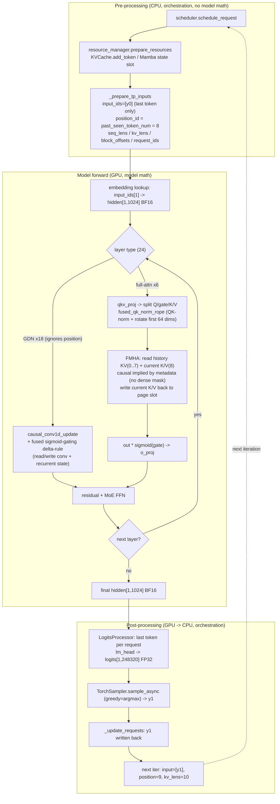
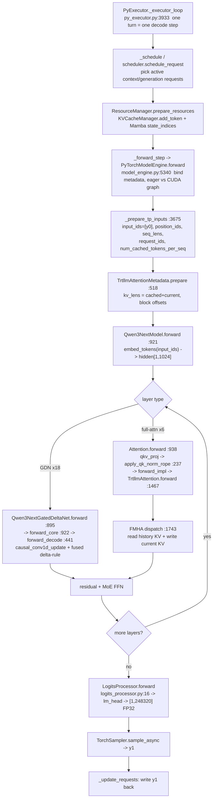

# Inference Variable Reading: llama.cpp and TensorRT-LLM

Status: source-reading organizer

This note traces five inference concerns through two checked-out runtimes:

1. initial hidden states
2. position IDs and RoPE
3. attention masks
4. KV cache
5. decode and sampling

The goal is not to force both systems into the same abstraction. It is to show
where each concern enters the runtime, how it is represented, and how it changes
between prefill, decode, and continuous batching.

## Scope and revisions

| Item | Selection |
| --- | --- |
| llama.cpp revision | `c528416388b6363d2781d8b82a59d0fba4968740` |
| TensorRT-LLM revision | `5344a0ad729e3411c14a1ddac65c39f6d0050824` |
| Model family | standard Llama causal decoder |
| llama.cpp path | server -> `llama_decode` -> standard `llama_kv_cache` |
| TensorRT-LLM path | PyExecutor -> PyTorch model -> TRTLLM attention backend -> standard KV cache manager |
| Decode case | one current token per active sequence, beam width 1 |
| Excluded | speculative decoding, recurrent models, M-RoPE, sliding-window variants, beam search, encoder-decoder attention |

The TensorRT-LLM backend dynamically selects supported FMHA implementations.
This note therefore stops at the backend dispatch boundary and does not claim a
specific CUDA kernel. Physical layouts can also vary with tensor parallelism,
quantization, and backend configuration.

The llama.cpp worktree contained unrelated local edits while this note was
written. The behavioral claims below are grounded in the checked-out source
paths and do not depend on those edits.

## Representative scenario

Use this scenario when reading every section:

- A Llama model receives one request.
- Prefill processes its prompt.
- Decode processes one newly selected token while earlier K/V states remain
  cached.
- The batching section then extends the same case to several active requests,
  including mixed prefill and decode work.

Logical tensor names such as `[B, T, H]` are explanatory. The runtimes often use
packed physical layouts instead. Statements marked **Inference** are conclusions
drawn from several nearby source operations rather than a single declaration.

## Five variables at a glance

The following table is the core comparison. Let one request have `C` cached
tokens and `T` current tokens. In a full prefill, `C = 0` and `T = prompt_len`.
In ordinary decode, `C = previous_sequence_len` and `T = 1`.

| Variable or state | Logical value for the request | llama.cpp carrier and handling | TensorRT-LLM carrier and handling | Main difference |
| --- | --- | --- | --- | --- |
| Initial hidden states | `X[0:T, 0:H]`, produced only for current tokens | `inp_tokens` or `inp_embd` -> `build_inp_embd` -> `inpL`; GGML graph convention is `[H, T]` | flat `input_ids` -> `embed_tokens` -> `hidden_states`; packed convention is logically `[T, H]` | Same embedding result, transposed-looking physical conventions and different execution systems |
| Position IDs and RoPE | `P = [C, C+1, ..., C+T-1]`; RoPE changes Q and K, not V | `batch.pos` -> ubatch positions -> I32 `inp_pos` -> explicit `ggml_rope_ext(Q/K)` | packed `position_ids`; Python `rotary_emb` when unfused, otherwise TRTLLM backend fusion | Explicit graph operation versus optional backend fusion |
| Attention mask | Logical keep rule: same request, valid cache cell, and `key_pos <= query_pos` for causal attention | host-filled `KQ_mask` graph input with `0` for keep and `-INF` for drop | causal mask enum plus sequence lengths, request types, KV lengths, and block offsets | Explicit mask values versus metadata/kernel-implied masking |
| KV cache | Before forward: K/V for `C` old tokens; after forward: K/V for `C+T` tokens | cache cells selected by sequence ID and stream; graph copies current K/V to cell indexes, then reads cache views | paged pools selected by request ID and block-offset rows; backend reads/writes the selected pages | Cell/stream ownership versus paged block-table ownership |
| Decode/generation loop | current token IDs -> hidden states -> logits -> sampled token -> next current token IDs | server slot and `llama_batch` -> `llama_decode` -> `common_sampler_sample` -> slot update | scheduled request -> `ModelEngine.forward` -> async sampler -> request update | Same recurrence, different orchestration state; this item is a state machine, not one tensor |

### One concrete logical example

This example is illustrative and backend-independent. It shows the values that
the concrete carriers above must represent.

| Step | Current token IDs | Hidden states computed now | Positions | Logically visible keys | Cache after forward | Loop output |
| --- | --- | --- | --- | --- | --- | --- |
| prefill | `[a, b, c]` | three rows/vectors | `[0, 1, 2]` | query 0 sees key 0; query 1 sees keys 0..1; query 2 sees keys 0..2 | K/V for positions 0..2 | sample `d` from the requested prompt logits, normally the final position |
| decode 1 | `[d]` | one row/vector | `[3]` | the current query sees cached keys 0..2 and current key 3 | K/V for positions 0..3 | sample `e` |
| decode 2 | `[e]` | one row/vector | `[4]` | the current query sees cached keys 0..3 and current key 4 | K/V for positions 0..4 | sample the next token |

Neither runtime has to materialize those logical views as dense tensors. The
sections below show exactly which objects carry them.

## End-to-end call chains

### llama.cpp server path

```text
server_context::update_slots
  -> server_batch::render
  -> server_context::decode
  -> llama_decode
  -> llama_context::decode
  -> llama_context::process_ubatch
  -> graph build and input population
  -> graph_compute
  -> server sampling
  -> sampled token is added to the next server batch
```

Evidence:

- `tools/server/server-context.cpp:2711` updates slots, renders the batch at
  `tools/server/server-context.cpp:2751`, and slices it for decode at
  `tools/server/server-context.cpp:2761`.
- The server wrapper calls `llama_decode` at
  `tools/server/server-context.cpp:3528` and
  `tools/server/server-context.cpp:3562`.
- `llama_decode` delegates to the context at `src/llama-context.cpp:4058`.
- `llama_context::decode` prepares memory and iterates ubatches at
  `src/llama-context.cpp:1680`, `src/llama-context.cpp:1766`, and
  `src/llama-context.cpp:1822`.
- `process_ubatch` builds, populates, and computes the graph at
  `src/llama-context.cpp:1304`, `src/llama-context.cpp:1337`,
  `src/llama-context.cpp:1359`, and `src/llama-context.cpp:1364`.
- Sampling starts at `tools/server/server-context.cpp:3673`; the selected token
  is sampled at `tools/server/server-context.cpp:3724` and is returned to the
  next batch through `tools/server/server-context.cpp:448` and
  `tools/server/server-context.cpp:2991`.

### TensorRT-LLM PyExecutor path

```text
PyExecutor._executor_loop
  -> schedule context and generation requests
  -> resource managers prepare request resources
  -> PyExecutor._forward_step
  -> ModelEngine.forward
  -> prepare packed inputs and attention metadata
  -> LlamaModel.forward
  -> attention backend dispatch
  -> asynchronous sampling
  -> request state update
```

Evidence:

- The executor loop schedules, prepares resources, forwards, samples, and
  updates requests at
  `TensorRT-LLM/tensorrt_llm/_torch/pyexecutor/py_executor.py:3933`,
  `TensorRT-LLM/tensorrt_llm/_torch/pyexecutor/py_executor.py:3956`,
  `TensorRT-LLM/tensorrt_llm/_torch/pyexecutor/py_executor.py:4004`,
  `TensorRT-LLM/tensorrt_llm/_torch/pyexecutor/py_executor.py:4068`, and
  `TensorRT-LLM/tensorrt_llm/_torch/pyexecutor/py_executor.py:4106`.
- Scheduling separates context and generation requests at
  `TensorRT-LLM/tensorrt_llm/_torch/pyexecutor/py_executor.py:5218`.
- The model engine prepares inputs and calls the model at
  `TensorRT-LLM/tensorrt_llm/_torch/pyexecutor/model_engine.py:5340`,
  `TensorRT-LLM/tensorrt_llm/_torch/pyexecutor/model_engine.py:5481`, and
  `TensorRT-LLM/tensorrt_llm/_torch/pyexecutor/model_engine.py:5547`.
- Sampling and request updates are at
  `TensorRT-LLM/tensorrt_llm/_torch/pyexecutor/py_executor.py:6333` and
  `TensorRT-LLM/tensorrt_llm/_torch/pyexecutor/py_executor.py:6379`.

## 1. Initial hidden states

### Handling and comparison

| Question | llama.cpp | TensorRT-LLM |
| --- | --- | --- |
| Producer | `build_inp_embd(model.tok_embd)` selects token lookup or caller embeddings (`src/llama-graph.cpp:2130`, `src/models/llama.cpp:108`) | `LlamaModel.forward` calls `embed_tokens(input_ids)` (`TensorRT-LLM/tensorrt_llm/_torch/models/modeling_llama.py:1096`, `TensorRT-LLM/tensorrt_llm/_torch/models/modeling_llama.py:1112`) |
| Prefill value | one hidden vector per current prompt token; logically `T = prompt_chunk_len` | one hidden vector per flattened current prompt token; `sequence_lengths` retains request boundaries (`TensorRT-LLM/tensorrt_llm/_torch/pyexecutor/model_engine.py:3389`) |
| Decode value | one hidden vector per active sequence for normal one-token decode | one hidden vector per active generation sequence; generation `sequence_lengths` is initialized to 1 (`TensorRT-LLM/tensorrt_llm/_torch/pyexecutor/model_engine.py:3693`) |
| Concrete carrier | I32 `inp_tokens` or F32 `inp_embd`; selected result becomes `inpL`, physically `[n_embd, n_tokens]` (`src/llama-graph.cpp:2138`, `src/llama-graph.cpp:2143`, `src/llama-graph.cpp:2190`) | flat GPU `input_ids`, then `inputs_embeds`/`hidden_states`; **Inference:** logically `[num_scheduled_tokens, hidden_size]`, consistent with flat input packing and the backend's token-major Q shape checks (`TensorRT-LLM/tensorrt_llm/_torch/pyexecutor/model_engine.py:3838`, `TensorRT-LLM/tensorrt_llm/_torch/attention_backend/trtllm.py:1640`, `TensorRT-LLM/tensorrt_llm/_torch/attention_backend/trtllm.py:1648`) |
| First consumer | first layer normalization and Q/K/V projections through the layer loop (`src/models/llama.cpp:126`) | first `LlamaDecoderLayer`, which passes `hidden_states` into self-attention (`TensorRT-LLM/tensorrt_llm/_torch/models/modeling_llama.py:1118`) |
| What changes across iterations | the newly sampled token replaces the prompt chunk as current input; cached tokens do not recreate hidden states | same; only scheduled current tokens are embedded, while old history is represented by KV metadata/cache |
| Essential delta | GGML graph tensor with sequence identity outside the hidden-state axes | packed PyTorch/CUDA tensor with request boundaries outside the hidden-state axes |

### llama.cpp

`build_inp_embd` creates either a token-ID input or an explicit embedding input.
For token IDs, `ggml_get_rows` gathers rows from the model token embedding table
(`src/llama-graph.cpp:2130`, `src/llama-graph.cpp:2138`, and
`src/llama-graph.cpp:2155`). The alternate caller-provided embedding path is at
`src/llama-graph.cpp:2180`.

The Llama graph starts with this result, sends it through each transformer layer,
then applies the final normalization and output projection
(`src/models/llama.cpp:98`, `src/models/llama.cpp:108`,
`src/models/llama.cpp:126`, and `src/models/llama.cpp:231`).

Physical convention: GGML represents the embedding input as
`[n_embd, n_tokens]`. It does not preserve a dense batch dimension here; sequence
identity travels separately in batch and memory metadata.

### TensorRT-LLM

The model receives packed input IDs. `LlamaModel.forward` calls
`embed_tokens(input_ids)`, assigns the result to `hidden_states`, and passes it
through the decoder layers
(`TensorRT-LLM/tensorrt_llm/_torch/models/modeling_llama.py:1096`,
`TensorRT-LLM/tensorrt_llm/_torch/models/modeling_llama.py:1112`, and
`TensorRT-LLM/tensorrt_llm/_torch/models/modeling_llama.py:1118`).

Input preparation flattens tokens from the scheduled requests into `input_ids`
and copies them to a GPU buffer
(`TensorRT-LLM/tensorrt_llm/_torch/pyexecutor/model_engine.py:3288` and
`TensorRT-LLM/tensorrt_llm/_torch/pyexecutor/model_engine.py:3838`).

**Inference:** the ordinary packed hidden-state shape is logically
`[num_scheduled_tokens, hidden_size]`. Request boundaries are reconstructed from
lengths and metadata rather than a dense `[batch, sequence, hidden]` tensor.

### Delta

Both systems begin with an embedding lookup and then carry hidden states through
the same conceptual transformer stack. The visible difference is representation:
llama.cpp builds a GGML graph around `[H, N]`, while TensorRT-LLM prepares packed
PyTorch/CUDA inputs around `[N, H]` and richer attention metadata.

## 2. Position IDs and RoPE

### Handling and comparison

| Question | llama.cpp | TensorRT-LLM |
| --- | --- | --- |
| Position producer | when absent, `llama_batch_allocr` starts from `memory->seq_pos_max(seq_id) + 1` and increments per sequence (`src/llama-batch.cpp:90`) | context positions use `range(begin_compute, begin_compute + len(prompt_tokens))`; generation uses `past_seen_token_num` (`TensorRT-LLM/tensorrt_llm/_torch/pyexecutor/model_engine.py:3368`, `TensorRT-LLM/tensorrt_llm/_torch/pyexecutor/model_engine.py:3725`) |
| Prefill value | normally `[C, ..., C+T-1]`; `C` can be nonzero for chunked/reused context | the same logical range is appended per context request, then packed |
| Decode value | one position per sequence, normally `[C]` | one `position_id` per beam/request, normally the number of previously seen tokens |
| Concrete carrier | `batch.pos` -> `ubatch.pos` -> I32 graph input `inp_pos` (`src/llama-batch.cpp:780`, `src/llama-graph.cpp:2219`) | Python `position_ids` list -> packed CUDA position tensor (`TensorRT-LLM/tensorrt_llm/_torch/pyexecutor/model_engine.py:4092`) |
| Consumer/effect | `ggml_rope_ext` rotates `Qcur` and `Kcur`; V is not passed to RoPE (`src/models/llama.cpp:146`, `src/models/llama.cpp:153`) | `apply_rope` rotates Q/K with `rotary_emb` when `rope_fusion` is false; otherwise the backend consumes positions (`TensorRT-LLM/tensorrt_llm/_torch/modules/attention.py:1011`, `TensorRT-LLM/tensorrt_llm/_torch/modules/attention.py:1062`) |
| Essential delta | positions and RoPE are visible inputs/ops in the GGML graph | positions are explicit, but their Q/K application can move into a fused backend operation |

### llama.cpp

If callers do not provide positions, the batch allocator starts each sequence at
`memory->seq_pos_max(seq_id) + 1` and increments positions per sequence
(`src/llama-batch.cpp:90`). Positions are copied into each ubatch at
`src/llama-batch.cpp:748` and `src/llama-batch.cpp:780`.

The graph exposes positions as an explicit I32 input
(`src/llama-graph.cpp:2219`). The Llama graph builds that input and supplies the
same positions to the Q and K RoPE operations
(`src/models/llama.cpp:110`, `src/models/llama.cpp:146`, and
`src/models/llama.cpp:153`).

Result: position state is derived from each sequence's memory state, materialized
as a graph input, and consumed by explicit graph-level RoPE operations.

### TensorRT-LLM

For context tokens, input preparation creates a position range matching the
selected prompt chunk
(`TensorRT-LLM/tensorrt_llm/_torch/pyexecutor/model_engine.py:3368`). For normal
generation, it appends the latest token and one position based on already seen
tokens
(`TensorRT-LLM/tensorrt_llm/_torch/pyexecutor/model_engine.py:3725`). The packed
position tensor is copied to CUDA and returned at
`TensorRT-LLM/tensorrt_llm/_torch/pyexecutor/model_engine.py:4092`.

Attention receives `position_ids`. When RoPE fusion is disabled, Python-side
attention applies RoPE before backend dispatch; when fusion is enabled, the
backend owns that operation
(`TensorRT-LLM/tensorrt_llm/_torch/modules/attention.py:1011` and
`TensorRT-LLM/tensorrt_llm/_torch/modules/attention.py:1062`). The TRTLLM backend
declares fused RoPE support at
`TensorRT-LLM/tensorrt_llm/_torch/attention_backend/trtllm.py:1763`.

### Delta

Both compute positions per logical sequence, even after tokens are packed.
llama.cpp makes RoPE visible as graph operations. TensorRT-LLM may apply RoPE in
the Python module or fuse it into the selected attention backend.

## 3. Attention masks

### Handling and comparison

| Question | llama.cpp | TensorRT-LLM |
| --- | --- | --- |
| Logical rule | keep only a cache cell owned by the query sequence; for causal attention also require `key_pos <= query_pos` (`src/llama-kv-cache.cpp:1625`, `src/llama-kv-cache.cpp:1641`) | predefined causal mask plus valid per-request query/KV lengths and the request's cache blocks (`TensorRT-LLM/tensorrt_llm/_torch/modules/attention.py:938`, `TensorRT-LLM/tensorrt_llm/_torch/attention_backend/trtllm.py:1674`) |
| Prefill behavior | each prompt query sees permitted earlier/current positions from its own sequence | context request lengths and cumulative/packed metadata tell the backend each query and KV span |
| Decode behavior | the one current query row can keep all permitted old cells plus its current cell | generation metadata reports one current query and `cached_len + current_len` valid KV positions |
| Explicit values | host code writes `0` (`mask_keep`) or `-INFINITY` (`mask_drop`) into a KQ mask tensor (`src/llama-kv-cache.cpp:1546`, `src/llama-kv-cache.cpp:1669`, `src/llama-kv-cache.cpp:1674`) | no dense mask values are built in the representative TRTLLM path; `attention_mask` is a predefined enum and constraints are metadata/kernel rules |
| Concrete carrier | graph input shaped from `n_kv`, current tokens, and streams (`src/llama-graph.cpp:38`); filled by the memory context (`src/llama-graph.cpp:467`) | `attention_mask`, `seq_lens`, `kv_lens`, `request_types`, `request_ids`, and `kv_cache_block_offsets` (`TensorRT-LLM/tensorrt_llm/_torch/attention_backend/interface.py:140`, `TensorRT-LLM/tensorrt_llm/_torch/attention_backend/trtllm.py:547`) |
| Consumer | `build_attn_mha(q, k, v, ..., kq_mask, ...)` (`src/llama-graph.cpp:2656`) | TRTLLM attention backend/FMHA dispatch (`TensorRT-LLM/tensorrt_llm/_torch/attention_backend/trtllm.py:1740`) |
| Essential delta | logical mask is materialized as graph input values | logical mask is reconstructed inside the backend from an enum and metadata |

### llama.cpp

The graph creates an explicit KQ mask input. Its shape is based on KV cells,
tokens, and streams, not a conventional dense `[B, T, T]` tensor
(`src/llama-graph.cpp:38`). The memory context fills this input through a graph
callback (`src/llama-graph.cpp:467`).

For the standard KV cache, mask construction rejects cells that do not belong to
the current sequence and masks causally future positions
(`src/llama-kv-cache.cpp:1516`, `src/llama-kv-cache.cpp:1625`, and
`src/llama-kv-cache.cpp:1641`). Optional sliding-window restrictions are applied
near `src/llama-kv-cache.cpp:1659`.

The Llama graph passes this mask into multi-head attention
(`src/llama-graph.cpp:2575` and `src/llama-graph.cpp:2656`). Flash-attention and
non-flash paths can use different mask data types, but the mask remains an
explicit graph input.

### TensorRT-LLM

The representative TRTLLM path does not build a dense attention-mask tensor.
Instead, it passes a predefined mask type plus sequence metadata. Causal is the
module default (`TensorRT-LLM/tensorrt_llm/_torch/modules/attention.py:938`), and
the backend maps that enum to its kernel-facing mask type
(`TensorRT-LLM/tensorrt_llm/_torch/attention_backend/trtllm.py:1369`).

The metadata carries sequence lengths, context/generation counts, cumulative
length information, request IDs, and block offsets
(`TensorRT-LLM/tensorrt_llm/_torch/attention_backend/interface.py:140`,
`TensorRT-LLM/tensorrt_llm/_torch/attention_backend/interface.py:205`, and
`TensorRT-LLM/tensorrt_llm/_torch/attention_backend/trtllm.py:154`). The backend
uses per-sequence KV lengths and prompt lengths during dispatch
(`TensorRT-LLM/tensorrt_llm/_torch/attention_backend/trtllm.py:1674`).

### Delta

llama.cpp materializes allowed and disallowed attention relationships in a
host-filled graph tensor. TensorRT-LLM encodes the same logical constraints in a
causal mask enum plus packed sequence and paged-cache metadata, leaving the
kernel to interpret them.

## 4. KV cache

### Handling and comparison

| Question | llama.cpp | TensorRT-LLM |
| --- | --- | --- |
| Allocation owner | `memory->init_batch` and standard `llama_kv_cache` locate cells for ubatches (`src/llama-context.cpp:1771`, `src/llama-kv-cache.cpp:698`) | PyExecutor `KVCacheManager` allocates paged block pools and offsets (`TensorRT-LLM/tensorrt_llm/_torch/pyexecutor/resource_manager.py:266`, `TensorRT-LLM/tensorrt_llm/_torch/pyexecutor/resource_manager.py:643`) |
| Prefill action | allocate `T` positions, write each layer's current K/V, then make them readable by later prompt queries | collect and add context sequences, allocate their blocks, and expose their block rows to attention (`TensorRT-LLM/tensorrt_llm/_torch/pyexecutor/resource_manager.py:793`, `TensorRT-LLM/tensorrt_llm/_torch/pyexecutor/resource_manager.py:797`) |
| Decode action | find a cell for the new position, write one K/V per active sequence/layer, read old plus new cache | add current-token capacity for every generation request, refresh block offsets, and read old plus new pages (`TensorRT-LLM/tensorrt_llm/_torch/pyexecutor/resource_manager.py:823`, `TensorRT-LLM/tensorrt_llm/_torch/pyexecutor/resource_manager.py:828`) |
| Write point | `mctx_cur->cpy_k` and `mctx_cur->cpy_v` copy `k_cur`/`v_cur` to selected indexes (`src/llama-graph.cpp:2646`) | backend sets `update_kv_cache` and dispatches with manager-owned cache pool pointers; the exact FMHA kernel is dynamically selected and not fixed in this report (`TensorRT-LLM/tensorrt_llm/_torch/attention_backend/trtllm.py:1516`, `TensorRT-LLM/tensorrt_llm/_torch/pyexecutor/resource_manager.py:644`) |
| Read point | `mctx_cur->get_k` and `get_v` return cache views to attention (`src/llama-graph.cpp:2653`) | TRTLLM attention receives valid KV lengths and request-selected block offsets before backend dispatch (`TensorRT-LLM/tensorrt_llm/_torch/attention_backend/trtllm.py:572`, `TensorRT-LLM/tensorrt_llm/_torch/attention_backend/trtllm.py:589`) |
| Request-to-storage mapping | `seq_id -> seq_to_stream -> cache cells`; cells also record sequence ownership (`src/llama-kv-cache.cpp:982`) | `request_id -> batch block-offset row -> paged pool blocks` (`TensorRT-LLM/tensorrt_llm/_torch/pyexecutor/resource_manager.py:2226`) |
| Growth/release | cells are found/applied per ubatch; later lifecycle operations can move, copy, or release sequence-owned cells | manager adds tokens/blocks, updates or rewinds sequences, and frees request resources (`TensorRT-LLM/tensorrt_llm/_torch/pyexecutor/resource_manager.py:1019`, `TensorRT-LLM/tensorrt_llm/_torch/pyexecutor/resource_manager.py:1066`) |
| Essential delta | cell/stream-oriented cache whose mask directly checks sequence ownership | paged/block-oriented cache whose attention metadata selects request-owned block rows |

### llama.cpp

Before graph execution, the context asks its memory object to initialize the
batch (`src/llama-context.cpp:1766` and `src/llama-context.cpp:1771`). The
standard KV cache splits work into ubatches, finds usable cells, and applies the
allocation (`src/llama-kv-cache.cpp:698`, `src/llama-kv-cache.cpp:747`, and
`src/llama-kv-cache.cpp:894`).

The graph writes current K and V values into selected cache locations, then reads
views of cached K and V for attention
(`src/llama-graph.cpp:2646` and `src/llama-graph.cpp:2653`). Sequence isolation is
maintained by the sequence-to-stream mapping and by the attention mask's
sequence-ownership check (`src/llama-kv-cache.cpp:982` and
`src/llama-kv-cache.cpp:1625`).

### TensorRT-LLM

The standard PyExecutor KV manager configures paged block pools using layer,
head, head-dimension, and tokens-per-block settings
(`TensorRT-LLM/tensorrt_llm/_torch/pyexecutor/resource_manager.py:266`). It
allocates cache pools and block-offset storage at
`TensorRT-LLM/tensorrt_llm/_torch/pyexecutor/resource_manager.py:643`.

During resource preparation, context requests are added and generation requests
extend their sequences with new token capacity
(`TensorRT-LLM/tensorrt_llm/_torch/pyexecutor/resource_manager.py:793` and
`TensorRT-LLM/tensorrt_llm/_torch/pyexecutor/resource_manager.py:823`). The
manager copies per-request block offsets into batch rows at
`TensorRT-LLM/tensorrt_llm/_torch/pyexecutor/resource_manager.py:2226`; attention
metadata selects those rows by request ID at
`TensorRT-LLM/tensorrt_llm/_torch/attention_backend/trtllm.py:589`.

### Delta

Both systems separate packed compute order from persistent sequence history.
llama.cpp exposes logical cache cells and sequence-to-stream ownership to graph
construction. TensorRT-LLM exposes paged block pools and per-request block-offset
tables to its attention backend. Their physical layouts should not be compared by
assuming the same K/V dimensions or axis order.

## 5. Decode and sampling

The fifth item is not one model tensor. It is the state transition that produces
the next values of the first four items.

### Handling and comparison

| Question | llama.cpp | TensorRT-LLM |
| --- | --- | --- |
| Loop input state | server slot contributes current token, position, sequence ID, and output flag to `server_batch` (`tools/server/server-context.cpp:104`, `tools/server/server-context.cpp:136`, `tools/server/server-context.cpp:448`) | scheduled request contributes latest token, position, request ID, cached length, and output gather index (`TensorRT-LLM/tensorrt_llm/_torch/pyexecutor/model_engine.py:3696`, `TensorRT-LLM/tensorrt_llm/_torch/pyexecutor/model_engine.py:3717`, `TensorRT-LLM/tensorrt_llm/_torch/pyexecutor/model_engine.py:3725`) |
| Decoder computation | `llama_decode` -> `llama_context::decode` -> ubatch graph -> transformer layers (`src/llama-context.cpp:4058`, `src/llama-context.cpp:1680`) | `_forward_step` -> `ModelEngine.forward` -> `LlamaModel.forward` (`TensorRT-LLM/tensorrt_llm/_torch/pyexecutor/py_executor.py:6207`, `TensorRT-LLM/tensorrt_llm/_torch/pyexecutor/model_engine.py:5340`) |
| Model output | selected output hidden states -> final norm -> LM head/logits (`src/models/llama.cpp:231`) | model engine gathers logits after model forward (`TensorRT-LLM/tensorrt_llm/_torch/pyexecutor/model_engine.py:5598`) |
| Sampling | server calls `common_sampler_sample` and accepts the token (`tools/server/server-context.cpp:3724`, `tools/server/server-context.cpp:3729`) | `_sample_async` invokes the sampler (`TensorRT-LLM/tensorrt_llm/_torch/pyexecutor/py_executor.py:6333`) |
| Stop/state update | server processes the token and stop conditions, then updates its slot (`tools/server/server-context.cpp:3755`) | `_update_requests` applies sampler results and request state (`TensorRT-LLM/tensorrt_llm/_torch/pyexecutor/py_executor.py:6379`) |
| Next input construction | sampled token is added at the next position during the following `update_slots`/batch build (`tools/server/server-context.cpp:2991`) | updated request's latest token is collected in the next scheduled generation input preparation |
| Essential delta | slot-centric synchronous-looking server orchestration around `llama_decode` | request-centric scheduler with model forward and asynchronous sampling stages |

### llama.cpp

For a normal decode step, the next sampled token is added to the server batch at
the next position (`tools/server/server-context.cpp:448`). `llama_decode` may
split the combined server batch into ubatches, update memory, compute logits, and
return them to the server. The server calls `common_sampler_sample`, accepts the
sample, checks stop conditions, and later adds it to the next batch
(`tools/server/server-context.cpp:3724`,
`tools/server/server-context.cpp:3729`, and
`tools/server/server-context.cpp:3755`).

### TensorRT-LLM

Normal generation input preparation contributes the latest token for each active
request and records its past-seen-token count
(`TensorRT-LLM/tensorrt_llm/_torch/pyexecutor/model_engine.py:3717`). After the
forward step, `_sample_async` invokes the sampler, and `_update_requests` applies
the resulting state to requests
(`TensorRT-LLM/tensorrt_llm/_torch/pyexecutor/py_executor.py:6333` and
`TensorRT-LLM/tensorrt_llm/_torch/pyexecutor/py_executor.py:6379`).

### Delta

The recurrence is the same:

```text
selected token -> next position -> model forward with cached history
               -> logits -> sampling -> selected token
```

llama.cpp exposes the recurrence through server slots, `llama_batch`, and GGML
graph execution. TensorRT-LLM exposes it through scheduler requests, packed model
inputs, asynchronous sampling, and request-state updates.

## Prefill, decode, and continuous batching

| Concern | Prefill | Decode |
| --- | --- | --- |
| current tokens | prompt chunk, often many tokens per request | normally one token per active sequence |
| positions | a range for each prompt chunk | one position after cached history |
| attention | causal within current prompt plus any prior cache | current query attends permitted cached history |
| KV action | allocate and write many positions | allocate and write the new position |
| output use | usually only final prompt position needs sampling logits | each active sequence needs next-token logits |

### llama.cpp continuous batching

The server first adds sampled tokens for generating slots, then may add pending
prompt tokens when continuous batching is enabled
(`tools/server/server-context.cpp:2991`). `server_batch` stores a slot ID for each
token and renders it as that token's sequence ID
(`tools/server/server-context.cpp:104` and
`tools/server/server-context.cpp:136`). Prompt tokens from multiple slots are
added at `tools/server/server-context.cpp:3411`.

The low-level cache maps sequence IDs to streams/cells, and mask construction
checks that a cache cell belongs to the token's sequence. Therefore packing work
together does not imply sharing request history.

### TensorRT-LLM continuous batching

The scheduler returns context and generation request groups in the same scheduled
step (`TensorRT-LLM/tensorrt_llm/_torch/pyexecutor/py_executor.py:5218`). Input
preparation flattens their current tokens while retaining request IDs, sequence
lengths, cached-token counts, and paged-cache block offsets
(`TensorRT-LLM/tensorrt_llm/_torch/pyexecutor/model_engine.py:3288`,
`TensorRT-LLM/tensorrt_llm/_torch/pyexecutor/model_engine.py:4141`, and
`TensorRT-LLM/tensorrt_llm/_torch/pyexecutor/model_engine.py:4168`).

The request ID selects a request's block-offset rows before attention. As in
llama.cpp, packing requests together merges compute work, not KV history.

## Compact comparison

| Concern | llama.cpp | TensorRT-LLM PyExecutor + TRTLLM |
| --- | --- | --- |
| hidden states | GGML graph, commonly `[H, N]` | packed PyTorch/CUDA tensor, logically `[N, H]` |
| positions | explicit graph input | packed CUDA tensor and attention metadata |
| RoPE | visible graph op | Python op or backend fusion |
| causal masking | explicit KQ mask tensor | mask enum plus lengths and cache metadata |
| request isolation | sequence IDs, streams/cells, ownership mask | request IDs and paged block-offset rows |
| KV cache | cache cells exposed to graph construction | paged pools exposed to attention backend |
| batching | server slots -> token-level sequence IDs -> ubatches | scheduled requests -> flat tokens -> metadata |
| sampling loop | server-side sampler and slot update | async sampler and request update |

## Appendix: Qwen3.5 hybrid (GDN + full attention)

The main note above is scoped to a standard Llama causal decoder and excludes
recurrent models and M-RoPE. This appendix extends the same five-variable reading
to the **Qwen3.5 hybrid** architecture, which the earlier scope deliberately left
out. It is self-contained and does not change any statement above.

### Scope for this appendix

| Item | Selection |
| --- | --- |
| Model | `Qwen/Qwen3.5-0.8B`, text-only |
| Shape facts | hidden 1024, 8 query heads, 2 KV heads, head_dim 256, 24 layers = 18 GDN (`linear_attention`) + 6 `full_attention`, vocab 248320, `partial_rotary_factor = 0.25` -> rotary_dim 64 |
| GDN facts | per GDN layer: causal-conv state width `conv_kernel(4) - 1 = 3`, recurrent state `[num_v_heads=16, head_k_dim=128, head_v_dim=128]` |
| Phase | ordinary decode after prefill; beam width 1; TP=1; no speculative decoding |
| llama.cpp carrier | `src/models/qwen35moe.cpp` graph build + hybrid/recurrent memory |
| TensorRT-LLM carrier | `Qwen3NextModel` (Qwen3.5 reuses the Qwen3Next hybrid layers) |

All tensor shapes below are **Inference** (config- and source-derived, not
captured from a run), per reading rule 7.

### A. TensorRT-LLM run flow after model load (pre/post-processing emphasized)



Per-variable rule and its before/after in this engine:

| Variable | Before (producer) | Computation rule | After (consumer) |
| --- | --- | --- | --- |
| input hidden states | embedding lookup `weight[id]` | keep only last token; width stays 1024, sequence axis = packed tokens | 24 layers update in sequence |
| position / RoPE | `position = past_seen_token_num` | not additive; RoPE rotates only the first `head_dim*0.25 = 64` dims per head, angle `pos / base^(2i/64)`; consumed by the 6 full-attn layers only, GDN ignores it | Q/K rotation |
| attention mask | causal enum + `kv_lens` / block offsets | no dense matrix materialized on this path; causal + request isolation live in metadata | FMHA kernel |
| KV cache | `qkv_proj` produces current K/V | full-attn: paged read history + write current; GDN: fixed-size conv + recurrent state advanced in place | next decode step |
| decode | the whole forward | full-attn = fused FMHA; GDN = `causal_conv1d_update` + delta-rule recurrence | sampler emits `y1` |

Evidence: `_prepare_tp_inputs` position at
`TensorRT-LLM/tensorrt_llm/_torch/pyexecutor/model_engine.py:3725` and mRoPE 3-axis
expand at `TensorRT-LLM/tensorrt_llm/_torch/pyexecutor/model_engine.py:3769`;
embedding at `TensorRT-LLM/tensorrt_llm/_torch/models/modeling_qwen3_next.py:942`;
fused QK-norm+RoPE at
`TensorRT-LLM/tensorrt_llm/_torch/modules/qk_norm_attention.py:237`; full-attn
forward at `TensorRT-LLM/tensorrt_llm/_torch/modules/attention.py:973`; FMHA
dispatch at `TensorRT-LLM/tensorrt_llm/_torch/attention_backend/trtllm.py:1740`; GDN
decode at `TensorRT-LLM/tensorrt_llm/_torch/modules/mamba/gdn_mixer.py:594`.

### B. Demo input: per-step shape and dtype (TensorRT-LLM)

Prompt tokenizes to 8 tokens (positions 0..7); prefill samples `y0`, then decode.

Prefill (`T = 8`, `C = 0`):

| Variable | shape | dtype | note |
| --- | --- | --- | --- |
| input_ids | `[8]` | int32 | whole prompt |
| hidden (after embed) | `[8, 1024]` | BF16 | sequence axis = 8 |
| position_ids | `[3, 1, 8]` | int32 | mRoPE 3 axes, text -> all axes equal 0..7 |
| attention mask | none dense; `kv_lens=[8]` | - | triangular causal via metadata |
| KV cache (per full-attn layer) | K/V each `[8, 2, 256]` (logical) | BF16 | physical paged `[pages, 2, 2, 32, 256]` |
| GDN state (per GDN layer) | conv `[conv_dim, 3]` / recurrent `[16,128,128]` | BF16 | final state after scanning 8 tokens |
| logits | `[1, 248320]` | FP32 | last token only |

Decode step 1 (`T = 1`, `C = 8`, position = 8):

| Variable | input shape/dtype | computation | output shape/dtype |
| --- | --- | --- | --- |
| input_ids | `[1]` int32 = `[y0]` | keep last token | - |
| hidden | - | embedding lookup | `[1,1024]` BF16 |
| position_ids | `[3,1,1]` int32, value 8 | fused_qk_norm_rope | Q/K first 64 dims rotated in place (BF16) |
| Q / gate / K / V | qkv_proj `[1,1024] -> [1,5120]` BF16 | split | Q `[1,2048]`->`[1,8,256]`; gate `[1,2048]`; K/V `[1,512]`->`[1,2,256]` |
| attention mask | `kv_lens=9` (read 0..8) | implicit causal | no tensor emitted |
| KV cache | read history `[8,2,256]` + current | FMHA read + write | slot 8 written; logical `[9,2,256]` |
| GDN state | recurrent `[16,128,128]` | delta-rule, 1 step | shape unchanged, values advanced |
| attn out | `[1,2048]` BF16 | `* sigmoid(gate)` -> o_proj | `[1,1024]` BF16 |
| logits | final hidden `[1,1024]` | lm_head + cast | `[1,248320]` FP32 |
| sampled | - | argmax | `y1` int |

Decode step 2 (position = 9) is structurally identical; only three scalars move:
`input_ids=[y1]`, `position=9`, `kv_lens=10`. Every non-cache tensor keeps its
step-1 shape and dtype. Only the KV cache *logical* length grows (`[10,2,256]`),
and the GDN recurrent state does not even grow (fixed size). This shape-stability
is what makes the decode forward capturable as a replayable CUDA graph.

### C. llama.cpp vs TensorRT-LLM for this hybrid model

#### C-1. Framework layer

| Dimension | llama.cpp | TensorRT-LLM |
| --- | --- | --- |
| Language / backend | C++ + ggml; CPU/Metal/CUDA/Vulkan | Python+C++ (nanobind) + PyTorch/CUDA; NVIDIA only |
| Execution model | static compute graph rebuilt per ubatch (`build_arch_graph`), scheduled by `ggml_backend_sched` | PyTorch eager + fused custom ops (`torch.ops.trtllm.*`) + optional whole-forward CUDA graph replay |
| Hybrid layer mark | GGUF KV `is_recr_impl` / `full_attention_interval` (`src/models/qwen35moe.cpp:24`) | `get_qwen3_hybrid_layer_types()` from HF config |
| KV / state store | `llama_kv_cache` + `memory_recurrent` + `memory_hybrid` | `KVCacheManager` (paged) + `MambaHybridCacheManager` |
| Sampling | `common/sampling` on CPU | `TorchSampler` on GPU |

#### C-2. Input model format

| | llama.cpp | TensorRT-LLM (PyTorch backend) |
| --- | --- | --- |
| Carrier | single GGUF file; offline `convert_hf_to_gguf.py` required | HF directory (config.json + safetensors + tokenizer); no offline convert |
| Contents | weights + hparams (e.g. `ssm_d_conv`, `ssm_n_group`) + tokenizer, all packed | weights and config separate, read at runtime |
| Tensor naming | `blk.{i}.attn_norm.weight`, `blk.{i}.ssm_conv1d.weight` (`src/models/qwen35moe.cpp:72`) | PyTorch state_dict `model.layers.{i}.self_attn.*` |
| Loading / quant | mmap; GGUF block quant (Q4_K/Q5_K/Q8_0) read directly | safetensors + weight_mapper; FP8/NVFP4/AWQ via ModelOpt at runtime |

#### C-3. Compute graph (the sharpest contrast)

Same GDN linear-attention layer, two very different shapes:

TensorRT-LLM (`gdn_mixer.py:594`) is two coarse fused ops:

```text
causal_conv1d_update(...)                     # one fused kernel: conv-window update + q/k/v
fused_sigmoid_gating_delta_rule_update(...)   # one fused kernel: gating + delta recurrence + state r/w
```

llama.cpp (`src/models/qwen35moe.cpp:362`, `build_layer_attn_linear`) is ~10 explicit ggml nodes:

```text
ggml_ssm_conv -> ggml_silu -> view q/k/v -> ggml_l2_norm x2
-> build_recurrent_attn (delta net) -> build_norm_gated (rms_norm + silu + mul)
-> ggml_reshape -> ssm_out mul_mat
```

The full-attention layer shows the same pattern. TensorRT-LLM:
`qkv_proj -> fused_qk_norm_rope -> FMHA -> gate -> o_proj` (~5 ops, norm+RoPE fused).
llama.cpp (`src/models/qwen35moe.cpp:281`):
`wq/wk/wv three mul_mat -> build_norm(Q) -> build_norm(K) -> ggml_rope_multi x2 -> build_attn -> sigmoid -> mul -> wo` (~12 nodes, norm and RoPE are separate nodes).

Three graph-level differences that matter most:

| Concern | llama.cpp | TensorRT-LLM |
| --- | --- | --- |
| attention mask | materialized `attn_inp_kq_mask` tensor `[n_kv, n_tokens, 1, n_stream]`, dtype F16/F32, host-filled 0/-INF (`src/llama-graph.cpp:38`, `src/llama-graph.cpp:450`) | no dense mask; causal implied by metadata + kernel |
| position / RoPE | I32 1D tensor `n_tokens * n_pos_per_embd` (`src/llama-graph.cpp:2224`); `ggml_rope_multi` is its own node, QK-norm computed separately before it | int32 `[3,1,N]`; `fused_qk_norm_rope` fuses norm + RoPE into one op |
| fusion / scheduling | fine-grained nodes scheduled by `ggml_backend_sched`; graph rebuilt per ubatch | coarse fused ops + runtime FMHA dispatch + whole-forward CUDA graph replay |

One-line summary: llama.cpp is "explicit static graph + fine-grained ggml nodes +
materialized mask + offline GGUF"; TensorRT-LLM is "eager + coarse fused kernels +
metadata-implicit mask + direct HF ingest with runtime quant/CUDA-graph". The math
is equivalent; the abstraction boundaries are drawn in different places.

## Appendix: serving-layer optimizations and the five variables

Modern serving frameworks (vLLM, TensorRT-LLM, TGI) wrap the decode loop in a
layer of engineering that is what actually lets one GPU serve dozens of concurrent
users: **continuous batching**, **speculative decoding**, and **paged memory
management**. None of these change the model math. Each one changes how the five
variables are *organized* and what their *lifecycle* is. This appendix reads the
five variables under each optimization. Shapes are **Inference** (config-derived),
and code references keep the same revisions as the header.

### 1. Continuous (in-flight) batching

Instead of finishing one batch before starting the next, every iteration re-forms
the running batch: new requests join, finished ones leave, and the active
requests' current tokens are packed into one flat buffer.

| Variable | Effect |
| --- | --- |
| input hidden states | not a dense `[B, T, H]`; a flat `[sum of per-request current tokens, H]` pack. User A's and user B's tokens are contiguous; boundaries recovered from `seq_lens` / `num_contexts`. A *mixed batch* holds multi-token context requests and one-token generation requests together. |
| position / RoPE | positions are per-token, not per-batch; each token carries its own request's `past_seen_token_num`, so interleaving never conflicts. |
| attention mask | the load-bearing isolation: A's query must not read B's keys. Enforced by per-request `kv_lens` + block table (TRT-LLM) / cell sequence-ownership (llama.cpp), via varlen/`cu_seqlens` attention -- not a dense mask. |
| KV cache | each request owns its own blocks; packing merges compute, not history (`copy_batch_block_offsets` selects each request's offset rows). |
| decode | the loop no longer runs one request to completion; each iteration advances all active requests by one token and admits new context requests. The scheduler decides membership every step. |

Evidence: executor loop schedules/forwards/samples/updates per iteration at
`TensorRT-LLM/tensorrt_llm/_torch/pyexecutor/py_executor.py:3933`; packed inputs
with retained boundaries at
`TensorRT-LLM/tensorrt_llm/_torch/pyexecutor/model_engine.py:4141`; per-request
block-offset rows at
`TensorRT-LLM/tensorrt_llm/_torch/pyexecutor/resource_manager.py:2226`. llama.cpp
keeps per-token sequence IDs through `server_batch` and isolates via the
ownership mask (`src/llama-kv-cache.cpp:1625`).

### 2. Speculative decoding

A draft proposes `K` tokens; the target verifies `K+1` candidates in one forward
and keeps the longest correct prefix. This turns decode back into a mini-prefill,
so the variables that *degenerated* at decode time (section B of the hybrid
appendix) become non-trivial again.

| Variable | Effect |
| --- | --- |
| input hidden states | a generation request feeds `draft_len + 1` candidate tokens, not one; hidden becomes `[num_req * (draft_len+1), H]`. Decode now looks like prefill. |
| position / RoPE | draft tokens take consecutive positions `past + 0..K`; tree-based drafting assigns positions by tree offset -- exactly why `_adjust_position_ids_for_spec_dec` and `spec_decoding_position_offsets` exist. Position stops being a scalar. |
| attention mask | the hard decode-time mask returns: a small causal mask over the `K` tokens for chain drafting, or a custom **tree mask** (a candidate attends only to its ancestors) for tree drafting. This is the exception to "decode mask is degenerate." |
| KV cache | KV for the `K` tokens is written tentatively, then **rewound** to the accepted length on rejection. Recurrent (GDN/Mamba) state is worse: it cannot be overwritten in place, so per-step intermediate states are kept and the accepted one is selected afterwards. |
| decode | one target forward verifies `K` drafts, accepts a prefix, and emits multiple tokens per iteration. Qwen3.5 carries the draft head *inside the model* (built-in MTP), so no separate draft model is needed. |

Evidence: spec-dec position adjustment at
`TensorRT-LLM/tensorrt_llm/_torch/modules/attention.py:1008`; the GDN verify path
writing `intermediate_conv_states` / `intermediate_ssm_states` and deferring
selection to `update_mamba_states()` at
`TensorRT-LLM/tensorrt_llm/_torch/modules/mamba/gdn_mixer.py:459`; built-in MTP
head `Qwen3NextMTP` and one-model MTP wiring at
`TensorRT-LLM/tensorrt_llm/_torch/models/modeling_qwen3_next.py:704` and
`TensorRT-LLM/tensorrt_llm/_torch/models/modeling_qwen3_next.py:966`. llama.cpp
builds the Qwen3.5 MTP draft graph in `graph_mtp` (`src/models/qwen35moe.cpp:552`).

### 3. Paged memory management

Memory decides concurrency. KV cache is the protagonist.

| Variable | Effect |
| --- | --- |
| KV cache | PagedAttention: KV lives in fixed-size blocks (TRT-LLM `tokens_per_block=32`, vLLM default 16); a logically contiguous sequence maps to scattered physical pages through a block table. Wins: no `max_seq_len` pre-allocation (no fragmentation), on-demand growth via `add_token`, release on completion, and prefix/block reuse. Qwen3.5 hybrid **disables block reuse** because GDN state has no equivalent block-sharing semantics. |
| GDN / recurrent state | contrast: attention KV is paged and grows; recurrent state is a fixed-size slab per request, managed by `state_indices` (not paged, size is constant). |
| attention mask / isolation | the block table *is* the isolation mechanism -- metadata, not a mask matrix. |
| input hidden / position | not memory-managed directly (transient per step), but the packing that paging enables is what lets many requests share one buffer. |
| decode | the scheduler admits requests by free-block count; on exhaustion it preempts/evicts (recompute or offload). This is the memory-side support for "dozens of concurrent users." |

Evidence: `tokens_per_block` default at
`TensorRT-LLM/tensorrt_llm/llmapi/llm_args.py:3435`; paged pools and block offsets
at `TensorRT-LLM/tensorrt_llm/_torch/pyexecutor/resource_manager.py:643`;
`add_token` growth at
`TensorRT-LLM/tensorrt_llm/_torch/pyexecutor/resource_manager.py:823`; hybrid block
reuse disabled at
`TensorRT-LLM/tensorrt_llm/_torch/models/modeling_qwen3_next.py:989`; fixed-size
Mamba state slots in `CppMambaHybridCacheManager` (`get_state_indices`). llama.cpp
splits the same concerns across `llama_kv_cache`, `memory_recurrent`, and
`memory_hybrid`.

### Why one GPU serves many users

The three optimizations attack different bottlenecks:

| Optimization | Bottleneck it relieves | Variable it reorganizes most |
| --- | --- | --- |
| continuous batching | GPU utilization (no waiting on the slowest request) | hidden states (packed) + mask (metadata isolation) |
| paged memory | concurrency density (KV packed, more sequences fit) | KV cache (block table) + state slab |
| speculative decoding | tokens per step (multiple tokens per forward) | input tokens + mask (tree) + cache rewind |

The five variables never change identity: **hidden states are packed, positions
are per-token, the mask is metadata-driven isolation, KV is paged plus a
fixed-size recurrent slab, and decode is scheduler-orchestrated.** The
optimizations do not alter the math; they alter the organization and lifecycle of
these five variables.

## Appendix: one-decode-step call dispatch (side by side)

This appendix enters each runtime at its natural debug breakpoint and traces how
one decode step (one already-prefilled request generating one token) dispatches
through the functions. For each runtime: a call-dispatch flowchart, a
function-to-role table (with the source comment/intent), and args/variables
tables for the functions that compute the five variables. Model: Qwen3.5-0.8B
hybrid. Line numbers follow the header revisions and can drift; symbol names are
the stable anchors.

Debug entry points:

| Runtime | Breakpoint you set | Why |
| --- | --- | --- |
| llama.cpp | `llama_decode` (`src/llama-context.cpp:4058`) | the C entry every caller funnels through; step into `ctx->decode` |
| TensorRT-LLM | `PyExecutor._executor_loop` (`.../py_executor.py:3933`) | one loop turn == one decode step; step into `_forward_step` |

### llama.cpp: call-dispatch flow

```mermaid
flowchart TD
    D0["llama_decode(ctx, batch)\nsrc/llama-context.cpp:4058"] --> D1["llama_context::decode(batch_inp)\n:1680  prepare memory, split ubatches, loop"]
    D1 --> D2["memory->init_batch / find_slot\nllama_kv_cache + memory_recurrent (hybrid)\nallocate cells + recurrent state slot"]
    D2 --> D3["process_ubatch(ubatch, gtype, mctx, ret)\n:1304  build-or-reuse graph, set inputs, compute"]
    D3 --> G0["model.build_graph -> qwen35moe::build_arch_graph\nsrc/models/qwen35moe.cpp:152"]
    G0 --> G1["graph ctor :159\nbuild_inp_embd / build_inp_mem_hybrid\nbuild_inp_pos / build_inp_out_ids"]
    G1 --> G2{"per layer il\nhparams.is_recr(il)?"}
    G2 -->|recurrent (GDN)| G3["build_layer_attn_linear :362\nssm_conv + l2norm + recurrent delta + gated norm"]
    G2 -->|full attention| G4["build_layer_attn :281\nQG proj + q/k norm + rope_multi + build_attn + gate"]
    G3 --> G5["build_layer_ffn :496  MoE + shared expert"]
    G4 --> G5
    G5 --> G6{"more layers?"}
    G6 -->|yes| G2
    G6 -->|no| G7["build_norm(output) :233\nbuild_lora_mm(lm head) :246 -> t_logits"]
    G7 --> S0["res->set_inputs: fill inp_pos (I32),\nattn_inp_kq_mask (0/-INF, F16/F32)\nsrc/llama-graph.cpp:450"]
    S0 --> S1["ggml_backend_sched_graph_compute\nrun the DAG"]
    S1 --> S2["logits ready; caller samples\ncommon_sampler_sample (outside llama_decode)"]
```

Function-to-role:

| Function (path:line) | Role / intent |
| --- | --- |
| `llama_decode` (`src/llama-context.cpp:4058`) | public entry; forwards `batch` to `ctx->decode` |
| `llama_context::decode` (`:1680`) | validate batch, init memory context, split into ubatches, loop |
| `process_ubatch` (`:1304`) | build (or reuse) the graph for this ubatch, populate inputs, compute |
| `qwen35moe::graph` ctor (`src/models/qwen35moe.cpp:159`) | assemble the static DAG for one ubatch |
| `build_inp_pos` (`src/llama-graph.cpp:2219`) | create the I32 position graph input |
| `build_layer_attn` (`qwen35moe.cpp:281`) | full-attn layer: "joint QG proj, QG split, Q norm, KV proj, K norm, RoPE, attention" |
| `build_layer_attn_linear` (`qwen35moe.cpp:362`) | GDN layer: input proj, conv state, recurrent delta rule, gated norm |
| `build_layer_ffn` (`qwen35moe.cpp:496`) | MoE FFN plus gated shared expert |
| `set_inputs` / mask fill (`src/llama-graph.cpp:450`) | host-fill `inp_pos` and `attn_inp_kq_mask` (0 keep / -INF drop) |

Args/variables (five-variable functions):

| `build_layer_attn(inp, cur, inp_pos, sections, il)` | meaning |
| --- | --- |
| `inp` | attention KV graph input (mask, cache handles) |
| `cur` | layer input hidden `[n_embd, n_tokens]` |
| `inp_pos` | I32 positions -> `ggml_rope_multi` |
| `sections[4]` | IMRoPE section split |
| var `Qcur_full` | joint query+gate projection `[(head*2)*n_head, n_tokens]` |
| var `Qcur`/`Kcur`/`Vcur` | per-head views; Q/K get `build_norm` then `ggml_rope_multi` |
| var `gate` | sigmoid gate applied after `build_attn` |
| var `kq_scale` | `1/sqrt(head_dim)` unless overridden |

| `build_layer_attn_linear(inp, cur, il)` | meaning |
| --- | --- |
| `inp` | recurrent-state (`llm_graph_input_rs`) graph input |
| `cur` | layer input hidden |
| var `qkv_mixed`, `z` | in-proj outputs (`build_qkvz`) |
| var `beta`, `alpha`, `gate` | delta-rule gates; `gate = -A_log.exp() * softplus(alpha+dt)` |
| var `conv_states_all`, `ssm_states_all` | per-layer conv + recurrent state buffers (`get_r_l`/`get_s_l`) |
| var `state` | recurrent state `[head_v, head_v, num_v_heads, n_seqs]` |
| ops | `ggml_ssm_conv` -> `ggml_silu` -> `ggml_l2_norm` -> `build_recurrent_attn` -> `build_norm_gated` |

### TensorRT-LLM: call-dispatch flow



Function-to-role:

| Function (path:line) | Role / intent |
| --- | --- |
| `PyExecutor._executor_loop` (`py_executor.py:3933`) | schedule -> prepare -> forward -> sample -> update, once per step |
| `PyTorchModelEngine.forward` (`model_engine.py:5340`) | bind attention metadata; choose eager forward or CUDA graph replay |
| `_prepare_tp_inputs` (`model_engine.py:3675`) | pack current tokens; compute positions; build seq/kv lengths + metadata |
| `TrtllmAttentionMetadata.prepare` (`trtllm.py:518`) | assemble `kv_lens`, request types, block offsets for the kernel |
| `Qwen3NextModel.forward` (`modeling_qwen3_next.py:921`) | embed tokens, run 24 hybrid layers |
| `Attention.forward` (`attention.py:938`) | full-attn: qkv_proj, QK-norm+RoPE, backend attn, gate, o_proj |
| `apply_qk_norm_rope` (`qk_norm_attention.py:237`) | one fused op: per-head QK RMSNorm + (partial, mRoPE) RoPE |
| `Qwen3NextGatedDeltaNet.forward` (`gdn_mixer.py:895`) | GDN: token-wise proj, then `forward_core` dispatch, then gated norm + out_proj |
| `forward_core` (`gdn_mixer.py:922`) | split prefill/decode; fetch conv/ssm state; call `forward_extend` or `forward_decode` |
| `forward_decode` (`gdn_mixer.py:441`) | `causal_conv1d_update` + `fused_sigmoid_gating_delta_rule_update` |
| `TrtllmAttention.forward` (`trtllm.py:1467`) | set `update_kv_cache`, dispatch a supported FMHA (read history + write current) |

Args/variables (five-variable functions):

| `_prepare_tp_inputs(...)` key variables | meaning |
| --- | --- |
| `input_ids` | flat current tokens; generation appends only `get_last_tokens(beam)` (`:3717`) |
| `position_ids` | per-token position; `position_id = past_seen_token_num` (`:3725`), mRoPE expands to `[3,1,1]` (`:3769`) |
| `num_cached_tokens_per_seq` | per-request cached length -> `kv_lens` |
| `seq_lens` / `request_ids` / `gather_ids` | request boundaries + last-token gather index |

| `Attention.forward(position_ids, hidden_states, attn_metadata, attention_mask=CAUSAL, attention_mask_data=None, ...)` | meaning |
| --- | --- |
| `hidden_states` | `[1,1024]` BF16 layer input |
| `attention_mask` | enum, defaults `CAUSAL`; `attention_mask_data` stays `None` (no dense mask) |
| var `qkv` | `qkv_proj(hidden)` `[1,5120]` |
| var `q`,`gate`,`k`,`v` | split; `attn_output_gate=True` -> Q and gate share `q_gate` |
| var `attn_output` | after `forward_impl`; then `* sigmoid(gate)` -> `o_proj` |

| `apply_qk_norm_rope(qkv, position_ids)` | meaning |
| --- | --- |
| `qkv` | packed buffer, rotated/normed in place |
| `position_ids` | `[3,...]` -> `use_mrope`; else flattened |
| var `rotary_dim` | `head_dim * partial_rotary_factor` = 64 |
| var `mrope_section1/2` | interleaved mRoPE section sizes |
| op | `torch.ops.trtllm.fused_qk_norm_rope(...)` |

| `forward_core` / `forward_decode` key variables | meaning |
| --- | --- |
| `mixed_qkv`, `z`, `a`, `b` | token-wise proj outputs + gates |
| `num_decodes`, `num_prefills` | split from `attn_metadata`; decode path when `num_prefills==0` |
| `conv_states`, `ssm_states` | `kv_cache_manager.mamba_layer_cache(layer_idx)` conv + temporal |
| `state_indices` / `cache_indices` | per-request Mamba slot from `mamba_metadata` |
| `intermediate_*` | only set when `is_target_verify` (spec-dec state rewind) |
| ops | `causal_conv1d_update` -> `fused_sigmoid_gating_delta_rule_update` |

### The dispatch difference in one line

llama.cpp dispatches by **building a static DAG once per ubatch** (branching on
`is_recr(il)` at graph-construction time, then a single `graph_compute` runs
every node); TensorRT-LLM dispatches by **eager Python calls** (branching on layer
type at call time, each fused op launched or replayed via CUDA graph). Same five
variables, two scheduling models: graph-topology dispatch vs call-time dispatch.

## Appendix: multi-concurrency and long-context at the code level

This appendix evaluates a common community explanation of how the five variables
are reshaped under high concurrency (continuous batching + PagedAttention) and
long context (FlashDecoding). It keeps what is accurate and corrects what is not,
grounded in this tree where the mechanism is visible in Python, and labeled as
kernel-level where it is not.

### What holds

| Claim | Status |
| --- | --- |
| Naive batching pads to `max_seq_len` and builds a dense `[B, L, L]` mask | correct (early-HF style) |
| Modern engines flatten to `[num_total_tokens, hidden]`; compute-side padding removed | correct (`_prepare_tp_inputs` packing) |
| `cu_seqlens` marks request boundaries in the flat buffer | correct; present here as `cu_q_seqlens` (`attention_backend/interface.py:150`, used by the vanilla backend `attention_backend/vanilla.py:381`) |
| PagedAttention = two-level addressing (`block_table` -> physical block) | correct in spirit; physical layout here is paged HND `[max_pages, 2, num_kv_heads, page_size, head_dim]` |
| One batch mixes prefill and decode requests | correct (split by `num_contexts`) |
| FlashDecoding = split KV into chunks, grid `[B, H, num_chunks]`, partial attention + logsumexp reduction | correct as split-K / "multi-block" attention |
| RoPE decoupled from memory; pass an absolute position, rotate only current Q/K | correct (`position_ids` -> `fused_qk_norm_rope`) |
| `block_size` is 16 or 32 tokens | correct (TRT-LLM 32, vLLM 16) |

### What to correct

| Claim | Correction |
| --- | --- |
| "the attention mask disappears, replaced by `cu_seqlens`" | only the **dense padding mask** disappears. Causal masking still exists as a kernel-implicit `mask_type` enum. `cu_seqlens`/`kv_lens` take over the *boundary* role, not the *causal* role. Explicit masks **return** for sliding-window, custom, and speculative-decoding tree masks. |
| llama.cpp KV as `base + (seq_id*max_len + seq_pos)` contiguous | current llama.cpp uses a **cell-based shared buffer** (`llama_kv_cells`, `src/llama-kv-cells.h:32`); sequence ownership is enforced by the mask. Simpler than paging, but not per-sequence contiguous slabs. |
| FlashDecoding shown as launch code beside the Python layer | it is a **C++/CUDA kernel** feature (TRT-LLM "multi-block mode" / XQA), not present in the Python `attention_backend` tree. |
| "padding is completely eliminated" | compute-side padding is eliminated, but TRT-LLM still **pads the batch dimension** to CUDA-graph buckets. |
| `is_decoding_phase` as a literal bool array | TRT-LLM encodes phase via `num_contexts` + request ordering; the concept (mixed phases) is right, the representation differs. |
| "distributed across the whole GPU cluster" | it is the **SMs of a single GPU**, not a cluster. |

### The hybrid caveat the pure-attention story misses

The paste assumes every layer keeps a growing KV cache, so long context is a
per-layer problem solved by FlashDecoding. For Qwen3.5 hybrid this is only half
true:

| Layer type (count) | Long-context cost at decode | Needs paging / FlashDecoding? |
| --- | --- | --- |
| full attention (6) | O(context) KV reads per token | yes -- paged KV + split-K decode |
| GDN linear attention (18) | O(1) per token: fixed-size recurrent state, context length independent | no -- fixed `[16,128,128]` state slab, no KV, no FlashDecoding |

So on this model the long-context KV/bandwidth pressure lands on 1/4 of the layers;
the other 3/4 are already constant-cost by construction. That is the architectural
point of a hybrid model, and it is invisible if the mental model is pure attention.

### The corrected one-paragraph summary

High concurrency turns the regular 3D `[B, L, H]` tensors into a flat token pool
plus offset/index tables (`cu_seqlens` for boundaries, `block_tables` for paged
KV); it does not delete masking, it moves the *padding* mask into metadata while
causal masking stays kernel-implicit. Long context splits the decode attention
over the KV axis (FlashDecoding / multi-block) so many SMs share one token's work
-- but only for the attention layers; recurrent (GDN) layers are already O(1) per
token. Positions stay explicit and per-token throughout, feeding RoPE on the
current Q/K only. llama.cpp keeps a simpler cell-based KV and fewer scheduling
layers; TRT-LLM pays real system complexity (scheduler, paged tables, multi-block
kernels) for throughput. These are reorganizations and parallelizations of the
same five variables, not new math.

## Reading rules for future additions

When extending this note:

1. Declare the model, backend, phase, batching mode, and cache implementation.
2. Start at the public execution entry point and trace down to the backend
   boundary.
3. Record logical shape and physical packed shape separately.
4. Distinguish explicit tensors from constraints encoded in metadata.
5. Prove request isolation rather than assuming batching preserves it.
6. Mark backend behavior as unresolved when dispatch is dynamic.
7. Label multi-source conclusions as **Inference**.

## Related local notes

- [`docs/development/cli-inference-code-walkthrough.md`](docs/development/cli-inference-code-walkthrough.md)
  contains a deeper llama.cpp CLI-oriented trace of the five concerns.
- [`docs/development/llama-single-multi-user-inference-flow.md`](docs/development/llama-single-multi-user-inference-flow.md)
  expands the single-request and multi-user execution flow.
- [`docs/development/vscode-inference-debugging.md`](docs/development/vscode-inference-debugging.md)
  turns the llama.cpp paths into debugging checkpoints.

## Open follow-ups

- Trace one exact TensorRT-LLM FMHA implementation after fixing GPU architecture,
  dtype, quantization, and runtime configuration.
- Compare llama.cpp unified and non-unified KV modes with TensorRT-LLM cache
  reuse and offloading modes.
- Add speculative decoding as a separate scenario; it changes both current-token
  packing and cache acceptance/rewind behavior.
- Capture runtime tensor shapes with a concrete model to confirm the logical
  shape inferences above.
