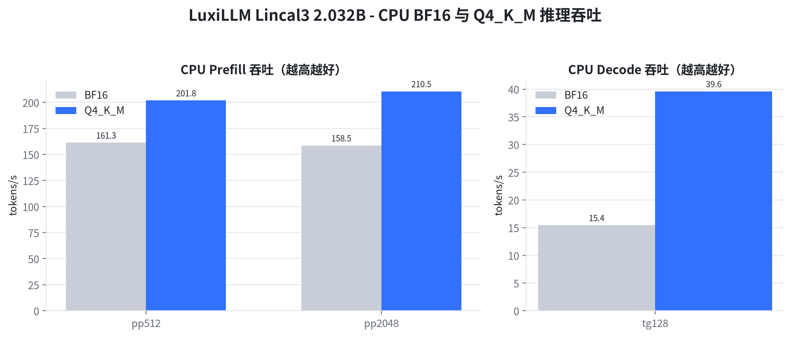
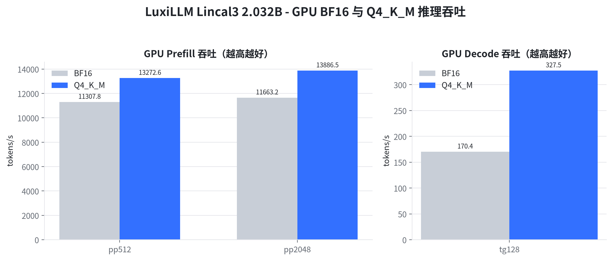
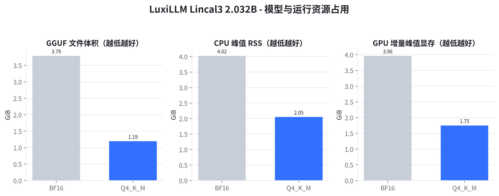
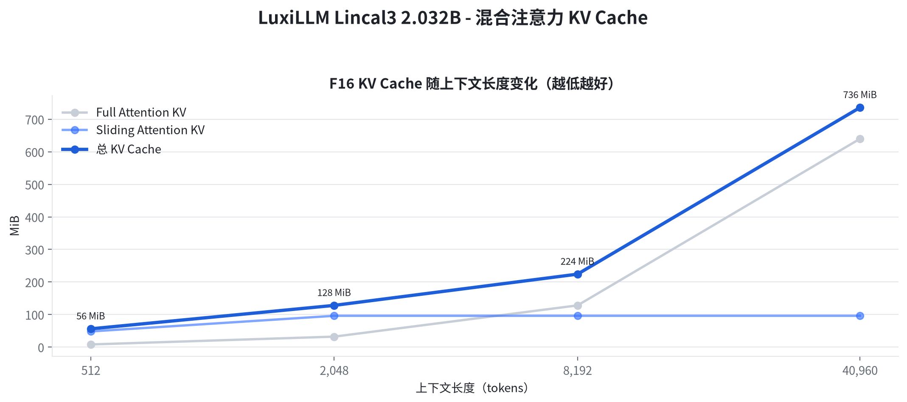
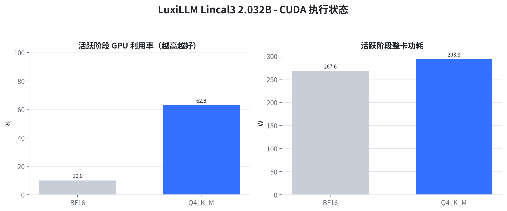

# LuxiLLM Lincal3 2.032B CPU-GPU BF16 与 Q4_K_M 部署评测报告

　　总结：在 NVIDIA GeForce RTX 3090 全层 CUDA 卸载条件下，Q4_K_M 的 pp2048 达到 13886.5 tokens/s；同一量化在 CPU 上的 tg128 为 39.6 tokens/s。Q4_K_M 将 GGUF 文件由 3.79 GiB 降至 1.19 GiB，减少 68.5%。结论限定于本报告所列硬件、llama.cpp 构建和推理参数。

## 1 工作背景与目标

　　LuxiLLM Lincal3 已在 llama.cpp 中完成独立架构注册、GGUF 转换和混合注意力图实现。本次评测面向部署选型，验证 BF16 与 Q4_K_M 在 CPU 和 NVIDIA GPU 上的运行状态、吞吐和资源占用。

- 验证 2 x 2 测试矩阵：CPU/GPU × BF16/Q4_K_M，四组均使用同一 2.032B 参数模型。
- 采用 pp512、pp2048 和 tg128 区分 Prompt Processing 与自回归 Decode，避免用单一吞吐值代替完整推理特征。
- 核对 24 层 Sliding Attention 与 4 层 Full Attention 的 KV Cache 分配，滑动窗口为 512 tokens。

## 2 核心结论

　　四组运行均完成模型加载、上下文创建和推理基准，CPU 构建仅加载 CPU backend，GPU 构建通过 CUDA backend 执行。量化收益在模型体积和 CPU 内存侧最稳定，吞吐收益随硬件与工作负载变化。

- **CPU：** Q4_K_M 相对 BF16 在 pp512、pp2048、tg128 上分别提升 25.1%、提升 32.8%、提升 156.6%；峰值 RSS 由 4.02 GiB 变为 2.05 GiB。
- **GPU：** Q4_K_M 相对 BF16 在 pp512、pp2048、tg128 上分别提升 17.4%、提升 19.1%、提升 92.2%；增量峰值显存由 3.96 GiB 变为 1.75 GiB。
- **KV Cache：** F16 KV 在 40,960 tokens 时总分配为 736 MiB，其中 Full Attention 为 640 MiB，Sliding Attention 为 96 MiB。

## 3 测试范围与指标说明

**模型与架构：** LuxiLLM Lincal3，实际参数量 2,031,739,904（2.032B），28 层；24 层 Sliding Attention，4 层 Full Attention；训练上下文 40,960 tokens；GGUF 架构标识为 `lincal3`。

**CPU 测试环境：** 12th Gen Intel(R) Core(TM) i5-12600KF，10 核/16 逻辑处理器，L3 20 MiB (1 instance)，系统内存 62Gi；测试固定 8 线程、`-ngl 0`、Flash Attention、F16 K/V Cache。CPU 核心指标为 pp/tg 吞吐、Prefill 时长、单 token Decode 时长、峰值 RSS、进程 CPU 利用率与 backend 状态。

**GPU 测试环境：** NVIDIA GeForce RTX 3090，显存 24.0 GiB，驱动 580.173.02，功耗上限 350 W；测试使用 `-ngl 99` 全层卸载、Flash Attention、F16 K/V Cache。GPU 核心指标为 pp/tg 吞吐、Prefill 时长、单 token Decode 时长、增量峰值显存、活跃利用率、整卡功耗与 CUDA backend 状态。

**测量方法：** llama.cpp build f760aa955；每个吞吐场景预热后重复 3 次，图中为平均 tokens/s；CPU 峰值 RSS 来自 `/usr/bin/time -v`；GPU 指标由 `nvidia-smi` 以 100 ms 间隔采样；KV Cache 来自 runtime 分配日志。BF16 与 Q4_K_M 共享相同模型架构、token 负载、线程数和 KV 类型；Q4_K_M 由 BF16 直接量化，不使用 importance matrix。

　　本报告聚焦部署可用性、性能与资源，不对 BF16 与 Q4_K_M 的生成质量差异作结论。CPU 与 GPU 数值用于说明当前平台行为，不构成跨产品排名。

## 4 CPU 推理吞吐

　　Prompt Processing（pp）表示一次性处理输入 token 的速度，Decode（tg）表示逐 token 生成速度，二者单位均为 tokens/s，越高越好。

图 1　CPU BF16 与 Q4_K_M 在 pp512、pp2048 与 tg128 场景的平均吞吐

　　BF16 的 pp512、pp2048、tg128 分别为 161.3±5.1、158.5±1.4、15.4±0.5 tokens/s；Q4_K_M 分别为 201.8±16.0、210.5±4.8、39.6±0.6 tokens/s。折算后，BF16/Q4_K_M 的 pp512 时长为 3.17/2.54 s，pp2048 时长为 12.92/9.73 s，单 token Decode 时长为 64.81/25.25 ms；完整基准进程平均 CPU 利用率为 758%/692%。

　　本节结论：在本机 8 线程 CPU 配置下，Q4_K_M 的 pp512、pp2048、tg128 相对 BF16 分别提升 25.1%、提升 32.8%、提升 156.6%。

## 5 GPU 推理吞吐

　　GPU 使用 CUDA backend 和全层卸载请求，Prefill 与 Decode 采用和 CPU 相同的 token 负载、Flash Attention 与 F16 KV Cache。

图 2　GPU BF16 与 Q4_K_M 在 pp512、pp2048 与 tg128 场景的平均吞吐

　　BF16 的 pp512、pp2048、tg128 分别为 11307.8±1185.7、11663.2±76.4、170.4±0.9 tokens/s；Q4_K_M 分别为 13272.6±1323.9、13886.5±196.5、327.5±4.0 tokens/s。折算后，BF16/Q4_K_M 的 pp512 时长为 45.3/38.6 ms，pp2048 时长为 175.6/147.5 ms，单 token Decode 时长为 5.87/3.05 ms。

　　本节结论：RTX 3090 已执行 CUDA 路径；Q4_K_M 的 pp512、pp2048、tg128 相对 BF16 分别提升 17.4%、提升 19.1%、提升 92.2%。

## 6 模型体积与运行内存

　　GGUF 文件体积反映存储与传输成本；CPU 峰值 RSS 反映完整基准进程的最大常驻内存；GPU 增量峰值显存为测试期间设备峰值减去运行前基线。三项指标均越低越利于部署。

图 3　BF16 与 Q4_K_M 的 GGUF 体积、CPU 峰值 RSS 和 GPU 增量峰值显存

　　Q4_K_M 文件为 1.19 GiB，相对 BF16 的 3.79 GiB 减少 68.5%；CPU 峰值 RSS 变化为 4.02→2.05 GiB，GPU 增量峰值显存变化为 3.96→1.75 GiB。RSS 包含 runtime、工作缓冲和已访问的 mmap 页面，显存数值包含模型、KV 与计算缓冲的设备侧增量。

　　本节结论：Q4_K_M 显著降低模型文件与运行内存，文件体积降幅为 68.5%，CPU 峰值 RSS 降幅为 49.1%，GPU 增量峰值显存降幅为 55.8%。

## 7 混合注意力 KV Cache

　　Lincal3 将 24 层配置为 Sliding Attention、4 层配置为 Full Attention。F16 KV Cache 分别由两套缓存保存，Full Attention 随上下文增长，Sliding Attention 缓存受滑动窗口与处理批次共同约束。

图 4　512 至 40,960 tokens 下 Full Attention、Sliding Attention 与总 KV Cache 分配

　　在 512、2,048、8,192、40,960 tokens 下，总 KV Cache 分别为 56, 128, 224, 736 MiB。Sliding Attention 部分在上下文超过 512 后稳定为 96 MiB，Full Attention 部分继续随上下文线性增长。

　　本节结论：40,960 tokens 最大训练上下文下，F16 KV Cache 总分配为 736 MiB；混合注意力将 24 层 Sliding Attention 的缓存限制在 96 MiB。

## 8 CUDA 执行状态与功耗

　　GPU 活跃利用率仅统计利用率大于零的 100 ms 样本，整卡功耗由 `nvidia-smi` 读取，包含模型加载和三种基准负载中的活跃阶段。功耗用于描述当前运行状态，不等同于单 token 能耗。

图 5　BF16 与 Q4_K_M 基准期间的活跃 GPU 利用率和整卡功耗

　　BF16 活跃利用率均值为 10.0%，整卡功耗均值/峰值为 267.6/345.9 W；Q4_K_M 对应为 62.8% 和 293.3/334.2 W。

　　本节结论：CUDA backend 在 BF16 与 Q4_K_M 两种精度下均形成持续设备负载，显存采样与吞吐结果共同证明 GPU 路径已实际执行。

## 9 综合结论与适用范围

　　LuxiLLM Lincal3 2.032B 已在 llama.cpp CPU 与 CUDA backend 上完成 BF16/Q4_K_M 部署验证。Q4_K_M 的主要确定性收益是模型体积、CPU RSS 和 GPU 显存下降；吞吐变化取决于 CPU 指令执行、GPU kernel 与 Prefill/Decode 工作负载。

- CPU 部署应同时查看 pp 与 tg，不能用 Prefill 吞吐推断 Decode 体验；8 线程结果仅代表本机 i5-12600KF 配置。
- GPU 部署应同时检查 CUDA backend、卸载参数、显存、利用率和功耗；仅看到可执行文件名不能证明 CUDA 已参与计算。
- KV Cache 仍随 4 层 Full Attention 的上下文长度增长；40,960 tokens 部署需要在模型显存之外保留 KV 与计算缓冲空间。
- BF16/Q4_K_M 的质量取舍需要使用同一业务数据集进行准确率或生成质量评测，本报告数值不用于推断质量变化。

　　报告生成日期：2026-08-19。
